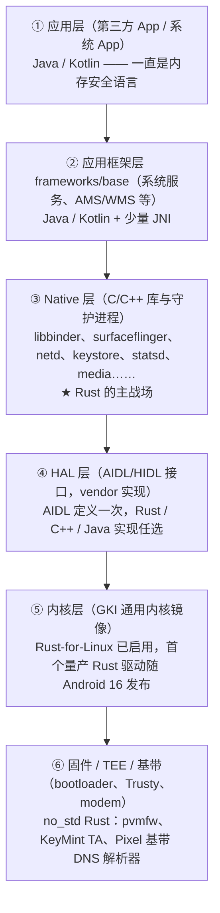

# Rust 在 Android / AOSP 中的调研报告

> 调研日期：2026-08-07
> 代码数据来源：AOSP main 分支（清华 TUNA 镜像，depth=1 浅克隆实测）
> 官方数据来源：Google Security Blog / Android 官方文档的公开数据（见文末说明）

---

## 摘要

Rust 是 Google 为 Android 选定的"内存安全语言"战略在原生层（native）的核心载体。其落地逻辑非常清晰：**2019 年内存安全漏洞占 Android 全部漏洞的 76%，传统缓解手段治标不治本，于是 Google 决定从"源头"（safe coding）解决问题——新代码用内存安全语言写，而不是重写旧代码。**

到 2026 年，Rust 已覆盖 AOSP 的构建工具链、IPC 基础设施、密钥/TEE、虚拟化与固件、连接协议栈、媒体编解码、内核驱动乃至基带固件；AOSP main 分支实测仅 vendored 第三方 Rust crates 就有约 **359 万行**，采样的第一方平台 Rust 代码约 **76.2 万行**；第三方全树统计（AOSP 17，2026-06）Rust 合计约 **695 万行**、约占全树代码 3.8%。官方口径（均已回源核对）：Android 13（2022）新增原生代码 21% 为 Rust，并成为**首个新增代码中内存安全语言占多数的版本**；2025-11 官方更新 Rust 总量约 **500 万行**；内存安全漏洞占比从 2019 年的 76% 降至 2022 年 35%、2024 年 24%、**2025 年首次低于 20%**，绝对数量从 2019 年 223 个降至 2022 年 85 个、2024 年年化 36 个；Rust 的内存安全漏洞密度比 C/C++ **低三个数量级（>1000x）**，至今无随版本发布的 Rust 内存安全漏洞（2025 年披露一次 unsafe 代码未遂事件，发布前被拦截）。

---

## 一、AOSP 架构与 Rust 的落位

### 1.1 AOSP 分层架构速览

AOSP 自上而下可分为六层，不同层的语言约束截然不同：



关键结构事实：

- **上层早已被内存安全语言覆盖**：应用层与应用框架层以 Java/Kotlin 为主（带 GC），因此 Rust 的机会不在上层，而在"GC 不可接受"的下层——Native 守护进程、HAL、内核、固件。
- **Native 层是历史包袱最重的层**：libbinder、libutils、media、蓝牙等数千万行 C/C++，也是内存安全漏洞的主要产地，这正是 Rust 的切入点。
- **AIDL 是跨语言的"换轨开关"**：HAL 与服务接口用 AIDL 定义后，编译器可生成 Rust/C++/Java 任一侧实现——Rust 组件由此能"透明替换"C++ 组件而不动接口两侧。
- **Mainline（APEX）模块化是分发通道**：UWB、DNS、蓝牙、Permission 等被做成可经 Google Play 更新的 APEX 模块，Rust 组件的安全修复不必等整机 OTA。
- **构建体系已完成 Rust 一等公民化**：Soong 原生 Rust 模块类型 + `prebuilts/rust` 内置工具链 + `external/rust/android-crates-io` 统一 vendored 依赖，使"在哪个层写 Rust"只取决于工程决策，不再有工具链障碍。

### 1.2 Rust 的落位规律

对照后文的模块清单，Rust 在 AOSP 中的分布呈现明显的"三层渗透"：

1. **Native 层新增/替换**（量最大）：keystore2、DNS-over-HTTP/3、UWB、蓝牙 gd、libbinder_rs、crosvm、AVF。
2. **固件与 TEE 的 no_std 落地**（安全收益最高）：pvmfw、Trusty KeyMint/SecretKeeper TA、libavb Rust 封装、Pixel 基带解析器——这些环境无 OS、无 GC 容忍度，Rust 几乎是唯一可选的内存安全语言。
3. **内核驱动**（最新前沿）：Rust-for-Linux 启用、ashmem 等量产驱动，仍处早期。

反向地，Rust **没有**出现在：应用框架 Java 层（Kotlin 已覆盖）、性能极致敏感且成熟的渲染/Skia 存量核心（仅新增 pica 等周边）、以及未暴露新攻击面的成熟守护进程——与"不重写存量、风险驱动选点"的策略完全一致。

---

## 二、落地过程：原因、策略、过程

### 2.1 动因：为什么是 Rust

- **内存安全漏洞是 Android 最大的漏洞类别。** Google Security Blog（2019-05, "Queue the Hardening Enhancements"，已回源核对）披露：UAF、整数溢出、越界读写合计占当年 Android 漏洞的 **90%**（越界最常见），其中数组边界检查类约占 34%。广为流传的"2019 年内存安全漏洞占 76%"是 Google 在 2022/2024 年回顾文章中给出的追溯口径；2021 年 Rust 文章自身使用的是"约 70% 的高危漏洞"口径。
- **传统缓解手段（mitigation）已触天花板。** ASLR、NX、stack canary、sanitizer、CFI 等只能提高利用难度，不能消除漏洞；且每代缓解都伴随绕过技术演进，属于"军备竞赛"。
- **修复模式不可持续。** 漏洞在成熟 C/C++ 代码中反复出现（"打地鼠"），修复本身还可能引入新漏洞。
- **为什么选 Rust 而不是别的：** 应用层已有 Java/Kotlin（内存安全但有 GC），但系统层（HAL、守护进程、固件、内核、VMM、协议栈）要求无 GC、可预测延迟、与 C ABI 无缝互操作。Rust 是唯一同时满足"内存安全 + 无 GC + 零成本抽象 + C 级性能 + 成熟生态"的候选。Go 因 GC 和运行时依赖被排除在系统层之外。

### 2.2 策略：怎么落

Google 在 2021-04 的官方博文 "Rust in the Android platform" 中明确了四条核心策略，后续 2024-09 "Eliminating memory safety vulnerabilities at the source" 将其系统化为 "Safe Coding" 方法论：

1. **新代码用内存安全语言写，不重写成熟旧代码。** 依据是漏洞随代码年龄指数衰减（"半衰期"）：Android 的内存安全 bug 约 50% 诞生于不到一年的新代码（2021 原文，已核对）；5 年陈代码的漏洞密度比新代码低 3.4–7.4 倍（2024 原文引用 Usenix Security 2022 研究与 Android/Chromium 观测）。因此重写成熟代码收益递减，Rust 优先用于**新增功能**。
2. **互操作优先，而非替换。** Android 已有数千万行 C/C++，因此投入大量基础设施做互操作：bindgen、cxx、autocxx、AIDL 的 Rust 代码生成后端，目标是 Rust 模块能渐进嵌入现有 C/C++ 系统。这一决策是数据驱动的（2021-06 原文，已核对）：对 Android 最常用的 C++ 库（liblog/libbase/libutils/libbinder 等）用 objdump 分析导出函数参数类型，**81% 的类型当时即可由 bindgen/cxx/AIDL 原生支持、87% 可低成本支持**；Mainline 模块（64 个二进制、21 个模块）为 88%/90%——互操作可行性先被量化证明，才有后续大规模投入；2024 年再向 Rust Foundation 捐资 100 万美元专项攻关互操作。
3. **风险驱动选点。** 优先投向攻击面最大的位置：解析不可信输入的组件（网络协议、媒体编解码、镜像验证）、特权服务（密钥管理）、隔离边界（TEE、固件、虚拟化）。
4. **工具链与流程配套。** 平台内置 Rust 工具链（`prebuilts/rust`）、Soong 原生 Rust 模块类型（`rust_binary`、`rust_library`、`rust_ffi`、`rust_proc_macro` 等）、CI 中强制 rustfmt/clippy、第三方 crates 统一 vendored 管理（`external/rust/android-crates-io`）。

### 2.3 时间线（2019 → 2026）

| 时间 | 里程碑 |
|---|---|
| 2019 | "Queue the Hardening Enhancements"：内存类缺陷占当年漏洞 90%（追溯口径 76%）；Android 团队开始将新开发转向内存安全语言（2024 年官方回顾确认决策时点为 2019 年前后） |
| 2020 | AOSP 构建系统（Soong）加入 Rust 支持；`prebuilts/rust` 工具链入树；Android 12 开发中引入首批 Rust 平台代码 |
| 2021-04 | 官方博文 "Rust in the Android platform"：正式宣布 **Android 12 起平台级支持 Rust**，公开策略与互操作基础设施（bindgen/cxx/AIDL 后端） |
| 2021-05/06 | 官方博文 "Integrating Rust into Android Open Source Project"（已核对：Soong 模块类型、工具链与构建集成细节）与 "Rust/C++ interop in the Android Platform"（已核对：互操作可行性的数据化论证，详见 2.2；**此时 AOSP 中 Rust 已超 10 万行**） |
| 2021 | **Android 12 发布：Keystore2 随系统上线——第一个公开的旗舰级 Rust 系统组件**（source.android.com 官方文档确认其为 Rust 重写的密钥守护进程）；ART 的 CompOS 签名服务 composd/odsign 等亦以 Rust 编写（后续版本中该方案被调整） |
| 2022-12 | 官方博文 "Memory Safe Languages in Android 13"（已回源核对）：**Android 13 中约 150 万行 Rust**（含依赖）；**新增原生代码 21% 为 Rust**；**Android 13 成为首个新增代码（全语言）中内存安全语言占多数的版本**；UWB 协议栈、DNS-over-HTTP/3（基于 Cloudflare quiche）、AVF 等落地；**Rust 代码零内存安全漏洞**；内存安全漏洞占比 76%（2019）→ **35%**（2022，首次不再是多数）；**绝对数量 223（2019）→ 85（2022）**；C/C++ 历史漏洞密度 >1 个/kLOC（媒体/蓝牙/NFC 等） |
| 2023-09/10 | 官方博文 "Scaling Rust adoption through training"（已核对：500+ 工程师受训、96% 好评，Rust 培训体系化）与 "Bare metal Rust in Android"（已核对：**pvmfw 从 U-Boot（C）整体迁移为 Rust 成为 pVM 信任根**——官方直言 U-Boot 并非为敌意环境设计、VirtIO 驱动存在大量缺失的边界检查；no_std 裸机工程经验） |
| 2024-02 | 官方博文 "Improving interoperability between Rust and C++"（已核对）：Google 向 Rust Foundation 捐资 **100 万美元**发起 Interop Initiative 专攻 Rust/C++ 互操作；公开聚合的开源 crate 安全审计；官方称 **Rust 已为 Android 生态预防了数百个漏洞**（按历史漏洞密度推算） |
| 2024-09 | 官方博文 "Eliminating memory safety vulnerabilities at the source"（已回源核对）：内存安全漏洞占比 **76%（2019）→ 24%（2024）**，"远低于 70% 的行业常态"且总数持续下降（2024 为年化外推值）；提出漏洞半衰期/指数衰减模型，"safe coding" 成为正式方法论 |
| 2024-09/10 | 官方博文 "Deploying Rust in existing firmware"（已核对：既有固件渐进引入 Rust 的方法论——新代码与最高风险代码优先、现成 Rust crate 直接替换、C shim 封装 unsafe 边界）与 "Safer with Google: Advancing memory safety"（已核对：**内存安全漏洞绝对数量从 2019 年 220+ 降至 2024 年预计 36**；C++ 加固、MiraclePtr 等配套手段） |
| 2025 | **Android 16 配套 Linux 6.12 内核成为首个启用 Rust 支持、首个含量产 Rust 驱动的 GKI 内核**（官方 2025-11 确认；首个驱动为 ashmem 的说法见公开报道与内核社区）；蓝牙 offload HAL、AVB 验证库（libavb Rust 实现）等持续扩展 |
| 2025-11 | 官方博文 "Rust in Android: move fast and fix things"（已回源核对）：**2025 年内存安全漏洞占比首次低于 20%**；**Android 中 Rust 约 500 万行**；**漏洞密度比 C/C++ 低 1000+ 倍**（C/C++ 历史约 1000 个/MLOC）；披露 CrabbyAVIF unsafe 代码未遂事件（发布前拦截，Scudo 硬化分配器使其不可利用）；**工程效率：评审耗时少约 25%、返工轮次少约 20%、中大型变更回滚率约低 4 倍——"the safer path is now also the faster one"**；Rust 净增行数已超过 C++；全平台约 4% Rust 代码在 unsafe 块内；扩展动向：6.12 内核首个量产 Rust 驱动、与 Arm/Collabora 合作 Rust GPU 内核驱动 Tyr、与 Arm 合作 Rusted Firmware-A、Nearby Presence（已运行于 Google Play Services）、MLS（RCS 加密消息协议，将入 Google Messages）等第一方应用 |
| 2026-04 | 官方博文 "Bringing Rust to the Pixel Baseband"（已回源核对）：**Pixel 10 成为首个在基带（调制解调器）固件中集成内存安全语言的 Pixel**——用 Rust 重写基带 DNS 解析器（基于 hickory-proto，并为其上游补齐 no_std 支持）；基带是可远程攻击面（Project Zero 曾演示对 Pixel 基带的远程 RCE）；代码增量约 371KB |
| 2026 | AOSP main 分支：vendored crates 达 454 个 / 约 359 万行；第一方 Rust 遍布 system、frameworks/native、packages/modules、trusty、external 各层（本报告实测） |

---

## 三、AOSP 中的 Rust：量、位置、功能

### 3.1 总量与口径

AOSP 全树约 1045 个 git 仓库、上百 GB，无法整体克隆。本报告采用两种口径：

- **官方口径**（各时点均已核对原文）：2021-06 AOSP 中 Rust 已超 **10 万行** → Android 13 约 **150 万行**（2022-12，含新增功能及其开源依赖）→ 2025-11 约 **500 万行**。
- **实测口径**（本报告，AOSP main，2026-08-07）：对约 40 个已知含 Rust 的仓库做浅克隆/树扫描逐文件统计。
  - `external/rust/android-crates-io`（统一 vendored 的第三方 crates，454 个）：**3,586,959 行** / 10,938 个 .rs 文件。
  - 采样的第一方平台 Rust 代码合计约 **76.2 万行**（不含 vendored crates、不含 cxx/aidl 等纯工具链代码）。
  - 对比 2022 年官方口径的 150 万（含依赖），如今**仅 vendored 依赖就达 359 万行**，可见 Rust 生态在 AOSP 中的扩张速度。

### 3.2 全树语言占比的跨版本变化（第三方全量统计）

第三方开发者 derdilla 用 repo 全量检出 + tokei 对 AOSP 做了逐版本全树统计（[AOSP 14](https://derdilla.com/blog/size-aosp14/)、[AOSP 16](https://derdilla.com/blog/size-aosp16/)、[AOSP 17](https://derdilla.com/blog/size-aosp17/)；**没有 Android 15 专篇**，作者从 14 直接跳到了 16）。其统计按 top-level 目录分为 Core / SDKs / Third-party / Devtools / Userspace / Tests / Docs 七类；注意 `external/`（含 android-crates-io vendored crates、crosvm 等）被归入 Third-party。下表为代码行（不含注释/空行）汇总：

| 版本（统计时间） | Rust 总行数 | 其中 Core 类 Rust | Rust 占全树代码比 | C/C++ 总行数 | C/C++ 占比 | 全树代码总量 | "设备上运行"代码估计 |
|---|---|---|---|---|---|---|---|
| AOSP 14（2024-08） | 约 498 万 | 7.8 万（Core 的 0.72%） | 4.0% | 约 6836 万 | 54.7% | 约 1.25 亿 | 约 6600 万 |
| AOSP 16（2025-06） | 约 593 万 | 13.6 万（Core 的 1.25%） | 3.9% | 约 7864 万 | 51.9% | 约 1.52 亿 | 约 9200 万 |
| AOSP 17（2026-06） | 约 695 万 | 35.8 万（Core 的 2.70%） | 3.8% | 约 9009 万 | 49.0% | 约 1.84 亿 | 约 1.13 亿 |

读法：

- **Rust 绝对量持续增长**（14→17 约 +40%），尤其 **Core 类 Rust 两年增长约 3.6 倍**（7.8 万→35.8 万）、Userspace 类翻倍（9.8 万→25.6 万，占比 2.6%→5.0%）——这对应平台第一方组件的 Rust 化（本报告 3.3 的模块清单）。Third-party 类 Rust（389 万→483 万）主要反映 vendored crates 依赖膨胀。
- **Rust 占全树比例反而略降**（4.0%→3.8%）：作者在 AOSP 17 一篇中解释，这是因为 C/C++ 侧的**测试代码**增长更快（Tests 类从 4550 万膨胀到 6280 万），并非 Rust 放缓。
- **C/C++ 占比持续下降**（54.7%→49.0%），但绝对量仍在增长（全树本身在变大），与官方"不重写存量"策略一致：C/C++ 存量继续存在并缓慢增长，新增份额被 Rust/Kotlin 切走。
- 与本报告实测的交叉验证：AOSP 17 统计中 Third-party Rust 483 万行，与本报告实测 main 分支 android-crates-io（359 万）+ crosvm（39 万）+ 其余 external Rust 仓库的量级吻合。

### 3.3 模块清单与实测行数

#### 基础设施与工具链

| 位置 | 功能 | Rust 行数（实测） |
|---|---|---|
| `prebuilts/rust` | 平台内置 Rust 工具链（rustc/cargo/clippy/rustfmt） | （二进制） |
| `build/soong` | Soong 原生模块类型：rust_binary / rust_library / rust_ffi / rust_proc_macro / rust_test | — |
| `system/tools/aidl` | AIDL 编译器的 **Rust 代码生成后端**（接口即跨语言契约） | 33,682 |
| `external/rust/cxx` | 安全的 C++↔Rust FFI 桥接库 | 21,456 |
| `external/rust/autocxx` | 自动生成 cxx 绑定的工具 | — |
| `external/bazelbuild-rules_rust` | Bazel Rust 构建规则 | — |
| `external/rust/android-crates-io` | 454 个第三方 crates 统一 vendored 管理 | 3,586,959 |

#### IPC 与系统服务

| 位置 | 功能 | Rust 行数（实测） |
|---|---|---|
| `frameworks/native/libs/binder/rust` | **libbinder_rs**：Binder 的 Rust 绑定；含 `rpcbinder`（Binder over socket，用于 Microdroid/Trusty 跨隔离通信）与 tokio 异步集成 | 11,078 |
| `system/security`（keystore2） | **Keystore2**（Android 12 起替换旧 keystore 的密钥管理守护进程）+ authgraph 认证库 | 50,865（C++ 16,631） |
| `system/keymint` | KeyMint 支持库（boringssl 封装、wire 协议、HAL/TA 通用层，供各厂商密钥 HAL 复用） | 23,392 |
| `system/librustutils` | Rust 侧平台工具库（fd、socket、system property 绑定） | 1,062 |
| `system/core/debuggerd/rust` | tombstone 客户端 Rust 绑定 | 159 |
| `system/core/init/libprefetch` | 启动预取（prefetch）记录/回放工具 | 4,335 |
| `system/core/libstats/pull_rust` | statsd 数据拉取的 Rust 接口 | 171 |
| `system/apex/libs/libapexsupport` | APEX 信息的 Rust 支持库 | 190 |

#### 安全、TEE 与固件

| 位置 | 功能 | Rust 行数（实测） |
|---|---|---|
| `trusty/user/app/keymint` | Trusty TEE 的 **KeyMint** 可信应用（密钥原语） | 7,164 |
| `trusty/user/app/secretkeeper` | SecretKeeper 可信应用（秘密存储） | 570 |
| `trusty/user/app/authmgr` | AuthMgr 可信应用（认证管理） | 2,095 |
| `trusty/user/base`（lib） | Trusty Rust 应用公共库（IPC、alloc、no_std 支持） | 13,842 |
| `system/core/trusty` | keymint/secretkeeper 的 HAL 入口（Rust） | 796 |
| `external/avb/rust` | **Android Verified Boot 验证库的 Rust 实现**（供 pvmfw/固件使用） | 5,407 |

#### 虚拟化

| 位置 | 功能 | Rust 行数（实测） |
|---|---|---|
| `external/crosvm` | 虚拟机监视器（VMM），AVF 的宿主端核心 | **388,522**（1057 文件） |
| `packages/modules/Virtualization` | **AVF**（Android Virtualization Framework）：Microdroid、pvmfw、VM 管理 API | 59,797 |

#### 连接与协议栈

| 位置 | 功能 | Rust 行数（实测） |
|---|---|---|
| `external/uwb` | **UWB（超宽带）协议栈核心** | 21,722 |
| `packages/modules/Uwb` | UWB Mainline 模块服务层 | 5,805 |
| `packages/modules/DnsResolver` | **DNS-over-HTTP/3** 解析器（Rust 新增） | 3,879（存量 C++ 40,904） |
| `packages/modules/Bluetooth` | **Gabeldorsche 蓝牙栈 Rust 组件**（`system/gd`、`system/rust` 等）+ offload HAL + floss + rootcanal 测试工具 | 74,045 |
| `system/logging` | liblog 的 Rust 绑定 | 656 |
| `system/extras` | libatrace_rust、profcollectd、simpleperf Rust 组件 | 3,770 |
| `packages/modules/Connectivity/remoteauth` | 跨设备认证服务 JNI（Rust 协议实现） | 463 |
| `external/rust/beto-rust` | "Better Together"（Nearby 近距离通信平台）核心 Rust 组件；Nearby Presence 协议经官方确认已运行于 Google Play Services | 56,919 |

#### 媒体与图形

| 位置 | 功能 | Rust 行数（实测） |
|---|---|---|
| `external/rust/crabbyavif` | **AVIF 图像解码器**（Rust，替代 C 的 libavif 路径） | 20,664 |
| `external/rust/pica` | 矢量路径渲染器（供 Skia/HWUI 使用） | 3,790 |
| `external/rust/cros-libva`、`crates/v4l2r`、`crates/vhost-device-vsock` | 虚拟化媒体/设备 Rust 库 | — |

#### 内核

| 位置 | 功能 |
|---|---|
| GKI 内核（`kernel/`） | Rust-for-Linux 支持入树；**ashmem 驱动的 Rust 重写随 Android 16（2025）量产内核发布**，为首个进入 Android 量产内核的 Rust 驱动 |

### 3.4 与 C/C++ 的对比

1. **存量：C/C++ 仍占绝对多数。** AOSP 原生层历史代码以数千万行计，Rust（采样约 67 万行第一方）占比很小，且按策略不会重写存量。同一仓库内的对比很能说明"新旧分层"：
   - `DnsResolver`：新功能 DoH3 用 Rust（3,879 行），存量 resolver 仍是 C++（40,904 行）。
   - `system/security`：新 keystore2 用 Rust（50,865 行），已反超其 C++ 部分（16,631 行）。
   - `Trusty storage/gatekeeper` 等老可信应用仍是 C/C++（约 3 万行），新 KeyMint/SecretKeeper 是 Rust。
2. **增量：Rust 占比持续攀升。** 官方口径：Android 13（2022）新增原生代码 21% 为 Rust，且该版本起新增代码（全语言，含 Kotlin/Java）中内存安全语言已占多数；2025-11 官方给出第一方代码净增行数对比，Rust 相对 C++ 持续上升（评审耗时少 25% 意味着增量还在加速）。
3. **质量：漏洞数据是最硬的指标。** 内存安全漏洞占 Android 漏洞比例：76%（2019）→ 35%（2022）→ 24%（2024）→ **<20%（2025）**；绝对数量 223（2019）→ 85（2022）→ 年化 36（2024）。Rust 自身的口径在 2025-11 有一次重要升级：不再强调"零漏洞"，而是给出**漏洞密度对比**——C/C++ 历史约 1000 个内存安全漏洞/MLOC，Rust 低三个数量级以上；并披露一次未遂事件（CrabbyAVIF 中 unsafe 代码的线性缓冲区溢出，发布前发现，且被 Android 默认的 Scudo 硬化分配器确定性地中和为不可利用）。
4. **依赖生态：vendored crates 三年从数十万行膨胀到 359 万行（454 个 crate）**，tokio、http/hyper 系、crypto 系等成为平台 Rust 代码的公共底座；AOSP 用单一 `android-crates-io` 仓库统一审计与版本管理。

---

## 四、典型场景 × Rust 特性优势

> 归纳自上述实际模块：为什么是这些场景先落地，以及各自吃到 Rust 的哪一项特性红利。

官方 2021-04 原文（已核对）在 "Prioritizing prevention" 一节给出了 Rust 超越"内存安全"一词的七项特性清单，本节各场景实际用到的是其中不同子集：

1. **内存安全**（所有权/借用检查 + 少量运行时检查）；
2. **数据并发安全**（`Send`/`Sync` 编译期杜绝数据竞争，即 "Fearless Concurrency"）；
3. **更具表达力的类型系统**（newtype、带数据的枚举，从类型层面排除非法状态）；
4. **默认不可变**（最小权限原则；官方吐槽 C++ 的 const "用得少且不一致"）；
5. **强制错误处理**（`Result` + `?`，官方点名反例：Android 历史提权漏洞 **Rage Against the Cage** 的根因就是未检查错误返回值）；
6. **强制初始化**（未初始化内存历史上占 Android 漏洞的 **3–5%**；Android 11 的 C/C++ 自动初始化只是缓解，且对返回值场景反而会引入新的错误处理 bug）；
7. **更安全的整数处理**（转换必须显式 cast，无隐式截断；调试构建默认开启溢出检查）。

### 场景 1：解析不可信输入（攻击面最大、收益最直接）

- **模块**：UWB 协议栈、DNS-over-HTTP3（DnsResolver）、crabbyavif（AVIF 解码）、libavb Rust 实现（镜像验证）、pvmfw（解析 VM 镜像/AVB 描述符）、**基带 DNS 解析器**（Pixel 10 调制解调器固件，基于 hickory-proto 并为其补齐 no_std）。
- **痛点**：C/C++ 解析器是内存安全漏洞的头号产地（越界读写、UAF），且输入完全不可信（网络包、媒体文件、恶意 VM 提供的镜像）。
- **Rust 特性红利**：
  - **默认内存安全**：边界检查、所有权与借用检查在编译期消除 UAF/越界/双重释放——把漏洞类别整个消灭，而非缓解。
  - **`Result`/`Option` 强制错误处理**：解析失败路径必须显式处理，消除 C 中"忘了检查返回值"这一类 bug。
  - **枚举 + 模式匹配**：协议状态机的每个分支在编译期穷尽检查。
  - **unsafe 收拢的实证**（2022-12 原文）：整个 UWB 协议栈**仅有两处 unsafe**（一处从 Java 对象还原 Rust 引用，一处对应释放），正因为审查面小，额外审查还顺带发现并修复了一个潜在竞态条件。

### 场景 2：特权服务与密钥管理（出事故代价最高）

- **模块**：keystore2、Trusty KeyMint/SecretKeeper/AuthMgr、authgraph。
- **痛点**：密钥服务持有最高价值资产，且并发处理多客户端请求；旧 keystore（C++）历史上多次出现内存类漏洞。
- **Rust 特性红利**：
  - **所有权/生命周期**：密钥句柄的生命周期由类型系统表达（如"解密中的密钥不可被导出"这类约束可用类型编码），use-after-free 在编译期不可能发生。
  - **fearless concurrency**：`Send`/`Sync` 在编译期排除数据竞争，多客户端并发场景无需依赖运行期锁审查。
  - **`no_std` 能力**：同一语言可从 Android 用户态写到 Trusty TEE 的可信应用（bare-metal/受限环境），安全属性不依赖大运行时。

### 场景 3：隔离边界——虚拟化与固件

- **模块**：crosvm（38.9 万行，AOSP 最大第一方 Rust 单体）、AVF/Microdroid、pvmfw。
- **痛点**：VMM 解析客户机提供的全部数据（virtio 队列、设备模拟），是宿主机被 VM 逃逸攻击的主战场；pvmfw 是受保护 VM 的信任根，体积必须小、可审计。
- **Rust 特性红利**：
  - **`unsafe` 边界显式化**：设备模拟中与硬件/ioctl 打交道的代码被收拢进小而可审计的 `unsafe` 块，其余 90%+ 代码由编译器保证安全——审计工作量下降一个量级。
  - **零成本抽象 + 无 GC**：virtio 数据路径性能与 C 持平，无 GC 暂停，满足 VMM 延迟要求。
  - **`no_std` + 无外部运行时**：pvmfw 这种固件环境没有 OS、没有堆分配器以外的设施，Rust 是少数能直接写固件的内存安全语言。
  - **反面教材的推动力**（2023-10 原文）：pvmfw 最初基于 U-Boot（C）构建，官方直言"U-Boot 并非为敌意环境设计"，其 VirtIO 驱动存在大量缺失/有问题的边界检查，屡次出漏洞后整体迁移到 Rust——同一类问题从根上不再复发。

### 场景 4：IPC 与跨语言互操作（渐进改造的关键）

- **模块**：libbinder_rs（含 rpcbinder）、AIDL Rust 后端、cxx/autocxx/bindgen（以及生态侧的 cbindgen/diplomat/crubit）。
- **痛点**：Android 服务间通信全走 Binder；新 Rust 服务必须能透明接入既有 C++/Java 服务网。
- **Rust 特性红利**：
  - **零成本 FFI**：Rust 直接调用 C ABI 无序列化/运行时开销，`cxx` 让 C++↔Rust 边界类型安全（错误绑定在编译期报错，而不是运行期崩溃）。
  - **AIDL 代码生成**：接口定义一次，自动生成 Rust/C++/Java 绑定——跨语言契约由编译器强制一致。
  - **tokio 异步集成**：Binder 线程池模型与 async/await 结合，服务代码避免手写回调地狱。
  - rpcbinder 把同一套 Binder 语义延伸到 socket 上，使 Microdroid VM、Trusty 这类无 Binder 内核驱动的环境复用同一接口。
  - **粗粒度互操作哲学**（2021-06 原文）：锁、句柄等状态不跨语言传递，FFI 边界保持简单——官方分析显示该哲学下 87–90% 的既有 C++ 接口类型可直接或低成本支持，剩余类型被明确判定为"不需要支持"（如互斥锁、JNI native_handle、locale）。

### 场景 5：内核驱动

- **模块**：ashmem Rust 驱动（Android 16 量产）、GKI 的 Rust-for-Linux 支持。
- **痛点**：内核态内存错误的后果是整机沦陷；ashmem 是共享内存 IPC 的关键路径，历史上有漏洞记录。
- **Rust 特性红利**：Rust-for-Linux 用类型编码内核 API 契约（引用计数、锁持有、初始化状态），把"用错内核 API"变成编译错误；共享内存的所有权/生命周期建模天然契合 ashmem 的语义。

### 场景 6：性能敏感的新组件（证明 Rust 不只"安全"）

- **模块**：UWB（测距时序敏感）、pica（图形路径渲染）、libprefetch（启动路径工具）。
- **Rust 特性红利**：零成本抽象（迭代器/泛型单态化后不劣于手写 C）、无 GC 带来的可预测延迟、与 C 等同的内存布局控制——即在这些场景选 Rust **不需要拿性能换安全**。

### 实证结论

Google 用七年时间验证了一条可复制的路径：**选对新代码 + 互操作优先 + 风险驱动选点**，可以在不重写存量的情况下让一个巨型 C/C++ 系统的新增攻击面逐年收缩（76%→35%→24%→<20%），Rust 部分的漏洞密度低三个数量级。官方还给出两组超出"漏洞计数"的实证：**资源与性能**（2022-12 原文：UWB 新栈因无需独立隔离进程而省下数 MB 内存并减少 IPC 延迟；DNS-over-HTTP/3 用 async/await 在单线程内安全调度多任务，线程数更少）；**交付效率**（2025-11 原文：Rust 变更评审耗时少约 25%、返工轮次少约 20%、中大型变更回滚率约低 4 倍——"the safer path is now also the faster one"）。配合**unsafe 收拢**（全平台约 4% Rust 代码在 `unsafe{}` 块内，审计得以聚焦；官方正为 Comprehensive Rust 课程增加 unsafe 专题模块），这套方法论也被业界（Linux 内核、Windows、各类嵌入式厂商）参照。

---

## 五、代表性 Rust 库深度分析（本地代码实证）

> 本节基于 `G:\aosp-scan` 本地检出的 AOSP main 分支代码（2026-08，稀疏检出）逐文件统计与源码精读。`unsafe` 统计口径为 `unsafe {}` 块与 `unsafe fn/impl` 出现次数（含少量注释命中，数量级结论不受影响）。
> **每个案例另有独立深度报告**（含更多源码精读）：[代表性rust库分析/](代表性rust库分析/README.md)——[01 libbinder_rs](代表性rust库分析/01-libbinder_rs.md)、[02 keystore2/KeyMint](代表性rust库分析/02-keystore2-keymint.md)、[03 蓝牙 GATT](代表性rust库分析/03-bluetooth-gatt.md)、[04 libavb 封装](代表性rust库分析/04-libavb-rust.md)、[05 libprefetch](代表性rust库分析/05-libprefetch.md)。

### 案例 1：libbinder_rs —— 把 Android 的 IPC 大动脉接到 Rust

- **位置与规模**：`frameworks/native/libs/binder/rust`，30 个文件 / 11,078 行；unsafe 块 308 处、unsafe fn/impl 47 处——是本次采样中 unsafe 密度最高的第一方库。
- **unsafe 的分布本身就是教科书**：绝大多数 unsafe 集中在 `sys` 子 crate（bindgen 生成的 libbinder C++ 绑定）与 `parcel`/`proxy`/`native` 等直接跨越 FFI 边界的模块；业务侧接口定义层几乎无 unsafe。**FFI 边界即 unsafe 边界，其余代码由编译器兜底**——这正是官方"unsafe 收拢、审计聚焦"方法论的代码级证据。
- **类型系统复刻并强化 C++ 语义**：
  - `SpIBinder`/`WpIBinder` 用 newtype + 引用计数封装 C++ `sp<>`/`wp<>` 智能指针语义，生命周期由所有权系统管理，杜绝"指针还活着但对象已释放"。
  - 核心 trait 定义为 `pub trait Interface: Send + Sync + DowncastSync`——**`Send + Sync` 写进了 trait bound**：任何 Binder 服务实现若在多线程下共享状态不安全，直接编译失败。C++ 侧"服务必须线程安全"靠 code review 约定，Rust 侧是编译错误。
  - 错误模型统一为 `Result<T, status_t>`，AIDL 生成的接口强制处理失败路径。
- **rpcbinder 的复用价值**：把 Binder 语义搬到 Unix socket 上（`server/android.rs` / `server/trusty.rs` 两个后端），使 Microdroid VM、Trusty 这类**没有 Binder 内核驱动**的隔离环境也能复用同一套接口与代码——这是 AIDL"接口即契约"策略的延伸。
- **回归 Rust 本身**：所有权映射句柄生命周期；`Send`/`Sync` 把并发约束编译化；`Result` 消灭"忘查返回值"。Binder 是全 Android 服务通信的底座，底座可信，上层所有 Rust 服务（keystore2、AVF 等）才立得住。

### 案例 2：keystore2 / KeyMint —— 最高价值资产的 no_std 重写

- **位置与规模**：`system/security`（keystore2 守护进程，Rust 50,865 行 vs 存量 C++ 16,631 行，**Rust 已反超**）；`system/keymint` 支持库 69 个文件 / 23,392 行，**仅 27 个 unsafe 块 + 4 个 unsafe fn/impl**——持有最高价值资产的代码，unsafe 密度却是采样中最低的一档。
- **全链路 no_std**：`wire`（HAL↔TA 通信协议）与 `ta`（可信应用主体）两个 crate 都是 `#![no_std] + extern crate alloc`。同一份密钥逻辑可编译到 Android 用户态、Trusty TEE 两种环境——**安全属性不依赖操作系统运行时**，这是 GC 语言在此类场景的根本性短板。
- **解析层由类型系统守门**：HAL 与 TA 之间用 CBOR/COSE（`ciborium`/`coset` crate）通信，wire crate 用 `try_from_n!` 宏为每个协议枚举生成 `TryFrom<i32>`——**无法识别的标签值在反序列化阶段即被拒绝**，非法状态根本无法进入业务逻辑。
- **密钥材料的生命周期建模**：`OpaqueOr<KeyBlob>` 等类型把"明文密钥/不透明密钥块"的区别编码进类型，解密中的密钥不可被误导出这类约束由编译器强制，而非靠文档约定。
- **回归 Rust 本身**：`no_std` 一份代码跨用户态/TEE/固件；枚举 + `TryFrom` 把协议健壮性提前到类型层面；所有权保证密钥材料不被意外复制或滞留。旧 keystore（C++）历史上的内存类漏洞类别，在这里被语言层面整体消除。

### 案例 3：蓝牙 Gabeldorsche / GATT —— 协议栈的渐进 Rust 化

- **位置与规模**：`packages/modules/Bluetooth`（201 个 .rs / 74,246 行，为采样中第一方 Rust 量最大的模块仓库）。分三块：`system/gd/rust`（50,216 行，新栈核心）、`system/rust`（GATT server 等，10,497 行）、`offload/`（offload HAL，含 derive 宏）。
- **零 unsafe 的证据**：`system/rust` 下的 GATT server（含 transactions、helpers、mocks）**10,497 行中 `unsafe {}` 块为 0**——一个完整的、处理对端不可信协议输入的并发协议栈，全程在安全 Rust 内完成。unsafe 仅出现在 `gd/rust/linux` 等与 BlueZ/内核打交道的绑定层。
- **架构形态**：GATT 事务建模为 `transactions/` 下的类型化状态机，配合 channel 驱动的异步任务——并发调度由 `Send`/`Sync` 编译期校验，协议状态分支由枚举 + match 穷尽检查。
- **回归 Rust 本身**：协议栈是"解析不可信输入 + 高并发状态机"的双重高危场景，蓝牙（C 实现的 Fluoride）历史漏洞密度极高。GATT server 的零 unsafe 实证说明：**安全不是性能或功能的代价换来的，而是类型系统与异步模型的副产品**。官方 2021 年也确认 cxx 互操作首次大规模实战即在蓝牙栈渐进迁移。

### 案例 4：libavb 的 Rust 封装 —— "安全外壳"策略的样板

- **位置与规模**：`external/avb/rust`，17 个文件 / 5,407 行；`#![cfg_attr(not(any(test, android_dylib)), no_std)]`——`no_std` for portability。
- **源码注释自述的策略**（`rust/src/lib.rs` 原文）："This library wraps the libavb C code with safe Rust APIs. **This does not materially affect the safety of the library itself**, since the internal implementation is still C. The goal here is instead to provide a simple way to use libavb from Rust, in order to make Rust a more appealing option for code that may want to use libavb such as bootloaders."
- **这是"互操作优先"策略最诚实的注脚**：先给成熟 C 库包一层安全外壳，让新的 Rust 代码（pvmfw、bootloader）得以成长；等生态成熟后再谈替换内核。安全收益来自**新代码用 Rust 写**，而非给旧代码换皮。
- **回归 Rust 本身**：封装层用 `Result`/`IoError`/`SlotVerifyError` 把 C 的错误码转换成调用方必须处理的类型；`Ops` trait 把"平台相关的 IO 回调"抽象为可测试的接口（`test_ops.rs` 提供内存 fake）。unsafe 集中在 FFI 调用点（95 块/26 fn），外壳之上零 unsafe。

### 案例 5：libprefetch —— 性能关键路径上的 Rust

- **位置与规模**：`system/core/init/libprefetch`，启动预取（record/replay）工具，约 4,335 行。
- **意义**：开机启动路径对延迟极度敏感，这里的工具选择 Rust（`argh` 参数解析、结构化 tracer/format 模块）说明在 AOSP 内部 Rust 已被视为**默认系统语言之一**，而非"安全专用语言"——零成本抽象与无 GC 使性能敏感工具不需要拿效率换安全。
- **回归 Rust 本身**：`match &args.nested { Record/Replay/Dump }` 子命令分发 + `if let Err` 统一错误出口，类型安全的 CLI 解析在 C 里通常是手写 getopt + 无检查的错误码。

### 案例小结：unsafe 密度即"信任地图"

| 库 | Rust 行数 | `unsafe {}` 块 | `unsafe fn/impl` | unsafe 集中位置 |
|---|---|---|---|---|
| libbinder_rs | 11,078 | 308 | 47 | sys（bindgen FFI）、parcel/proxy |
| keymint 支持库 | 23,392 | 27 | 4 | 少量 FFI/底层 |
| 蓝牙 `system/rust`（GATT） | 10,497 | **0** | 4 | 无（绑定层在 gd/rust/linux） |
| libavb Rust 封装 | 5,407 | 95 | 26 | C FFI 调用点 |
| system/core（prefetch 等） | 5,461 | 24 | 1 | ptrace/底层交互 |

规律高度一致：**unsafe 精确地贴着 FFI/内核/硬件边界分布，业务逻辑层趋近于零**。这把"哪些代码需要人工审计"从全库缩小到边界层——官方口径的全平台约 4% unsafe 占比，在这几个库中体现为 0–3% 的块级密度，审计工作量下降一个数量级不是修辞，是代码结构决定的。

---

## 六、为什么是 Rust：竞争力与收益综合分析

> 前五章分别从架构、过程、规模、场景、代码五个角度铺陈事实，本章收束回答一个问题：**在一众候选中为什么是 Rust，以及 AOSP 七年实测到底买到了什么。**

### 6.1 设计竞争力：源码级论证

> 以下每条设计均给出 `G:\aosp-scan` 本地 AOSP main 分支（2026-08）的真实源码片段与逐行解读。论证目标只有一个：C/C++ 里靠**纪律、review、文档约定**维护的不变量，Rust 是如何把它们转移给**编译器和类型系统**强制执行的。

#### ① 所有权与 RAII：把 C 的"引用计数纪律"变成类型不变量

Binder 对象跨进程共享，生命周期靠 `AIBinder_incStrong`/`AIBinder_decStrong` 配对——C 里最经典的"漏一次泄露、多一次 UAF"。libbinder_rs 的处理（`frameworks/native/libs/binder/rust/src/proxy.rs`、`native.rs`）：

```rust
// proxy.rs —— 裸指针只在入口出现一次，接管即获得所有权
/// This constructor is safe iff `ptr` is a null pointer or a valid pointer
/// to an `AIBinder`. ... this method conceptually takes ownership of a strong
/// reference ... we keep a strong reference, and only decrement on drop.
pub(crate) unsafe fn from_raw(ptr: *mut sys::AIBinder) -> Option<Self> {
    ptr::NonNull::new(ptr).map(Self)
}

// native.rs —— 离开作用域自动 decStrong，编译器保证不多不少恰好一次
impl<T: Remotable> Drop for Binder<T> {
    fn drop(&mut self) {
        // Safety: ... `self.ibinder` is always a valid `AIBinder` pointer
        unsafe { sys::AIBinder_decStrong(self.ibinder); }
    }
}
```

**解读**：unsafe 收敛在 `from_raw` 这一个入口；此后"谁持有 `SpIBinder` 谁就持有一个强引用"成为类型系统表达的不变量，克隆/移动/析构全部由编译器记账。C++ 的 `sp<>` 也能做类似的事，但裸指针与智能指针在 C++ 里可以自由混用、互转无门槛；Rust 里从安全侧根本拿不到裸指针（`as_raw` 是 `unsafe` 且文档明确"仅测试用"）。**纪律问题被改写成了可证明的类型属性。**

#### ② `Send`/`Sync`：线程安全从 review 约定变编译门槛

Binder 服务由驱动线程池并发回调，"服务实现必须线程安全"在 C++ 里只是 code review 约定。libbinder_rs（`binder.rs`）把它写进了 trait bound：

```rust
/// Super-trait for Binder interfaces.
/// ... All Binder remotable interface (i.e. AIDL interfaces) must implement this trait.
pub trait Interface: Send + Sync + DowncastSync {
    fn as_binder(&self) -> SpIBinder { ... }
}
```

**解读**：任何服务实现若含有非线程安全字段（`Rc`、裸指针、`Cell` 等），**编译直接失败**，根本进不了 review 环节。数据竞争这一类在 C/C++ 里最难查、最难复现的 bug，在 Rust 侧是编译错误。蓝牙 GATT 10,497 行并发协议栈零 unsafe（第五章）能成立，靠的就是这套编译期并发审查。

#### ③ 类型系统：让非法状态在类型层面不可表示

三个递进层次，均取自真实代码：

**a) 协议枚举的输入守门**（`system/keymint/wire/src/lib.rs`）——线上来的 `i32` 必须先过 `TryFrom`，未知标签成为类型化错误，而不是静默落进 C 的 `switch default`：

```rust
macro_rules! try_from_n {
    { $ename:ident } => {
        impl core::convert::TryFrom<i32> for $ename {
            type Error = $crate::ValueNotRecognized;
            fn try_from(value: i32) -> Result<Self, Self::Error> {
                Self::n(value).ok_or($crate::ValueNotRecognized::$ename)
            }
        }
    };
}
```

**b) C 错误码到 `Result` 的收口**（`binder/rust/src/error.rs`）——调用方拿不到"忘了检查"的机会，不用 `?` 就必须显式写 `unwrap`/`ignore`。对照官方点名的反例：历史提权漏洞 Rage Against the Cage 的根因正是 C 里没检查返回值：

```rust
pub type Result<T> = result::Result<T, StatusCode>;
pub fn status_result(status: status_t) -> Result<()> {
    match parse_status_code(status) {
        StatusCode::OK => Ok(()),
        e => Err(e),
    }
}
```

**c) newtype + bitflags 的领域建模**（蓝牙 `gatt/server/att_database.rs`）——`AttHandle(u16)` 使"句柄"与普通整数不可混用；权限是类型化位标志，编译器保证只能检查定义过的权限位（注释明确标注对应 Core Spec 5.3 的章节号）：

```rust
bitflags! {
    /// These values are from Core Spec 5.3 Vol 3G 3.3.1.1 ...
    pub struct AttPermissions : u8 {
        const READABLE = 0x02;
        const WRITABLE_WITHOUT_RESPONSE = 0x04;
        const WRITABLE_WITH_RESPONSE = 0x08;
        const INDICATE = 0x20;
    }
}
```

#### ④ 协议处理：async + 泛型 + 可测试性，一个函数看全

GATT server 的读请求处理（`bluetooth/system/rust/src/gatt/server/transactions/read_request.rs`，全文仅 20 行逻辑）：

```rust
pub async fn handle_read_request<T: AttDatabase>(
    request: att::AttReadRequest, mtu: usize, db: &T,
) -> Result<att::Att, EncodeError> {
    let handle = request.attribute_handle.into();
    match db.read_attribute(handle).await {
        Ok(mut data) => {
            // as per 5.3 3F 3.4.4.4 ATT_READ_RSP, we truncate to MTU - 1
            data.truncate(mtu - 1);
            att::AttReadResponse { value: data }.try_into()
        }
        Err(error_code) => att::AttErrorResponse {
            opcode_in_error: att::AttOpcode::ReadRequest,
            handle_in_error: handle.into(),
            error_code,
        }.try_into(),
    }
}
```

**解读**，四个 Rust 红利在一个函数里同时兑现：

- **报文是类型化结构体**：`att::AttReadRequest` 由 PDL（packet definition language）生成，解析层没有任何手写指针运算——C 协议栈的越界重灾区在源头上不存在；
- **`data.truncate(mtu - 1)`**：C 里"按对端通告的 MTU 截断响应"是经典的越界写场景（对端不可信！）；`Vec::truncate` 语义上不可能越界；
- **泛型 `T: AttDatabase` 解耦协议与存储**：同文件 4 个单元测试用 `TestAttDatabase` 注入，覆盖 simple/truncated/missed/not-permitted 全部分支——C 大函数式写法很难达到这种可测试性；
- **async/await 单线程并发**：与官方 DoH3 案例同源——"单线程内安全调度多任务，线程数更少"。

#### ⑤ unsafe 收拢：每个 unsafe 都自带一份"安全论证"

libavb 的 Rust 封装（`external/avb/rust/src/verify.rs`）展示了 unsafe 代码的规范形态：

```rust
/// Wraps a raw C `AvbVBMetaData` struct. ... no copies are made.
#[repr(transparent)]
pub struct VbmetaData(AvbVBMetaData);

/// Validates the internal data so the accessors can be fail-free.
fn validate(&self) -> SlotVerifyNoDataResult<()> {
    check_nonnull(self.0.partition_name)?;
    check_nonnull(self.0.vbmeta_data)?;
    Ok(())
}

pub fn data(&self) -> &[u8] {
    // SAFETY:
    // * libavb gives us a properly-allocated byte array.
    // * the returned contents remain valid and unmodified while we exist.
    unsafe { slice::from_raw_parts(self.0.vbmeta_data, self.0.vbmeta_size) }
}
```

**解读**：三个工程实践叠加——`#[repr(transparent)]` 零拷贝包装（安全抽象零性能税）；`validate()` 前置校验使后续 accessor "fail-free"（注释原话），校验集中在构造点而非散布在每个调用处；每个 unsafe 块上方以 `SAFETY:` 注释列出所依赖的不变量。**"审计聚焦"因此有了落地形态：审计者只需核对这几行论证是否成立，而不必通读整个 C 库。**第五章的 unsafe 统计表证明这不是孤例，而是全平台的统一代码结构。

#### ⑥ no_std 与可失败分配：TEE/固件环境的专属能力

keymint wire crate（`#![no_std] + extern crate alloc`）里的分配辅助函数（`wire/src/lib.rs`）：

```rust
pub fn vec_try_fill_with_alloc_err<T: Clone, E>(
    elem: T, len: usize, alloc_err: fn() -> E,
) -> Result<Vec<T>, E> {
    let mut v = alloc::vec::Vec::new();
    v.try_reserve(len).map_err(|_e| alloc_err())?;
    v.resize(len, elem);
    Ok(v)
}
```

**解读**：TEE 内存稀缺且不可换页，**分配失败必须可恢复**。`try_reserve` 把 OOM 建模为类型化错误沿调用链传播；而这段代码同时能编译进 no_std 的 Trusty TA——同一门语言从用户态服务写到可信执行环境。C 里 `malloc` 返回 NULL 全靠自觉检查（没有类型支撑）；GC 语言则因运行时依赖在此类环境直接出局。这是 Rust 独占的生态位。

#### ⑦ fuzz 常态化：安全工程的工具化

keymint 对 HAL 消息的 fuzz target（`system/keymint/wire/fuzz/fuzz_targets/message.rs`，全文即全部）：

```rust
#![no_main]
use libfuzzer_sys::fuzz_target;

fuzz_target!(|data: &[u8]| {
    // `data` allegedly holds a CBOR-serialized request message that has arrived
    // from the HAL service in userspace.  Do we trust it? I don't think so...
    let _ = kmr_wire::PerformOpReq::from_slice(data);
});
```

**解读**：解析不可信输入的代码标配 fuzz target（keymint 有 4 个、binder 有 parcel fuzzer），与 AOSP 构建/CI 直接集成。Rust 生态（`libfuzzer-sys`）把 fuzz 的成本降到"顺手就做"；配合内存安全语言，fuzz 的目标也从"找内存崩溃"升级为"找逻辑 panic 与协议不一致"——安全从专项活动变成日常工程习惯。

#### 小结

以上七个片段共享同一个模式：**把 C/C++ 里靠人维护的不变量（引用计数配对、线程安全、返回值检查、指针有效性、分配失败处理、协议分支穷尽）转移给编译器与类型系统强制执行**。人依然会犯错，但错误的类别从"线上漏洞"变成了"编译错误"。官方 2025 年的效率数据（评审耗时 -25%、返工 -20%、回滚率 4x）正是这一转移在组织层面的回声——编译器提前拦截的每一个 bug，都是 review、调试、热修复环节省下的成本。**Rust 把"安全"从持续支付人力的运营开销，变成了一次性的编译期约束**——这是它与所有"更谨慎地用 C++"路线的本质区别。

### 6.2 为什么不是别的：横向对比

| 候选 | 被排除/受限的原因 |
|---|---|
| **继续加固 C++**（ASLR/CFI/sanitizer/MiraclePtr） | 缓解手段只提高利用难度、不消除漏洞类别，且每代缓解都伴随绕过技术演进（军备竞赛）；Google 并未放弃（MiraclePtr 仍在做），但定位是**存量的补充，不是增量的答案** |
| **Go** | GC + 运行时依赖，延迟不可预测；无法用于 HAL/固件/内核/TEE；官方明确将其排除在系统层之外 |
| **Java/Kotlin** | 已是应用层与应用框架层主力，内存安全但有 GC——下层（native 守护进程、固件、内核）进不去；Rust 补的是它够不着的层，两者是互补而非竞争 |
| **Swift** | 生态与工具链深度绑定 Apple 平台，bare-metal/嵌入式支持薄弱，跨厂商（Qualcomm/MTK/Samsung 等 vendor）不可行 |
| **重写存量 C++**（任何语言） | 经济学上不成立：漏洞随代码年龄指数衰减（半衰期），5 年陈代码漏洞密度比新代码低 3.4–7.4 倍；重写成熟代码收益递减且会引入新 bug——所以策略是"新代码用 Rust"，而非"旧代码换 Rust" |

Rust 是唯一同时满足六项硬约束的候选：**内存安全、无 GC、C 级性能、与 C ABI 零成本互操作、bare-metal（no_std）能力、成熟且中立的生态**。

### 6.3 收益实证：四个维度

1. **安全（最硬的指标）**：内存安全漏洞占比 76%（2019）→ 35%（2022）→ 24%（2024）→ **<20%（2025）**；绝对数量 223（2019）→ 85（2022）→ 年化 36（2024）；Rust 代码漏洞密度比 C/C++ **低 1000 倍以上**，至今无随版本发布的 Rust 内存安全漏洞；官方按历史密度推算 Rust 已为生态**预防数百个漏洞**。
2. **交付效率（2025-11 官方数据，超出预期的收益）**：Rust 变更评审耗时**少约 25%**、返工轮次**少约 20%**、中大型变更回滚率**约低 4 倍**——官方结论 "the safer path is now also the faster one"。编译器提前拦截 bug，把成本从左移到了极致。
3. **资源与性能**：UWB 新栈因无需独立隔离进程省下数 MB 内存并减少 IPC 延迟；DNS-over-HTTP/3 用 async/await 单线程安全调度多任务、线程数更少——**安全收益之外还顺手拿到了架构简化的红利**（安全语言让"必须隔离到独立进程"的防御性架构不再必要）。
4. **工程与组织**：unsafe 收拢使安全审计聚焦（约 4% 代码）；AIDL/bindgen/cxx 互操作让渐进改造可行（81–90% 既有接口类型可直接支持）；500+ 工程师完成 Rust 培训形成组织惯性；vendored crates 体系把第三方依赖纳入统一审计。

### 6.4 竞争力的边界（保持客观）

- **unsafe 不是免责金牌**：CrabbyAVIF 未遂事件（unsafe 代码线性缓冲区溢出，发布前拦截、被 Scudo 硬化分配器中和）说明 unsafe 块内仍可能写错——Rust 把战场缩小了，没有消灭战场。官方正为 Comprehensive Rust 课程增加 unsafe 专题。
- **互操作仍有税**：约 13–19% 的 C++ 接口类型当年不可直接支持（互斥锁、native_handle 等被明确判定"不需要支持"）；cxx/bindgen 有学习成本，crubit 等更自动化的方案仍在演进。
- **存量 C/C++ 不会消失**：全树 C/C++ 绝对量仍在增长（6836 万→9009 万行），Rust 切走的是**增量份额**；这是一场以十年计的分母战争。
- **成本真实存在**：编译速度、学习曲线（Google 为此建了一整套培训体系）、双语言代码库的长期维护——Google 的选择是认定这些成本远低于漏洞成本，七年数据支持了这一判断。

---

## 七、数据来源与局限

**官方数据来源（定性 + 总量口径）**

以下为 Google Online Security Blog 原文，除文末"另"注的内核条目外均已下载原文逐句核实：

- 2019-05, [Queue the Hardening Enhancements](https://security.googleblog.com/2019/05/queue-hardening-enhancements.html)（已核对：UAF/整数溢出/越界占 90%、边界类 34%；76% 为后续文章追溯口径）
- 2021-04, [Rust in the Android platform](https://security.googleblog.com/2021/04/rust-in-android-platform.html)（已核对：~70% 高危漏洞口径、50% bug 不足一年、Rule of 2、不重写存量策略）
- 2021-05, [Integrating Rust into Android Open Source Project](https://security.googleblog.com/2021/05/integrating-rust-into-android-open.html)（已核对）
- 2021-06, [Rust/C++ interop in the Android Platform](https://security.googleblog.com/2021/06/rustc-interop-in-android-platform.html)（已核对：81%/87% 库类型、88%/90% Mainline 类型可支持；当时 Rust 已超 10 万行；cxx 用于蓝牙渐进迁移、AIDL 用于 keystore、profcollectd 手写封装三案例）
- 2022-12, [Memory Safe Languages in Android 13](https://security.googleblog.com/2022/12/memory-safe-languages-in-android-13.html)（已核对：150 万行、21% 新原生代码、A13 为首个新增代码内存安全语言占多数的版本、零漏洞、76%→35%、月均约 20 个漏洞但其中内存安全类严重性更高）
- 2023-09, [Scaling Rust adoption through training](https://security.googleblog.com/2023/09/scaling-rust-adoption-through-training.html)（已核对：500+ 工程师、96% 好评）
- 2023-10, [Bare-metal Rust in Android](https://security.googleblog.com/2023/10/bare-metal-rust-in-android.html)（已核对：pvmfw Rust 重写为 pVM 信任根、裸机/no_std 工程经验）
- 2024-02, [Improving interoperability between Rust and C++](https://security.googleblog.com/2024/02/improving-interoperability-between-rust-and-c.html)（已核对：100 万美元 Interop Initiative 捐资、crate 审计聚合公开、"预防数百个漏洞"表述）
- 2024-09, [Eliminating Memory Safety Vulnerabilities at the Source](https://security.googleblog.com/2024/09/eliminating-memory-safety-vulnerabilities-Android.html)（已核对：76%→24%、新代码交叉点、漏洞半衰期与 3.4–7.4 倍密度差、safe coding 三代演进）
- 2024-09, [Deploying Rust in existing firmware](https://security.googleblog.com/2024/09/deploying-rust-in-existing-firmware.html)（已核对：固件渐进替换方法论）
- 2024-10, [Safer with Google: Advancing memory safety](https://security.googleblog.com/2024/10/safer-with-google-advancing-memory.html)（已核对：绝对数量 220+→预计 36、MiraclePtr 等配套）
- 2025-11, [Rust in Android: move fast and fix things](https://security.googleblog.com/2025/11/rust-in-android-move-fast-fix-things.html)（已核对：<20%、约 500 万行、1000x 密度、CrabbyAVIF 未遂事件、评审提速 25%、4% unsafe）
- 2026-04, [Bringing Rust to the Pixel Baseband](https://security.googleblog.com/2026/04/bringing-rust-to-pixel-baseband.html)（已核对：Pixel 10 基带 Rust DNS 解析器、hickory-proto no_std、约 371KB）
- 另：2021-04, [Rust in the Linux kernel](https://security.googleblog.com/2021/04/rust-in-linux-kernel.html)（未下载原文）；内核侧量产口径以 2025-11 原文为准（"6.12 内核首个启用 Rust 支持、首个量产 Rust 驱动"），"首个驱动为 ashmem"之说见内核社区公开报道（未回源）

**第三方全树统计（跨版本对比口径）**

- derdilla, [How many lines of code are in Android 14?](https://derdilla.com/blog/size-aosp14/)（2024-08-23）
- derdilla, [How many lines of code are in Android 16?](https://derdilla.com/blog/size-aosp16/)（2025-06-12）
- derdilla, [How many lines of code are in Android 17?](https://derdilla.com/blog/size-aosp17/)（2026-06-23）
- 无 Android 15 专篇；统计工具为 repo 全量检出 + tokei，分析脚本开源（derdilla/aosp-analyzer）。

**社区清单（模块级索引）**

- [tardyp/awesome-aosp-rust](https://github.com/tardyp/awesome-aosp-rust)：按源码路径统计各 Rust crate 被哪些 AOSP 组件引用（官方未发布逐模块行数清单，逐模块规模可参考该项目与 cs.android.com）。

**实测数据来源（定量口径）**

- AOSP main 分支 manifest（1045 个仓库）+ 约 40 个仓库的浅克隆/树扫描（清华 TUNA AOSP 镜像，2026-08-07，depth=1），逐文件统计 `.rs` / `.c/.cc/.cpp/.h` 行数；原始克隆在 `G:\aosp-research`（仓库级）与 `G:\aosp-scan`（散点稀疏检出）。

**局限**

- 采样覆盖约 45/1045 个仓库，未覆盖的仓库可能仍有零星 Rust（扫描过 frameworks/base、hardware/interfaces、Wifi、Media、StatsD、Permission、AppSearch、NeuralNetworks、AdServices、HealthFitness、OnDevicePersonalization、system/nfc 等为 0；NFC 未见 Rust 组件，个别资料提及的 rootcanal 实为 Python/蓝牙测试工具）。
- 行数含注释与空行，未区分测试代码；vendored crates 为第三方代码，与第一方平台代码分开列出。
- ART 中的 composd/odsign（Android 12 时代的 Rust 组件）在当前 main 分支已不见，时间线中以历史事实标注。
