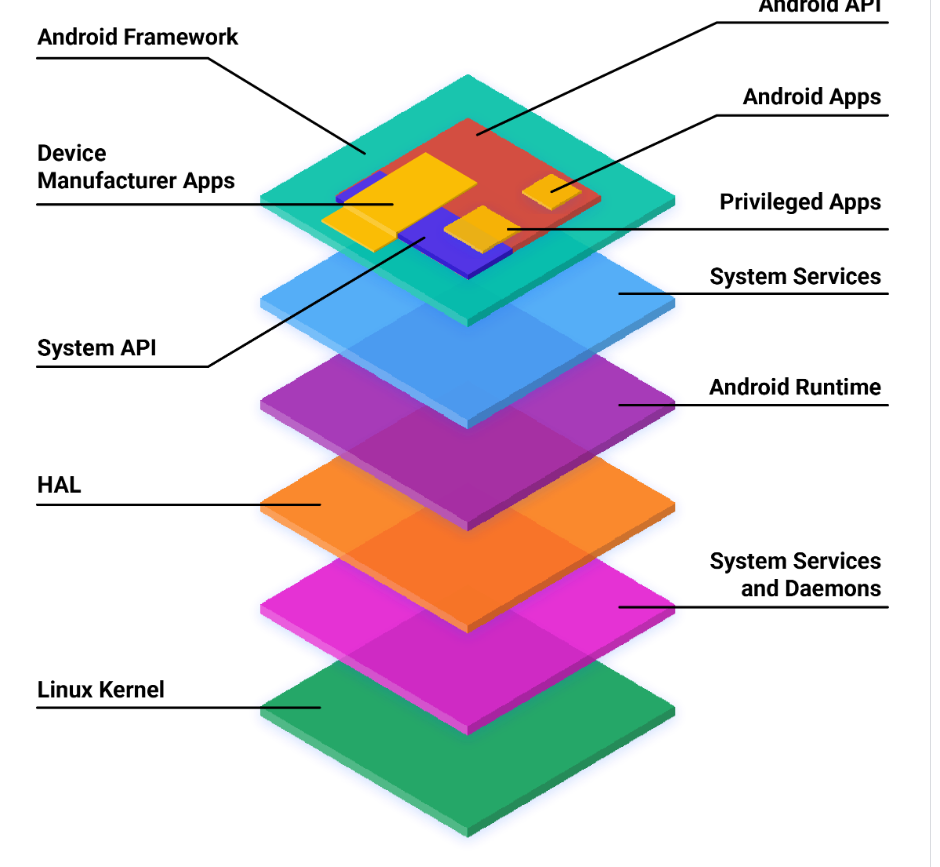
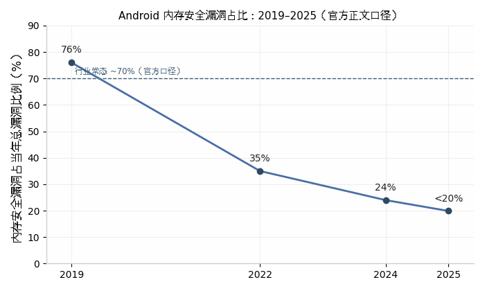

# Rust 在 Android 中的落地：AOSP 引入路径全景调研

（基于官方来源的调研报告，截至 2026 年 8 月）

本报告是一份基于官方来源的调研，主题只有一个：Rust 在 Android 开源项目（Android Open Source Project, AOSP）中是如何落地的——Google 从哪一年、以什么方式把 Rust 引入平台，哪些组件已经用 Rust 编写，实际收益与代价如何。所有关键结论以 source.android.com、Google 安全博客和 AOSP 代码库等官方来源为准，调研截至 2026 年 8 月。报告共七章，依次覆盖架构位置、引入动机与策略、六年时间线、模块全景与代码规模、标志性模块深度分析、构建工程体系，最后给出收益评估与结论。

## 1. AOSP 架构与 Rust 的位置

本章先交代 Android 的分层架构，再定位 Rust 在其中的覆盖范围。

### 1.1 Android 平台分层架构

#### 1.1.1 官方架构总览

AOSP 官方文档《Architecture overview》把软件堆栈自上而下划分为七层 [(davthecoder)](https://www.davthecoder.com/blog/rust-on-android-how-to-use-it-debug-it-and-why) ：

- **应用层（Apps）**：分为 Android Apps（仅用公开 Android API）、Privileged Apps（可用 System API，须预装）和 Device Manufacturer Apps（可访问框架内部不稳定 API）。
- **Android Framework**：应用所依赖的 Java 类、接口与预编译代码，公开部分是 Android API，OEM 专用部分是 System API。框架代码运行在应用进程内。
- **系统服务（System Services）**：模块化系统组件，如 `system_server`、SurfaceFlinger、MediaService，框架 API 通过它们访问底层硬件。
- **Android Runtime（ART）**：AOSP 自带的 Java/Kotlin 运行时，负责把应用字节码翻译为处理器指令执行。
- **硬件抽象层（Hardware Abstraction Layer, HAL）**：硬件厂商实现的标准接口层，使上层不感知驱动细节；修改 HAL 不影响上层系统。
- **Native 守护进程与库**：直接与内核交互的守护进程（`init`、`healthd`、`logd`、`storaged`）和原生库（`libc`、`liblog`、`libutils`、`libbinder`、`libselinux`），不依赖 HAL。
- **Linux 内核**：操作系统核心，与设备硬件直接通信；AOSP 内核尽量拆分为硬件无关的通用内核镜像（Generic Kernel Image, GKI）模块与厂商专有模块。

*图 1：AOSP 软件堆栈架构。来源：source.android.com《Architecture overview》（页面最后更新 2026-06-17）。 [(davthecoder)](https://www.davthecoder.com/blog/rust-on-android-how-to-use-it-debug-it-and-why) *

从实现语言看，这张图可以切成两半：ART 及以上（Framework、应用）由 Java/Kotlin 主导，内存由 ART 托管；ART 及以下（Native 库与守护进程、HAL、内核）是 C/C++ 的世界，内存由开发者手工管理。

#### 1.1.2 内存不安全代码集中在哪里

漏洞分布与语言分布高度重合。Google 安全团队 2021 年公布的数据：内存安全类 bug（越界读写、use-after-free 等）长期占 Android 高危安全漏洞的 70% 左右 [(The Keyword)](https://blog.google/security/rust-in-android-move-fast-fix-things/) 。这些漏洞几乎全部产自 C/C++ 代码，也就是架构图下半部分的三层——Native 守护进程与库、HAL、内核。

原因很直接。Java/Kotlin 由 ART 托管内存，官方说法是"Android OS 大量使用 Java，有效保护了平台的大部分区域免受内存 bug 影响" [(The Keyword)](https://blog.google/security/rust-in-android-move-fast-fix-things/) 。但托管语言到不了 OS 底层：ART 本身是 native 代码，内核、驱动、HAL、系统守护进程必须直接管理内存和硬件，这些位置只能用系统级语言。官方原话是："对 OS 的更低层，Java 和 Kotlin 不可行" [(The Keyword)](https://blog.google/security/rust-in-android-move-fast-fix-things/) 。于是平台的攻击面集中在 C/C++ 层，而这恰是沙箱穿透、提权类漏洞的重灾区——Native 服务以高权限运行并直接处理不可信输入（网络数据、媒体文件、Binder 调用）。

这就是 Rust 进场的具体位置：不是替代 Java/Kotlin，而是在托管语言够不着、C/C++ 又频频出事的那几层，提供一门有编译期内存安全保证的系统语言。

### 1.2 Rust 在架构中的位置

#### 1.2.1 官方定位

AOSP 官方文档《Android Rust introduction》的表述是："Android 平台支持用 Rust 开发**原生操作系统组件**（native OS components）"，看重的是"与 C/C++ 等价的性能"加"内存安全保证"——编译期的生命周期与所有权检查加上运行时内存访问检查，不需要垃圾回收器 [(Slashdot)](https://tech.slashdot.org/story/22/12/01/2124259/google-reports-decline-in-android-memory-safety-vulnerabilities-as-rust-usage-grows) 。

两个边界划得很清楚。向上：应用开发语言维持 Kotlin/Java/C/C++ 不变，官方没有发布 Rust NDK 的计划，Rust 不进入应用层和 Java Framework [(The Keyword)](https://blog.google/security/rust-in-android-move-fast-fix-things/) 。向后：不重写存量 C/C++ 代码——官方理由是数千万行代码重写不可行，且约半数内存 bug 出现在不到一年的新代码里，因此内存安全投入集中在新开发代码上 [(The Keyword)](https://blog.google/security/rust-in-android-move-fast-fix-things/) 。构建层面，Soong 构建系统提供与 `cc_*` 对等的 `rust_binary`、`rust_library`、`rust_ffi`（供 C/C++ 调用的库）、`rust_bindgen` 等一等模块类型 [(byteiota.com)](https://byteiota.com/android-rust-memory-safety-bugs-below-20-first-time/) ；AIDL（Android 接口定义语言，HAL 与系统服务的 Binder IPC 接口）自 Android 12 起提供 Rust 后端，基于 `libbinder_ndk` 之上的 `libbinder_rs`，Rust 可以直接实现并注册 Binder 服务 [(defense.gov)](https://media.defense.gov/2025/Jun/23/2003742198/-1/-1/0/CSI_MEMORY_SAFE_LANGUAGES_REDUCING_VULNERABILITIES_IN_MODERN_SOFTWARE_DEVELOPMENT.PDF) 。

#### 1.2.2 垂直贯通：从固件到系统服务

到 2025 年，Rust 在 AOSP 已不止于 native 用户态，而是沿整个软件栈纵向贯通。自下而上：

- **固件**：Android 虚拟化框架（Android Virtualization Framework, AVF）中，受保护虚拟机（pVM）上运行的第一段代码 pvmfw 是 Rust 编写的裸机固件，负责验证载荷并派生每 VM 密钥 [(foresiet.com)](https://foresiet.com/blog/google-adopts-rust-reducing-android-memory-vulnerabilities-by-52/) ；同一框架的虚拟机监视器 crosvm 同样以 Rust 编写 [(foresiet.com)](https://foresiet.com/blog/google-adopts-rust-reducing-android-memory-vulnerabilities-by-52/) 。官方 2024 年明确把内存安全语言扩展到"底层固件（含 Trusty apps）"，推荐用薄 Rust shim 替换现有 C 功能 [(Internshala Trainings)](https://trainings.internshala.com/blog/android-architecture/) 。
- **内核**：Google 自 2021 年起支持 Rust for Linux 工作 [(foresiet.com)](https://foresiet.com/blog/googles-transition-to-rust-programming-reduces-android-memory-vulnerabilities-by-52) ；2025 年 11 月官方确认，Android 的 6.12 内核是首个启用 Rust 支持的内核，并随 Android 16 出货首个生产级 Rust 驱动 [(9to5Google)](https://9to5google.com/2022/12/01/android-memory-safety-rust/) （多方佐证指向 ashmem 匿名共享内存子系统的 Rust 重写；Binder 驱动的 Rust 实现 rust_binder 也已进入上游内核）。
- **Native 服务**：Android 13 起，Keystore2（密钥材料守护进程）、DNS over HTTPS 解析、UWB 栈等一批系统组件以 Rust 交付 [(byteiota.com)](https://byteiota.com/android-rust-adoption-cuts-memory-bugs-below-20/) 。
- **HAL**：AIDL Rust 后端允许用 Rust 实现 HAL 服务 [(defense.gov)](https://media.defense.gov/2025/Jun/23/2003742198/-1/-1/0/CSI_MEMORY_SAFE_LANGUAGES_REDUCING_VULNERABILITIES_IN_MODERN_SOFTWARE_DEVELOPMENT.PDF) ，KeyMint HAL 是代表案例 [(Internshala Trainings)](https://trainings.internshala.com/blog/android-architecture/) 。
- **TEE**：Trusty 可信执行环境中的可信应用（Trusted Application, TA）已用 Rust 编写，官方博文以 KeyMint TA 源码为例；rustc 上游 2024 年 8 月合入 Trusty OS 支持，随 Rust 1.82（2024 年 10 月）发布为 Tier 3 目标平台（`aarch64-unknown-trusty`、`armv7-unknown-trusty`） [(FudzillaFudzilla)](https://fudzilla.com/rust-killing-off-memory-safety-issues-in-android/) 。
- **基带固件**：2026 年 4 月官方披露，Pixel 10 系列的基带 modem 固件集成了 Rust 编写的 DNS 解析器，是首个在 modem 中引入内存安全语言的 Pixel 设备 [(cwipedia)](https://www.cwipedia.in/2020/09/android-architecture-with-diagram.html) 。

这条路径的意义在于：从 bare-metal 固件到内核再到系统服务，整条信任链上的新代码可以用同一门内存安全语言编写。

#### 1.2.3 各架构层 × Rust 落地组件对照

| 架构层 | Rust 覆盖状态 | 代表组件 | 依据 |
|---|---|---|---|
| 应用 / Java Framework | 不涉及（Kotlin/Java 由 ART 托管，无 Rust NDK） | — |  [(The Keyword)](https://blog.google/security/rust-in-android-move-fast-fix-things/)  |
| 系统服务 / Native 守护进程 | 一等支持（Soong `rust_*` 模块、AIDL Rust 后端） | Keystore2、DoH 解析、UWB |  [(byteiota.com)](https://byteiota.com/android-rust-memory-safety-bugs-below-20-first-time/)  |
| Native 库 | `rust_ffi` / `rust_bindgen` 与 C/C++ 双向互操作 | libbinder_rs |  [(byteiota.com)](https://byteiota.com/android-rust-memory-safety-bugs-below-20-first-time/)  |
| HAL | AIDL Rust 后端（Android 12+）；vendor 镜像有限支持 | KeyMint HAL |  [(defense.gov)](https://media.defense.gov/2025/Jun/23/2003742198/-1/-1/0/CSI_MEMORY_SAFE_LANGUAGES_REDUCING_VULNERABILITIES_IN_MODERN_SOFTWARE_DEVELOPMENT.PDF)  |
| Linux 内核 | 6.12 起启用 Rust，随 Android 16 出货首个生产驱动 | ashmem（Rust 重写）、rust_binder |  [(foresiet.com)](https://foresiet.com/blog/googles-transition-to-rust-programming-reduces-android-memory-vulnerabilities-by-52)  |
| 虚拟化（AVF） | VMM 与 pVM 固件均为 Rust | crosvm、pvmfw |  [(foresiet.com)](https://foresiet.com/blog/google-adopts-rust-reducing-android-memory-vulnerabilities-by-52/)  |
| TEE（Trusty） | 可信应用用 Rust 编写；rustc 上游 Tier 3 目标 | KeyMint TA |  [(Internshala Trainings)](https://trainings.internshala.com/blog/android-architecture/)  |
| 基带 / 设备固件 | Pixel 10 起引入 Rust 组件 | hickory DNS 解析器（modem 固件） |  [(cwipedia)](https://www.cwipedia.in/2020/09/android-architecture-with-diagram.html)  |

读这张表要注意三点。第一，覆盖是自下而上的：越靠近硬件，Rust 的落地越晚但越完整——用户态服务 2021 年就有，内核驱动到 2025 年才进生产，基带固件 2026 年才出现第一个案例。第二，"覆盖"不等于"替换"：每一层的策略都是新代码用 Rust、存量 C/C++ 保留，所以表中的组件多为新模块或独立守护进程，而不是对既有大模块的整体重写。第三，例外也很明显：应用层和 Java Framework 被官方明确排除在外，这不是能力问题而是分工问题——托管语言在那两层已经解决了内存安全，Rust 的战场是它们够不到的地方。整体看，Rust 在 AOSP 中的角色不是"又一门可选语言"，而是平台 native 代码的默认安全基线。

## 2. 引入动机与策略：官方怎么说

第 1 章交代了 Rust 在 AOSP 架构中的位置——Native 层及以下。本章回答一个更根本的问题：Google 为什么要在这个位置引入一门新语言，以及为什么策略是"只换增量、不动存量"。所有关键论据均取自 Google 官方安全博客与 AOSP 官方文档，原文摘录附中文转述。

### 2.1 动机：内存安全漏洞的账

#### 2.1.1 官方数据：2019 年 223 个、占 76%，高危漏洞约七成与内存安全相关

Google 在 2021 年 4 月的 Rust 公告中给出动机的一句话总结：

> "Memory safety bugs in C and C++ continue to be the most-difficult-to-address source of incorrectness ... and consistently represent ~70% of Android's high severity security vulnerabilities." [(The Keyword)](https://blog.google/security/rust-in-android-move-fast-fix-things/) 

即：C/C++ 内存安全 bug 长期稳定地占 Android 高危安全漏洞的约 70%，且是最难根治的错误来源。这个 "~70%" 不是一次统计，而是官方反复使用的长期口径。

更具体的原始数字来自 2022 年 12 月的官方回顾：

> "From 2019 to 2022 the annual number of memory safety vulnerabilities dropped from 223 down to 85. ... From 2019 to 2022 it has dropped from 76% down to 35% of Android's total vulnerabilities." [(byteiota.com)](https://byteiota.com/android-rust-adoption-cuts-memory-bugs-below-20/) 

也就是说，2019 年 Android 全年内存安全漏洞 223 个，占当年总漏洞数的 76%。这两个数字是整套策略的基线。需要注意口径：该统计来自 Android 安全公告收录的 critical/high 级别漏洞（含外部漏洞奖励计划报告与内部发现），"76%" 是 2022 年博文回溯 2019 年数据时首次给出的，2019 年当年的博文并未公布这一比例。

AOSP 官方文档的口径略低但更稳健："Memory safety bugs ... account for over 60% of high severity security vulnerabilities and for millions of user-visible crashes." [(ProAndroidDev)](https://proandroiddev.com/android-os-architecture-from-kernel-to-apps-4ed21cfb7be8)  同时文档给出背景规模：以 C/C++/汇编等内存不安全语言编写的原生代码占 Android 平台代码的 70% 以上，并存在于约一半的 Play 商店应用中 [(ProAndroidDev)](https://proandroiddev.com/android-os-architecture-from-kernel-to-apps-4ed21cfb7be8) 。盘子大、占比高、难修复——这三个事实叠加，构成了引入内存安全语言的必要性论证。

#### 2.1.2 漏洞集中在 media、蓝牙等 C/C++ 组件

漏洞不是均匀分布的。2019 年 5 月的官方加固博文直接点名：

> "Most of Android's vulnerabilities occur in the media and bluetooth components. Use-after-free (UAF), integer overflows, and out of bounds (OOB) reads/writes comprise 90% of vulnerabilities with OOB being the most common." [(EyeHunts)](https://tutorial.eyehunts.com/android/android-architecture-platform-architecture/) 

两个信息点：其一，漏洞集中于媒体（Stagefright 一类）和蓝牙组件——这些恰恰是解析不可信输入、长期用 C/C++ 编写、无法放进应用沙箱的底层服务；其二，漏洞类型高度集中，释放后使用（Use-After-Free, UAF）、整数溢出、越界（Out-of-Bounds, OOB）读写三类占全部漏洞的 90%，其中越界最常见。这三类正是 Rust 的所有权模型与边界检查在编译期或运行期系统性消除的类型。漏洞类型与语言特性之间这种几乎一一对应的关系，是 Google 把 Rust 视为"治本"手段的直接依据。后来 Rust 组件的落点（Keystore2、UWB、DoH3、pvmfw 等）也印证了这一点——每一处都是不可信输入进入系统的关口。

### 2.2 为什么选 Rust

#### 2.2.1 官方理由：底层用不了 Java/Kotlin，需要系统语言

Android 应用层早已用 Java/Kotlin 解决了内存安全问题——Android 运行时（Android Runtime, ART）代管内存。为什么这套方案不能下沉？2021 年公告的解释是：

> "Managed languages like Java and Kotlin are the best option for Android app development... Unfortunately, for the lower layers of the OS, Java and Kotlin are not an option. Lower levels of the OS require systems programming languages like C, C++, and Rust. These languages are designed with control and predictability as goals. They provide access to low level system resources and hardware. They are light on resources and have more predictable performance characteristics." [(The Keyword)](https://blog.google/security/rust-in-android-move-fast-fix-things/) 

转述：托管语言依赖运行时环境，而操作系统底层恰恰是要自己构建运行时、直接操作硬件和内存的地方，托管方案在这里不成立。底层需要的是以控制力和可预测性为目标的系统编程语言：能访问底层系统资源与硬件、资源占用低、性能特征可预测。官方没有用 "no GC" 这样的措辞，论证核心是"ART 托管这一前提在 OS 底层不成立"。

除内存安全外，官方还列举了 Rust 在正确性上的附加收益：编译期防止数据竞争、表达能力更强的类型系统、引用与变量默认不可变、标准库用 Result 包装可能失败的调用、强制变量初始化后再使用、更安全的整数处理 [(The Keyword)](https://blog.google/security/rust-in-android-move-fast-fix-things/) 。这些特性针对的正是 C/C++ 代码里反复出现的另一类顽疾——初始化遗漏、错误码被忽略、整数下溢。

在 C、C++、Rust 这个候选集里，Rust 的差异点官方也写得很直白：

> "Rust provides memory safety guarantees by using a combination of compile-time checks to enforce object lifetime/ownership and runtime checks to ensure that memory accesses are valid. This safety is achieved while providing equivalent performance to C and C++." [(The Keyword)](https://blog.google/security/rust-in-android-move-fast-fix-things/) 

编译期的生命周期/所有权检查加运行期的访问有效性检查，换取内存安全保证，且性能与 C/C++ 相当。AOSP 文档的表述更简短："Rust provides memory and thread safety at performance levels similar to C/C++." [(ProAndroidDev)](https://proandroiddev.com/android-os-architecture-from-kernel-to-apps-4ed21cfb7be8)  对系统工程师而言，"性能相当、无运行时依赖"是入场券，"编译期消除整类漏洞"才是被选中的原因。

#### 2.2.2 互操作性：bindgen、cxx 让 Rust 与存量 C/C++ 共存

引入新语言最大的工程风险不是语言本身，而是与数千万行存量代码的边界。Google 在 2021 年 5 月的集成公告中说明了方案：

> "C and C++ modules can depend on Rust cdylib or staticlib producing modules the same way as they would for a C or C++ library... First-class bindgen support makes interfacing with existing C code simple and we have support modules using cxx for tighter integration with C++ code." [(The Hacker News)](https://thehackernews.com/2025/11/rust-adoption-drives-android-memory.html) 

要点有三个：Rust 编译产物（cdylib/staticlib）在 Soong 构建系统中被包装成普通库，C/C++ 模块可以像依赖 C/C++ 库一样依赖它，调用方无感知；bindgen 从 C 头文件自动生成 Rust 绑定，接入存量 C 代码成本低；对 C++ 则用 cxx 桥接，在两侧各保留类型安全的接口。这意味着迁移的粒度可以细到单个模块，不需要整组件重写，也不存在"全有或全无"的切换点。互操作能力直接支撑了 2.3 节的增量策略。

### 2.3 策略核心：只盯新代码，不重写旧代码

#### 2.3.1 官方原话：重写几千万行不可行

2021 年公告用一个独立小节（"But what about all that existing C++?"）把态度说死：

> "Of course, introducing a new programming language does nothing to address bugs in our existing C/C++ code. Even if we redirected the efforts of every software engineer on the Android team, rewriting tens of millions of lines of code is simply not feasible." [(The Keyword)](https://blog.google/security/rust-in-android-move-fast-fix-things/) 

引入新语言对存量 C/C++ 中的 bug 没有任何作用；即使把 Android 团队全部工程师调去重写几千万行代码，也不可行。2022 年 Android 13 的博文把目标表述得更明确：

> "As we noted in the original announcement, our goal is not to convert existing C/C++ to Rust, but rather to shift development of new code to memory safe languages over time." [(byteiota.com)](https://byteiota.com/android-rust-adoption-cuts-memory-bugs-below-20/) 

目标不是转换存量，而是让新代码随时间逐步转向内存安全语言。AOSP 官方文档落为正式表述：Rust 将成为多数新原生项目的首选（"the preferred choice for most new native projects"），同时与内存安全工具互补 [(ProAndroidDev)](https://proandroiddev.com/android-os-architecture-from-kernel-to-apps-4ed21cfb7be8) 。

#### 2.3.2 依据：漏洞随代码年龄指数衰减

"不重写"不是拍脑袋的妥协，背后有一组实证数据。Android 团队 2021 年的内部分析发现：

> "Most of our memory bugs occur in new or recently modified code, with about 50% being less than a year old." [(The Keyword)](https://blog.google/security/rust-in-android-move-fast-fix-things/) 

约半数内存 bug 的"年龄"（从引入到被发现）不足一年——漏洞压倒性地集中在新写的或刚改过的代码里。2024 年 9 月的官方博文把这一观察推广为正式结论，并援引 USENIX Security 2022 上发表的漏洞寿命大规模研究作为独立佐证：

> "The answer lies in an important observation: vulnerabilities decay exponentially. They have a half-life. ... 5-year-old code has a 3.4x (using lifetimes from the study) to 7.4x (using lifetimes observed in Android and Chromium) lower vulnerability density than new code." [(DirectDefense)](https://www.directdefense.com/assessing-memory-safety-in-programming-languages-like-rust-and-go/) 

漏洞呈指数衰减、存在"半衰期"：5 年旧的代码，其漏洞密度比新代码低 3.4 倍（按该研究的漏洞寿命数据）到 7.4 倍（按 Android 与 Chromium 实际观测）。博文由此得出两条策略结论："The problem is overwhelmingly with new code"（问题压倒性地在新代码）与"Code matures and gets safer with time, exponentially, making the returns on investments like rewrites diminish over time"（代码随时间指数级变安全，重写旧代码的投入回报随代码老化递减） [(DirectDefense)](https://www.directdefense.com/assessing-memory-safety-in-programming-languages-like-rust-and-go/) 。

这套推理把"重写"从工程问题变成了经济问题：旧代码即使不动，漏洞密度也在自然衰减，重写的收益低、风险高；新代码是漏洞的主要来源，把新代码换成 Rust 的边际成本接近零，收益却覆盖漏洞最密集的部分。这是整个"只盯新代码"策略的决策内核。另外，Android 自己的观测（2021 年）早于 USENIX 那篇论文（2022 年），官方是先有实践结论、后获学术佐证。

#### 2.3.3 Safe Coding 与纵深防御：Rust 降密度，Scudo 等兜底

2024 年博文把这套方法命名为 Safe Coding：

> "The foundation of this shift is Safe Coding, which enforces security invariants directly into the development platform through language features, static analysis, and API design." [(DirectDefense)](https://www.directdefense.com/assessing-memory-safety-in-programming-languages-like-rust-and-go/) 

即把安全不变量直接内建到开发平台中——通过语言特性、静态分析和 API 设计，让"意外引入漏洞"在结构上不可能，而不是依赖开发者遵守安全编码规范。官方将其定位为内存安全治理的第四代：前三代（被动打补丁、主动利用缓解、主动漏洞发现/fuzzing）不可扩展且成本持续上升，Safe Coding 才是"从源头消除" [(DirectDefense)](https://www.directdefense.com/assessing-memory-safety-in-programming-languages-like-rust-and-go/) 。

但 Safe Coding 不替代缓解措施，两者是分层关系。对存量 C/C++，Google 继续部署 Scudo 加固分配器、HWASAN、GWP-ASAN、KFENCE 并扩大 fuzzing 覆盖 [(byteiota.com)](https://byteiota.com/android-rust-adoption-cuts-memory-bugs-below-20/) ；官方同时明确指出，这些工具单独无法解释漏洞结构的转变，语言迁移才是主因 [(byteiota.com)](https://byteiota.com/android-rust-adoption-cuts-memory-bugs-below-20/) 。2025 年 11 月的博文用一次"未遂事件"（near-miss）展示了分层如何协作：Rust 编写的 AVIF 解析器 CrabbyAVIF 中出现一个线性缓冲区溢出（CVE-2025-48530，2025 年 8 月安全公告定级为 System 组件 Critical 级远程代码执行） [(9to5Google)](https://9to5google.com/2022/12/01/android-memory-safety-rust/) ，但 Scudo 在二级分配周围布置的 guard page 确定性地使该漏洞不可利用，并把静默内存破坏变成有噪声的崩溃，漏洞在发布前即被捕获修复，从未进入公开版本 [(9to5Google)](https://9to5google.com/2022/12/01/android-memory-safety-rust/) 。Rust 把漏洞密度压低，缓解措施兜住漏网之鱼——这是官方对两者关系的实际定位。

### 2.4 unsafe Rust 的官方态度

#### 2.4.1 约 4% 代码在 unsafe 块中；官方驳斥"unsafe 比 C 更危险"

unsafe 是社区对 Rust 落地最常见的质疑点：如果代码里还有 unsafe，安全保证是否打折？2025 年 11 月的官方博文正面回应，先给出规模：

> "The primary security concern regarding Rust generally centers on the approximately 4% of code written within unsafe{} blocks. This subset of Rust has fueled significant speculation, misconceptions, and even theories that unsafe Rust might be more buggy than C. Empirical evidence shows this to be quite wrong." [(9to5Google)](https://9to5google.com/2022/12/01/android-memory-safety-rust/) 

约 4% 的 Rust 代码位于 unsafe{} 块中；针对"unsafe Rust 可能比 C 更多 bug"的猜测，官方用实证数据直接否定。论证分三层。其一，"unsafe{} doesn't actually disable all or even most of Rust's safety checks"——unsafe 只放开了解引用裸指针等少数操作，借用检查、类型检查等绝大多数安全检查仍然生效，把它理解为"关掉安全"是常见误解。其二，封装带来局部推理：unsafe 代码被包在安全抽象之内，审查者只需在抽象边界内验证安全不变量，不必通读全模块。其三，unsafe 块受到额外审查，实际风险反而被压低。官方甚至给出一个保守上界：即使假设一行 unsafe Rust 与一行 C/C++ 同样容易出错，这个假设也显著高估了 unsafe 的实际风险 [(9to5Google)](https://9to5google.com/2022/12/01/android-memory-safety-rust/) 。更早的实证来自 Android 13 的 UWB 协议栈——整个栈仅两处 unsafe，而对这两处的额外审查反而帮助发现了一个潜在竞态条件 [(byteiota.com)](https://byteiota.com/android-rust-adoption-cuts-memory-bugs-below-20/) 。

对"能不能干脆禁掉 unsafe"，官方态度同样明确：操作系统开发离不开 unsafe 代码（FFI、硬件交互），"simply banning unsafe code is not workable" [(9to5Google)](https://9to5google.com/2022/12/01/android-memory-safety-rust/) 。可行路径是让开发者正确、负责地使用它——Google 为此在 Comprehensive Rust 培训中新增了 unsafe 专题，覆盖 soundness、未定义行为（Undefined Behavior, UB）、safety comment 规范以及如何封装为安全抽象 [(9to5Google)](https://9to5google.com/2022/12/01/android-memory-safety-rust/) 。归结起来，官方把 unsafe 当作需要工程纪律管理的必要手段，而不是需要消灭的污点。

## 3. 时间线：六年引入路径

第 2 章回答了 Google 为什么引入 Rust、为什么策略是"只换增量、不动存量"；本章回答这条策略是怎样一步步执行的。Rust 进入 AOSP 不是一次宣布、一夜落地，而是一条从 2019 年内部启动、到 2026 年铺进基带固件的长路径。把官方公告、版本发布和代码考古放在一起看，主线很清楚：先是平台 native 层（蓝牙、Keystore），再到 HAL 和可信执行环境（TEE），然后下探到裸机固件（pvmfw），再进入内核（驱动、Binder），最后外溢到第一方应用和 Pixel 基带。每一层的进入都以官方公开发文或版本落地为标记，本章按时间顺序复盘。

### 3.1 起步期（2019–2020）

#### 3.1.1 2019 年内部启动与最早的两个组件

官方口径中，Android 团队"自 2019 年起"开始向 AOSP 引入 Rust，作为平台原生代码的内存安全替代方案 [(The Hacker News)](https://thehackernews.com/2025/11/rust-adoption-drives-android-memory.html) ；2021 年 4 月的公告则说"过去 18 个月我们一直在为 AOSP 添加 Rust 支持"，倒推同样是 2019 年底 [(The Keyword)](https://blog.google/security/rust-in-android-move-fast-fix-things/) 。两个独立表述互证，起点可以定在 2019 年。需要纠偏一点：2019 年 5 月 Google 的内存安全加固博文《Queue the Hardening Enhancements》全文未提 Rust [(OSCHINA)](https://www.oschina.net/news/220538/memory-safe-languages-in) ，"2019 年官方公开表态 Rust"是后来的误传，当年的工作全部在水面下。

代码考古给出了更硬的证据。AOSP 的 Rust 预置工具链仓库 `platform/prebuilts/rust` 在 Android 10 的全部 tag 下不存在，在 Android 11.0.0_r1 中的最早快照提交日期是 2020-02-12 [(LWN.net)](https://lwn.net/Articles/1046397/) 。也就是说工具链进入主分支的时间窗口是 2019 年 9 月到 2020 年 2 月，与官方自述吻合。2020 年 9 月 Android 11 发布时，Rust 工具链已随源码树就位。

最早开始用 Rust 的平台组件是蓝牙。新蓝牙栈 Gabeldorsche（GD）至少自 2019 年初就在开发，2020 年 2 月随 Android 11 首个开发者预览版被外界发现，以开发者选项形式存在、默认关闭 [(thecybersyrup.com)](https://www.thecybersyrup.com/p/google-reports-major-drop-in-android-memory-safety-flaws-after-adopting-rust) 。但要精确表述：GD 的主体是 C++17 代码库，Rust 只在其底层子目录 `system/gd/rust`（topshim 等组件）中，且以 staticlib 方式链入 C++，设备上还需显式开关才启用 [(free domain names since 1996)](https://www.mayrhofer.eu.org/courses/android-security/selected-paper/2024/Prototyping__protected__VMs_with_AVF.pdf) 。2021 年媒体所称"GD 用 Rust 完整重写"与代码事实不符，官方也从未把蓝牙列入 Rust 组件清单。它是"最早开始使用 Rust 的组件"，不是"第一个纯 Rust 组件"。

#### 3.1.2 2021 年 2 月：官方首次点名已有 Rust 代码

官方公开文字的递进很有层次。2021 年 1 月，《Data driven security hardening in Android》给出关键背景数据——约 70% 的高危漏洞是内存安全问题——但只提到"参与 Rust 外部生态项目"，未承认 Android 自身在用 [(Bing)](https://www.bing.com/ck/a?!=&fclid=23298e6f-62ba-6bfb-090c-9b9763636af9&hsh=4&ntb=1&p=e3fea032146cadb000d39ee9c9ff81d5979e38a20dfc43d3911bf7edb1c9f889JmltdHM9MTc0ODIxNzYwMA&ptn=3&u=a1aHR0cHM6Ly9zb3VyY2UuYW5kcm9pZC5jb20vZG9jcy9jb3JlL3ZpcnR1YWxpemF0aW9u&ver=2) 。真正的首次点名是 2021 年 2 月 8 日：Google 宣布加入 Rust 基金会，工程总监 Lars Bergstrom 在博文中明确列出"Android 操作系统模块，包括蓝牙和 Keystore 2.0"已经在使用 Rust，并附上了对应仓库中 .rs 文件的查询链接 [(Github)](https://github.com/ProjectEverest-AOSP/packages_modules_Virtualization/blob/15/pvmfw/README.md) 。这篇博文比 4 月的正式宣布早了两个月，是 Google 官方首次公开确认 Android 平台内已有 Rust 代码。两个被点名的组件正好代表两类落点：蓝牙是外部输入密集的攻击面，Keystore 是密钥材料所在的信任根。

### 3.2 平台支持期（2021）

#### 3.2.1 官方公告与 Soong 集成

2021 年 4 月 6 日，Google Security Blog 发表《Rust in the Android platform》，正式宣布 AOSP 支持用 Rust 开发操作系统本身，同时划清边界：Java/Kotlin 继续管应用层和框架层，Rust 补的是它们够不着的 OS 底层 [(The Keyword)](https://blog.google/security/rust-in-android-move-fast-fix-things/) 。5 月 11 日的《Integrating Rust Into the AOSP》公开了工程细节：Rust 支持落在 Soong 构建系统中，不用 Cargo 做顶层构建，提供 `rust_binary`、`rust_library`、`rust_ffi` 等模块类型 [(The Hacker News)](https://thehackernews.com/2025/11/rust-adoption-drives-android-memory.html) 。6 月又补了一篇 Rust/C++ 互操作文章，透露相关评估完成于"一年多以前"，再次把时间锚在 2019 年底。三篇连发，把动机、构建集成和互操作策略一次讲透，这是平台支持期的工作方式：先把基础设施和口径全部公开，再谈规模。

#### 3.2.2 Android 12：首个官方支持 Rust 的版本

2021 年 10 月 4 日，Android 12 源码推入 AOSP 并正式发布 [(Github)](https://github.com/yaap/packages_modules_Virtualization/blob/fourteen/pvmfw/README.md) 。官方次年回溯确认："在 Android 12 中我们宣布了 Android 平台对 Rust 的支持" [(byteiota.com)](https://byteiota.com/android-rust-adoption-cuts-memory-bugs-below-20/) ——Android 12 因此成为首个以官方平台语言身份承载 Rust 的版本。随版落地的代表组件是 Keystore 2.0：keystore2 守护进程用 Rust 编写，随 Android 12（API 31）引入，取代了旧的 C++ keystore 守护进程。注意 GD 蓝牙栈此时仍是开发者选项，到 Android 13 才默认启用且仅覆盖到扫描层 [(ReversingLabs)](https://www.reversinglabs.com/blog/rust-geared-up-for-bare-metal-3-key-mobile-security-benefits) 。这个阶段 Rust 的位置很明确：平台 native 层的新组件，逐个落点，没有规模数据公布。

### 3.3 扩展期（2022–2024）

#### 3.3.1 Android 13：规模数据首次公开

2022 年 12 月 1 日，官方发表《Memory Safe Languages in Android 13》，第一次给出规模数字：Android 13 全部新增原生代码（C/C++/Rust）中约 21% 是 Rust；AOSP 内 Rust 代码累计约 150 万行；Android 13 成为首个新增代码以内存安全语言为主的版本 [(byteiota.com)](https://byteiota.com/android-rust-adoption-cuts-memory-bugs-below-20/) 。官方点名的组件清单是 Keystore2、新的超宽带（Ultra-Wideband, UWB）协议栈、DNS-over-HTTP/3（DoH3）和 Android 虚拟化框架（Android Virtualization Framework, AVF）——清一色的底层系统组件，都是"不写 Rust 就得写 C++"的位置。同一篇博文还宣布：截至目前，Android 的 Rust 代码中发现的内存安全漏洞为零；内存安全漏洞总数从 2019 年的 223 个降到 2022 年的 85 个，占比从 76% 降到 35%，2022 年是内存安全漏洞首次不占多数的年份 [(byteiota.com)](https://byteiota.com/android-rust-adoption-cuts-memory-bugs-below-20/) 。这篇博文还预告了下一步：用户态 HAL 用 Rust 实现、Trusty 可信应用增加 Rust 支持、AVF 的虚拟机固件已迁移到 Rust、借 Linux 6.1 的 Rust 支持进入内核驱动 [(byteiota.com)](https://byteiota.com/android-rust-adoption-cuts-memory-bugs-below-20/) ——这四条预告精确对应了后两年的实际落地。

#### 3.3.2 Android 14：下探到固件与 TEE

2023 年 10 月 9 日，《Bare-metal Rust in Android》公布了两件事。其一，AVF 保护虚拟机（pVM）的固件 pvmfw 已用 Rust 重写，取代原先基于 U-Boot 的实现，为 pVM 信任根提供内存安全基础，随 Android 14 发布 [(Internshala Trainings)](https://trainings.internshala.com/blog/android-architecture/) 。其二，Trusty（Pixel 等设备使用的开源 TEE）团队为 Rust 编写的可信应用（Trusted Application, TA）增加了支持，参考实现的 KeyMint TA 已用 Rust 完成 [(Internshala Trainings)](https://trainings.internshala.com/blog/android-architecture/) 。12 月的 AVF 官方博客显示框架本身在成熟：Android 14 向特权应用开放 AVF 系统 API，提供 hypervisor 供应商模块，Microdroid 虚拟机的启动速度提升至 Android 13 的两倍、内存占用减半 [(lpc.events)](https://lpc.events/event/16/contributions/1330/attachments/961/1882/LPC2022%20-%20Android%20Virtualization%20Framework%20.pdf) 。这一年 Rust 的位置从 Linux 用户态下探到了裸机和 TEE——这是比 native 服务更靠近硬件、历史上几乎只有 C 的地带。

#### 3.3.3 2024：漏洞占比 24%，内核通路打通

2024 年 9 月 25 日，官方更新数据：内存安全漏洞占 Android 总漏洞的比例降至 24%（2019 年为 76%），显著低于约 70% 的行业常态 [(DirectDefense)](https://www.directdefense.com/assessing-memory-safety-in-programming-languages-like-rust-and-go/) 。同年 10 月，上游 Rust 1.82 新增 aarch64/armv7 的 Trusty 目标（Tier 3），Trusty 可信应用的 Rust 工具链支持正式落地，承接 2023 年的官宣 [(Github)](https://github.com/GrapheneOS/platform_packages_modules_Virtualization) 。内核侧的关键铺垫是 Linux 6.1（2022 年 12 月发布）：它合入了首批 Rust 基础设施约 1.25 万行，是 Linux 内核三十余年首次接受 C 以外的语言 [(Bing)](https://www.bing.com/ck/a?!=&fclid=1a93acd1-f61a-62e2-06aa-b929f7f7632d&hsh=4&ntb=1&p=8957816eff7681b60e246a53fd006044acfb9be0f9c2c17ff656128be4d5501dJmltdHM9MTc0ODEzMTIwMA&psq=Android AVF 虚拟化架构 技术实现&ptn=3&u=a1aHR0cHM6Ly9zb3VyY2UuYW5kcm9pZC5jb20vZG9jcy9jb3JlL3ZpcnR1YWxpemF0aW9u&ver=2) ；Google Android 团队自 2021 年 4 月起就公开推动 Rust for Linux，并明确把 6.1 的合入视为"把内存安全带入内核、从驱动开始"的前提 [(foresiet.com)](https://foresiet.com/blog/googles-transition-to-rust-programming-reduces-android-memory-vulnerabilities-by-52) 。需要校准的是：2024 年内 Android 生产内核中尚无 Rust 驱动，首个量产 Rust 驱动要到 2025 年随 Android 16 的 6.12 内核到来 [(9to5Google)](https://9to5google.com/2022/12/01/android-memory-safety-rust/) 。这个阶段内核侧是基础设施和预研，不是量产。

### 3.4 全栈期（2025–2026）

#### 3.4.1 2025：500 万行、占比破 20%、首个生产 Rust 内核驱动

2025 年 11 月 13 日的官方博文《Rust in Android: move fast and fix things》给出了一组拐点数据。规模上，Android 平台 Rust 代码约 500 万行，三年增长超过两倍；安全上，内存安全漏洞占比首次跌破 20%，绝对数从 2019 年的 223 个降到 2024 年的不足 50 个；密度上，Rust 估算为 0.2 个/百万行，对比 C/C++ 历史约 1000 个/百万行，差距超过 1000 倍 [(9to5Google)](https://9to5google.com/2022/12/01/android-memory-safety-rust/) 。内核上，Android 的 6.12 内核成为首个启用 Rust 支持、并承载首个生产级 Rust 驱动的内核——官方博文未点名该驱动，LPC 2025 的 Rust for Linux 幻灯片和 LWN 对内核维护者峰会的报道确认它是 ashmem（匿名共享内存子系统）的 Rust 重写，随 Android 16 出货，运行在数百万台设备上 [(9to5Google)](https://9to5google.com/2022/12/01/android-memory-safety-rust/) 。采用曲线上，官方图表显示 2025 年前三季度第一方净新增 Rust 代码首次超过净新增 C++ [(9to5Google)](https://9to5google.com/2022/12/01/android-memory-safety-rust/) ——"新代码默认 Rust"从策略变成了既成事实。

上图数据全部取自官方博文正文口径：内存安全漏洞占 Android 当年总漏洞（安全公告 critical/high 严重度、VRP 及内部报告）的比例，2019 年 76% 与 2022 年 35% 出自 2022 年 12 月博文，2024 年 24% 出自 2024 年 9 月博文，2025 年"低于 20%"出自 2025 年 11 月博文 [(byteiota.com)](https://byteiota.com/android-rust-adoption-cuts-memory-bugs-below-20/) 。两点注意：一是 2025 年数据发布时距年底两个月，官方说明因 90 天补丁窗口，结果"非常接近最终值"；二是官方正文只给了这四个年份的占比数字，2020、2021、2023 年的中间值仅存在于官方图表图片中，故本图不画中间点。下降曲线与 Rust 代码量的增长曲线（2022 年 150 万行 → 2025 年约 500 万行）在时间上重合，这正是第 2 章"只盯新代码"策略预期的效果：新增攻击面被内存安全语言接管，存量 C/C++ 随时间自然老化。

#### 3.4.2 2025 年 10 月：rust_binder 合入 Linux 6.18 上游

Android 进程间通信的核心 Binder，其内核驱动的 Rust 重写版 rust_binder 于 2025 年 9 月中旬（约 18–21 日）进入 char-misc-next 分支，10 月 7 日随 char/misc pull request 合入 6.18 合并窗口，10 月 12 日随 v6.18-rc1 正式进入上游主线，合入提交为 `eafedbc7c050` [(Github)](https://github.com/Smacksmack206/P9Debian) 。C 与 Rust 两个实现将在内核中并存数个发布周期，由构建选项切换。该驱动最初由 Wedson Almeida Filho 撰写，现由 Google 工程师 Alice Ryhl 维护 [(Github)](https://github.com/Smacksmack206/P9Debian) 。Binder 是 Android 攻击面最关键的内核组件之一，选它做重写目标与官方"按漏洞密度选点"的逻辑一致。也要如实记录后续：2025 年 12 月，rust_binder 出现了主线内核首个分配给 Rust 代码的 CVE-2025-68260（死亡通知链表的竞态，可导致内核崩溃，无提权证据），修复于 6.18.1 [(Github)](https://github.com/CGCL-codes/Rattrap) 。这不推翻密度结论，但说明 Rust 消除的是内存安全这一类漏洞，不是并发逻辑缺陷。

#### 3.4.3 2025 年 11 月：官方公布工程效率数据

同一篇 11 月博文还给出了采用 Rust 后的工程效率对比，口径为第一方中大型变更：Rust 变更的回滚率约为 C++ 的四分之一；代码评审时间少约 25%；同等规模变更所需修改轮次少约 20%，且这一趋势自 2023 年起保持一致 [(9to5Google)](https://9to5google.com/2022/12/01/android-memory-safety-rust/) 。这组数据的意义在于论证重心的转移：前六年官方叙事是"Rust 让我们更安全"，从 2025 年起变成了"更安全的路恰好也是更快的路"。安全性是引入理由，交付效率才是它能成为默认语言的理由。

#### 3.4.4 2026：基带固件与 Chromium 编解码

2026 年 4 月 10 日，Pixel 团队发表《Bringing Rust to the Pixel Baseband》：Pixel 10 系列的基带 modem 固件中集成了一个 Rust 编写的 DNS 解析器（基于 hickory-proto crate 改造为 no_std 裸机环境，新增代码约 371 KB），Pixel 10 由此成为首个在 modem 中引入内存安全语言的 Pixel 设备 [(cwipedia)](https://www.cwipedia.in/2020/09/android-architecture-with-diagram.html) 。基带固件是手机上历史漏洞最密集、更新最难的组件之一，Project Zero 此前演示过对 Pixel modem 的远程代码执行——这是 Rust 路径上最靠外、也最难进的一层。同期，与 AOSP 共享生态的 Chromium 把图像编解码的 Rust 化从单点扩成体系：截至 2026 年 7 月，PNG、BMP、AVIF 的解析已用 Rust 出货（AVIF 容器解析用的正是 AOSP 也引入的 CrabbyAVIF），ICO、JPEG 在进行中 [(Android 开源项目)](https://source.android.google.cn/docs/core/virtualization?hl=en) 。

#### 3.4.5 完整时间线

| 时间 | 版本/节点 | 落地位置 | 组件/事件 |
|---|---|---|---|
| 2019 | — | 内部启动 | Android 团队开始为 AOSP 引入 Rust；Gabeldorsche 蓝牙栈开始用 Rust 开发底层组件 [(The Hacker News)](https://thehackernews.com/2025/11/rust-adoption-drives-android-memory.html)  |
| 2020-02 | Android 11 开发分支 | 构建系统 | Rust 预置工具链（`prebuilts/rust`）进入 AOSP master [(LWN.net)](https://lwn.net/Articles/1046397/)  |
| 2020-09 | Android 11 | 平台 native | Gabeldorsche 以开发者选项随版发布（默认关闭） [(thecybersyrup.com)](https://www.thecybersyrup.com/p/google-reports-major-drop-in-android-memory-safety-flaws-after-adopting-rust)  |
| 2021-02-08 | — | 平台 native | 官方首次点名已有 Rust 代码：蓝牙 + Keystore 2.0 [(Github)](https://github.com/ProjectEverest-AOSP/packages_modules_Virtualization/blob/15/pvmfw/README.md)  |
| 2021-04-06 | — | 平台整体 | 官方宣布 AOSP 支持用 Rust 开发 OS；5 月公开 Soong 集成细节 [(The Keyword)](https://blog.google/security/rust-in-android-move-fast-fix-things/)  |
| 2021-10-04 | Android 12 | 平台 native | 首个官方支持 Rust 的版本；Keystore2 随版落地 [(Github)](https://github.com/yaap/packages_modules_Virtualization/blob/fourteen/pvmfw/README.md)  |
| 2022-08 | Android 13 | native 服务/HAL | UWB 栈、DoH3、AVF 落地；Rust 占新原生代码 21%、AOSP 累计 150 万行；官方宣布 Rust 代码零内存安全漏洞 [(byteiota.com)](https://byteiota.com/android-rust-adoption-cuts-memory-bugs-below-20/)  |
| 2022-12-11 | Linux 6.1 | 内核基础设施 | 首批 Rust 支持合入上游内核，为驱动铺路 [(Bing)](https://www.bing.com/ck/a?!=&fclid=1a93acd1-f61a-62e2-06aa-b929f7f7632d&hsh=4&ntb=1&p=8957816eff7681b60e246a53fd006044acfb9be0f9c2c17ff656128be4d5501dJmltdHM9MTc0ODEzMTIwMA&psq=Android AVF 虚拟化架构 技术实现&ptn=3&u=a1aHR0cHM6Ly9zb3VyY2UuYW5kcm9pZC5jb20vZG9jcy9jb3JlL3ZpcnR1YWxpemF0aW9u&ver=2)  |
| 2023-10-04 | Android 14 | 裸机固件/TEE | pvmfw（Rust pVM 固件）随版发布；Trusty 支持 Rust 可信应用、KeyMint TA Rust 化；AVF 成熟化 [(Internshala Trainings)](https://trainings.internshala.com/blog/android-architecture/)  |
| 2024-09-25 | — | 数据节点 | 内存安全漏洞占比降至 24% [(DirectDefense)](https://www.directdefense.com/assessing-memory-safety-in-programming-languages-like-rust-and-go/)  |
| 2024-10-17 | Rust 1.82 | TEE 工具链 | 上游新增 Trusty 目标（Tier 3），TA 工具链落地 [(Github)](https://github.com/GrapheneOS/platform_packages_modules_Virtualization)  |
| 2025-06 | Android 16 | 内核驱动 | 6.12 内核首个启用 Rust 支持并含首个生产 Rust 驱动 ashmem，随 Android 16 出货 [(9to5Google)](https://9to5google.com/2022/12/01/android-memory-safety-rust/)  |
| 2025-10-12 | Linux 6.18-rc1 | 内核上游 | rust_binder 合入主线，C/Rust 双实现并存 [(Github)](https://github.com/Smacksmack206/P9Debian)  |
| 2025-11-13 | — | 数据节点 | 约 500 万行 Rust；漏洞占比首破 20%；回滚率低 4 倍、评审时间少 25%；净新增 Rust 超净新增 C++ [(9to5Google)](https://9to5google.com/2022/12/01/android-memory-safety-rust/)  |
| 2026-04-10 | Pixel 10 | 基带固件 | modem 固件集成 Rust DNS 解析器（hickory-proto，no_std） [(cwipedia)](https://www.cwipedia.in/2020/09/android-architecture-with-diagram.html)  |
| 2026-07 | Chromium | 第一方应用生态 | PNG/BMP/AVIF 图像解析 Rust 化出货，ICO/JPEG 进行中 [(Android 开源项目)](https://source.android.google.cn/docs/core/virtualization?hl=en)  |

把这张表按列扫一遍，模式就出来了。"落地位置"一列呈单向扩散：平台 native（2021）→ HAL/TEE（2022–2024）→ 裸机固件（2023）→ 内核（2025）→ 基带固件与第一方应用（2025–2026），六年里没有回头，也没有跳层——每一层都是等构建工具链和互操作设施在上一层站稳之后才进入。"组件"一列则显示选点的高度一致：Keystore2、UWB、DoH3、pvmfw、ashmem、rust_binder、基带 DNS，全部是不可信输入直达或信任根所在的位置，没有一个是为了用 Rust 而用 Rust。时间上还有两个错位值得注意：一是数据公布滞后于版本落地约一个季度（Android 13 八月发布、数据十二月公布），二是官方叙事在 2025 年 11 月完成转向——安全数据与效率数据同篇发布，标志着 Rust 在 Android 的身份从"安全团队的防御工具"变成"平台团队的默认语言"。

## 4. 模块全景与代码规模

第 3 章沿时间轴复盘了引入路径，本章换一个切面，从模块角度回答两个问题：AOSP 里哪些模块在用 Rust，各自多大规模。清单只收两类条目：Google 官方点名的，或 AOSP 源码树可直接核实的。第三方 crate 依赖（vendored 进 `external/rust/crates/` 的那些）数量庞大但不算"Android 模块"，只在总量口径中体现。

### 4.1 含 Rust 的模块清单

#### 4.1.1 系统服务类：Keystore2、netd/DoH3、virtualizationservice

Keystore2 是 Android 平台第一个落地的大型 Rust 组件，Android 12 引入，替代旧 C++ keystore 守护进程，负责密钥 blob 存储、授权和 KeyMint HAL 调度，路径在 `system/security/keystore2/` [(byteiota.com)](https://byteiota.com/android-rust-adoption-cuts-memory-bugs-below-20/) 。实测该目录 98 个 `.rs` 文件共约 4.87 万行（含注释、空行、测试；其中 `src/` 守护进程核心约 3.0 万行），另有约 6800 行 C/C++ 兼容层（`km_compat`，用于包装旧 Keymaster 设备） [(youngju.dev)](https://www.youngju.dev/blog/culture/2026-03-22-rust-programming-2025-adoption-guide.en) 。注意 Google 的总方针是"不重写存量 C/C++"，Keystore2 是少数整体重写的例外，原因是它处在"特权进程 + 密钥材料 + 任意应用可触达的 Binder 输入"这个位置 [(byteiota.com)](https://byteiota.com/android-rust-adoption-cuts-memory-bugs-below-20/) 。

DNS-over-HTTP/3（DoH3）实现位于 DNS 解析器 Mainline 模块内（`packages/modules/DnsResolver/doh/`，netd 所在仓库），是第一个进入 Mainline 模块的 Rust 项目，2022 年 7 月起经 Google Play 系统更新推送，覆盖 Android 11 及以上设备 [(synacktiv.com)](https://www.synacktiv.com/en/publications/paint-it-blue-attacking-the-bluetooth-stack) 。HTTP/3/QUIC 层用 Cloudflare 的 quiche 库，查询引擎基于 Tokio 单线程异步；仓库根的 `cbindgen.toml` 表明它通过生成 C 头文件与 netd 的 C++ 部分互操作 [(synacktiv.com)](https://www.synacktiv.com/en/publications/paint-it-blue-attacking-the-bluetooth-stack) 。

virtualizationservice（及配套二进制 virtmgr）是 AVF 的管理面系统服务，管理 pVM 生命周期、把建 VM 的实际工作委派给 crosvm，源码在 `packages/modules/Virtualization/android/virtualizationservice/`，入口为 `main.rs`，是 Rust 实现 [(foresiet.com)](https://foresiet.com/blog/google-adopts-rust-reducing-android-memory-vulnerabilities-by-52/) 。

#### 4.1.2 协议栈类：UWB 栈、DoH3、MLS

Android 13 的全新超宽带（Ultra-Wideband, UWB）协议栈直接用 Rust 写——这是"新代码默认 Rust"策略的典型样本：栈不存在历史包袱，官方明确表示这类底层组件若不用 Rust 就得用 C++ [(byteiota.com)](https://byteiota.com/android-rust-adoption-cuts-memory-bugs-below-20/) 。Rust 核心在 Android 13 分支位于 `packages/modules/Uwb/service/uci/jni/rust/`（UCI 即 UWB Command Interface），全栈仅两处 `unsafe`，都在 JNI 边界 [(byteiota.com)](https://byteiota.com/android-rust-adoption-cuts-memory-bugs-below-20/) 。因为内存安全，UWB 栈得以跑在既有进程内，省去独立沙箱进程的几 MB 内存和 IPC 延迟 [(byteiota.com)](https://byteiota.com/android-rust-adoption-cuts-memory-bugs-below-20/) 。DoH3 同属协议栈类（解析网络侧攻击者可控输入），见 4.1.1。

MLS（Messaging Layer Security，RFC 9420）方面，AOSP `system/security/mls/mls-rs-crypto-boringssl/` 是基于 Rust `mls-rs` 的加密适配层（含 Cargo 元数据，路径已核实，属近年的新组件） [(CSDN博客)](https://blog.csdn.net/nmdbbzcl/article/details/155377226) 。2025 年 11 月官方还披露：MLS 协议实现（用于 RCS 安全消息）已用 Rust 编写，将随 Google Messages 发布；Nearby Presence（蓝牙本地设备发现协议）的 Rust 实现已运行在 Google Play Services 中 [(9to5Google)](https://9to5google.com/2022/12/01/android-memory-safety-rust/) 。这两个属于第一方应用侧，不计入 AOSP 平台代码，但官方把它们算进平台 Rust 战略。

#### 4.1.3 虚拟化类：AVF 全家桶——crosvm、pvmfw、Microdroid

AVF（Android Virtualization Framework）是 AOSP 中 Rust 密度最高的子系统。用户态侧：VMM 用 crosvm（官方文档定义即"用 Rust 编写的虚拟机监视器"，AOSP 位于 `external/crosvm`）；microdroid_manager（pVM 内的生命周期管理器）、authfs（完整性校验文件系统）、compsvc（隔离编译服务）、encryptedstore、zipfuse 等 guest 组件均为 Rust [(foresiet.com)](https://foresiet.com/blog/google-adopts-rust-reducing-android-memory-vulnerabilities-by-52/) 。对 `packages/modules/Virtualization` 仓库的 GitHub 语言统计显示 Rust 占 57%、Java 20.1%、Kotlin 11.2%、C++ 仅 3.5% [(DebugPoint.com)](https://www.debugpoint.com/linux-kernel-6-1/) 。固件侧：pVM 固件 pvmfw 在 Android 14 中用 Rust 重写发布（`#![no_std]` 裸机代码，替代原先基于 U-Boot 的 C 实现），二进制约 460 kB，旧 C 版约 220 kB，但功能更多、整条启动链体积相当 [(Internshala Trainings)](https://trainings.internshala.com/blog/android-architecture/) 。边界要说清：pKVM hypervisor 是 Linux 内核的一部分，是 C 代码，刻意保持小巧；Rust 集中在用户态组件、pvmfw 和 vmbase 等库 [(foresiet.com)](https://foresiet.com/blog/google-adopts-rust-reducing-android-memory-vulnerabilities-by-52/) 。

#### 4.1.4 内核与固件类：ashmem 驱动、rust_binder、pvmfw、Pixel 基带

内核侧有两个。ashmem（匿名共享内存子系统）的 Rust 重写随 Android 16 的 6.12 内核出货，是 Android 首个生产级 Rust 内核驱动；2025 年 11 月官方博文只称"6.12 内核承载首个生产 Rust 驱动"未具名，ashmem 的对应关系由 LPC 2025 幻灯片和 LWN 报道确认，已运行在数百万台设备上 [(9to5Google)](https://9to5google.com/2022/12/01/android-memory-safety-rust/) 。rust_binder 是 Binder IPC 内核驱动的 Rust 重写，2025 年 10 月合入上游 Linux 6.18-rc1（`CONFIG_ANDROID_BINDER_IPC_RUST`，C 与 Rust 实现并存数个发布周期），维护者为 Google 工程师 Alice Ryhl，后续工作并入 AOSP [(Github)](https://github.com/Smacksmack206/P9Debian) 。它已有内核首个 Rust 代码 CVE（CVE-2025-68260，竞态导致的 DoS）——Rust 消除内存安全类漏洞，不消除并发逻辑缺陷 [(Github)](https://github.com/CGCL-codes/Rattrap) 。pvmfw 见 4.1.3。Pixel 10 基带 modem 固件集成了 Rust 编写的 DNS 解析器（hickory-proto 改造为 no_std），新增代码使固件体积增约 371 KB；这部分在设备固件树而非 AOSP 公开树，但官方将其归入平台 Rust 版图 [(cwipedia)](https://www.cwipedia.in/2020/09/android-architecture-with-diagram.html) 。

#### 4.1.5 TEE 与 HAL 类：KeyMint Rust TA、userspace Rust HAL

Trusty TEE（Pixel 等使用的开源可信执行环境）已支持用 Rust 写可信应用（Trusted Application, TA），AOSP 的 KeyMint 参考 TA 实现现在是 Rust（`system/keymint/ta/`）；Rust 编译器自 1.82 起提供 `aarch64-unknown-trusty` / `armv7-unknown-trusty` Tier 3 target [(Internshala Trainings)](https://trainings.internshala.com/blog/android-architecture/) 。HAL 侧，AIDL 编译器自 Android 12 起提供 Rust 后端（`libbinder_rs`，基于 `libbinder_ndk`，API 稳定），`aidl_interface` 自动生成 `<name>-rust` rustlib，厂商可以用 Rust 实现 userspace HAL 服务；UWB 的 AIDL HAL 绑定就有 Rust 版本（`android.hardware.uwb-V1-rust`） [(defense.gov)](https://media.defense.gov/2025/Jun/23/2003742198/-1/-1/0/CSI_MEMORY_SAFE_LANGUAGES_REDUCING_VULNERABILITIES_IN_MODERN_SOFTWARE_DEVELOPMENT.PDF) 。

#### 4.1.6 纠偏：两个常见误传

Gabeldorsche（GD）蓝牙栈主体不是 Rust。GD 是 Android 13 起默认启用的蓝牙栈架构重写，位于 `packages/modules/Bluetooth/system/gd/`，核心目录是 C++17，包解析由自研 PDL 语言生成 C++ 代码 [(DebugPoint.com)](https://www.debugpoint.com/linux-kernel-6-1-rc1/) 。树里确有 `system/gd/rust/` 子目录（topshim 互操作层、Floss 前端），但它主要服务于把同一栈移植到 Linux/ChromeOS 的 Floss 项目，Android 端要显式打开 `INIT_gd_rust` 开关才启用 [(free domain names since 1996)](https://www.mayrhofer.eu.org/courses/android-security/selected-paper/2024/Prototyping__protected__VMs_with_AVF.pdf) 。官方 2022 年 12 月的 Rust 组件清单没有蓝牙，反而把它列为历史漏洞密度超过 1 个/千行的 C/C++ 组件 [(byteiota.com)](https://byteiota.com/android-rust-adoption-cuts-memory-bugs-below-20/) 。2021 年媒体广泛报道的"GD 用 Rust 重写"是对官方材料的过度推断。

rkpd 本体不是 Rust。Android 14 把远程密钥置备（Remote Key Provisioning, RKP）做成 Mainline APEX `com.android.rkpd`，其中的 RKPD 应用和 system-server 片段都是 Java（`packages/modules/RemoteKeyProvisioning/`，源码树无 Rust 目录）；Rust 只在链路下游的 HAL 侧——`IRemotelyProvisionedComponent` 接口实现标注为 Rust/C++，其实现侧即 Rust 版 KeyMint [(微信公众平台)](http://mp.weixin.qq.com/s?__biz=MzU0OTkwNTM2Mw==&mid=2247614483&idx=7&sn=75a0131f20d370ec3f02445e358f59eb) 。准确表述是"RKP 链路的 HAL/TA 侧有 Rust"。另外两个次要误传顺带澄清：libcrashpad 是 Chromium 的 C++ 崩溃报告库，与 Rust 无关；Google 的 Rust 字体栈（fontations）已进入 Chromium，但截至调研时未进 AOSP 平台侧。

### 4.2 代码总量与口径

#### 4.2.1 官方口径：2022 年约 150 万行 → 2025 年约 500 万行

Google 官方只公布过两次全平台总量：

| 时间点 | 总量 | 口径与配套数据 | 来源 |
|---|---|---|---|
| 2022-12 | 约 150 万行 | "across new functionality and components … and their open source dependencies"，即第一方组件加 vendored 第三方 crate；同期 Rust 占 Android 13 新增原生代码约 21% |  [(byteiota.com)](https://byteiota.com/android-rust-adoption-cuts-memory-bugs-below-20/)  |
| 2025-11 | 约 500 万行 | "roughly 5 million lines of Rust in the Android platform"；同期官方图表显示 2025 年 Q1–Q3 净新增 Rust 行数已超过 C++ |  [(9to5Google)](https://9to5google.com/2022/12/01/android-memory-safety-rust/)  |

三年增长约 2.3 倍，但这个数字不能直接当"Google 写的 Rust 代码量"用：口径含第三方依赖，而第三方 crate（如 quiche、hickory-proto 及其传递依赖）占相当比例。官方也没有公布过按模块拆分的行数。所以单模块的规模数据只能来自实测或第三方统计，口径各不相同——物理行（含注释、空行、测试）与 cloc 式的纯代码行能差出 20% 以上。下文表格中的规模列都标注了口径和置信度，横向比较时注意这一点。

#### 4.2.2 模块清单总表

| 模块 | AOSP 路径 | 引入版本 | 代码规模 | 置信度与说明 |
|---|---|---|---|---|
| Keystore2 守护进程 | `system/security/keystore2/` | Android 12 (2021) | 约 4.87 万行 Rust（98 个 .rs，物理行，含注释/测试；`src/` 核心约 3.0 万行），另有约 0.68 万行 C/C++ 兼容层 | 高：main 分支实测（2026-08 快照） [(youngju.dev)](https://www.youngju.dev/blog/culture/2026-03-22-rust-programming-2025-adoption-guide.en)  |
| DoH3（DnsResolver 内） | `packages/modules/DnsResolver/doh/` | 2022-07 起经 Mainline 推送（Android 11+） | 官方未拆分；依赖 quiche | 高：官方博文 + 源码树 [(synacktiv.com)](https://www.synacktiv.com/en/publications/paint-it-blue-attacking-the-bluetooth-stack)  |
| UWB 协议栈 | `packages/modules/Uwb/service/uci/jni/rust/` | Android 13 (2022) | 官方未公布；全栈仅 2 处 `unsafe` | 高：官方博文 + 源码树 [(byteiota.com)](https://byteiota.com/android-rust-adoption-cuts-memory-bugs-below-20/)  |
| virtualizationservice / virtmgr | `packages/modules/Virtualization/android/` | Android 13 (2022) | 未单独统计；所在仓库 Rust 占 57% | 高：源码树 [(foresiet.com)](https://foresiet.com/blog/google-adopts-rust-reducing-android-memory-vulnerabilities-by-52/)  |
| microdroid_manager、authfs、compsvc 等 | `packages/modules/Virtualization/guest/*` | Android 13–14 | 同上，计入仓库 57% 占比 | 高：源码树 [(foresiet.com)](https://foresiet.com/blog/google-adopts-rust-reducing-android-memory-vulnerabilities-by-52/)  |
| crosvm（VMM） | `external/crosvm/` | Android 13（随 AVF） | 第三方统计约 992 个 .rs 文件（未独立复核） | 中：官方确认语言，规模为第三方统计 [(Tom's Hardware)](https://www.tomshardware.com/news/rust-in-linux-kernel)  |
| pvmfw（pVM 固件） | `packages/modules/Virtualization/guest/pvmfw/` | Android 14 (2023) | no_std；二进制约 460 kB（旧 C 版 220 kB） | 高：官方博文 [(Internshala Trainings)](https://trainings.internshala.com/blog/android-architecture/)  |
| KeyMint 参考 TA（Trusty） | `system/keymint/ta/` | 2023 起 | 未公布 | 高：官方博文 + 源码树 [(Internshala Trainings)](https://trainings.internshala.com/blog/android-architecture/)  |
| AIDL Rust 后端 / libbinder_rs | `system/libbinder/` | Android 12 (2021) | 基础设施，非业务模块 | 高：官方文档 [(defense.gov)](https://media.defense.gov/2025/Jun/23/2003742198/-1/-1/0/CSI_MEMORY_SAFE_LANGUAGES_REDUCING_VULNERABILITIES_IN_MODERN_SOFTWARE_DEVELOPMENT.PDF)  |
| MLS 加密适配层 | `system/security/mls/mls-rs-crypto-boringssl/` | main 分支（2025 前后） | 未公布 | 中高：路径与 Cargo 元数据已核实，上层消费者未核实 [(CSDN博客)](https://blog.csdn.net/nmdbbzcl/article/details/155377226)  |
| CrabbyAVIF（AVIF 解析） | `external/rust/crabbyavif/` | Android 16 (2025) | 未公布；曾现 unsafe 块溢出的未遂事件（near-miss，CVE-2025-48530，未发布即修复） | 高：官方博文 [(9to5Google)](https://9to5google.com/2022/12/01/android-memory-safety-rust/)  |
| ashmem Rust 驱动 | 内核树（Android 6.12 内核） | Android 16 (2025) | 未公布 | 中高：官方未具名，LPC/LWN 佐证 [(9to5Google)](https://9to5google.com/2022/12/01/android-memory-safety-rust/)  |
| rust_binder 内核驱动 | 内核 `drivers/android/` | 上游 Linux 6.18 (2025-10) | 未公布；已有 CVE-2025-68260 | 高：rust-for-linux 官方 [(Github)](https://github.com/Smacksmack206/P9Debian)  |
| 蓝牙 gd/rust 子树（topshim/Floss） | `packages/modules/Bluetooth/system/gd/rust/` | Android 13 起（实验开关） | 未公布；GD 栈主体为 C++ | 高：源码树 README [(free domain names since 1996)](https://www.mayrhofer.eu.org/courses/android-security/selected-paper/2024/Prototyping__protected__VMs_with_AVF.pdf)  |
| Pixel 基带 DNS 解析器 | 设备固件树（非公开 AOSP） | Pixel 10 (2025) | hickory-proto 及依赖，固件体积 +371 KB | 高：官方博文；注意不在 AOSP 公开树 [(cwipedia)](https://www.cwipedia.in/2020/09/android-architecture-with-diagram.html)  |

读这张表要看三个结构性事实。第一，时间分层清晰：Android 12 只有一个 Keystore2 加 AIDL 后端基础设施，Android 13 一次放进 UWB、DoH3、AVF 三个大组件，Android 14 之后转向固件（pvmfw）、TEE（KeyMint TA）和内核（ashmem、rust_binder）——Rust 的落点从用户态服务逐层下沉到离硬件最近的位置，与官方"userspace HAL → TA → VM 固件 → 内核驱动"的规划次序完全一致 [(byteiota.com)](https://byteiota.com/android-rust-adoption-cuts-memory-bugs-below-20/) 。第二，规模数据的缺口本身就是信息：官方从不公布单模块行数，只给全平台总量，说明其管理口径是"漏洞密度"而非"代码量"；能实测的 Keystore2（约 4.9 万行）已属平台最大的单体 Rust 组件之一，AVF 仓库 57% 的 Rust 占比则说明它是按体积计最大的 Rust 聚集区 [(youngju.dev)](https://www.youngju.dev/blog/culture/2026-03-22-rust-programming-2025-adoption-guide.en) 。第三，表尾几行的置信度标注同样关键：ashmem 的"首个生产驱动"身份、MLS 的上层消费者、crosvm 的文件数都依赖间接证据，写报告时不宜与官方原文数据混用。

## 5. 标志性模块深度分析：Rust 的设计优势

第 4 章给出了含 Rust 组件的全景清单。本章挑四个案例往深里挖：Keystore2、AVF/pvmfw、Binder、UWB 与 DoH3。选它们不是因为名气大，而是因为它们对应 Rust 在 AOSP 的四种落地形态——整体重写存量服务、全新子系统从零起步、内核态重写、新功能默认 Rust。四种形态的选点逻辑相同，都卡在信任边界上。分析时重点回答两个问题：Rust 的具体语言机制（类型系统、所有权、Drop、no_std、async）在这个模块里解决了什么 C/C++ 解决不了的问题；代价是什么。

### 5.1 Keystore2：第一个整体重写的系统服务

#### 5.1.1 为什么重写它

Keystore2 是 Android 密钥体系的用户态枢纽。分层结构是：应用经 AndroidKeyStore（Java）调 keystore2 守护进程（Binder AIDL），守护进程再经 KeyMint HAL 把敏感操作交给 TEE 里的 KeyMint TA 或 StrongBox 安全芯片；keystore2 自己只保存加密后的密钥 blob，不接触明文 [(arXiv.org)](https://arxiv.org/html/2509.06326v1) 。这个位置意味着三样东西叠在一起：系统级特权进程、密钥材料、来自任意应用的不可信输入（密钥名、证书 DER 解析、授权令牌）。

旧 C++ 版 keystore 有实打实的前科。CVE-2014-3100 是 encode_key 函数里的栈溢出，攻击者用超长密钥名即可在系统进程里执行任意代码，影响 Android 4.3 [(拆开3万元的按摩椅：按摩10次，7次睡着)](https://t.cj.sina.cn/articles/view/1746173800/68147f680190171lv?from=tech) 。IBM 的分析报告引用了旧 keystore.c 里的源码注释："为简单起见，缓冲区总是开得比所需更大，因此省略边界检查。"这正是 Google 后来说的 C/C++ 内存安全重灾区——官方统计内存安全 bug 长期约占 Android 高危漏洞的 70% [(The Keyword)](https://blog.google/security/rust-in-android-move-fast-fix-things/) 。

Google 的总方针是不重写存量 C/C++，只做新代码。Keystore2 是少数整体重写的例外：Android 12 引入 KeyMint HAL 的同时，"keystore 系统守护进程用 Rust 重写，称为 keystore2" [(arXiv.org)](https://arxiv.org/html/2509.06326v1) 。例外的原因可以用经济账解释：密钥服务的失陷代价是整机信任链崩溃，重写的收益足够覆盖成本。

#### 5.1.2 Rust 设计：类型系统编码操作生命周期、编译期权限映射、敏感材料清零

Keystore2 的 Rust 用法不是"把 C++ 逐行翻译"，而是把原来靠注释和约定维持的不变量搬进类型系统。源码里有四处代表性机制 [(youngju.dev)](https://www.youngju.dev/blog/culture/2026-03-22-rust-programming-2025-adoption-guide.en) 。

第一是操作用类型编码生命周期。`Operation` 结构带一个 `Outcome` 枚举成员：取值为 `Unknown` 时操作处于活动状态；`update` 出错、调用 `finish`、调用 `abort`、操作被 drop、操作被清理，这五个事件之一发生时生命周期结束。KeyMint 的操作槽是稀缺资源，C++ 里靠程序员记得在每条错误路径上释放；Rust 版用 RAII 保证 drop 时必释放，且每次操作的结局都被记录进度量。

第二是权限在编译期映射。`KeyPerm` 类型把 AIDL Grant 接口的 `KeyPermissions` 直接绑定到 SELinux `keystore2_key` class 的访问矢量；`KeyDescriptor` 的 `Domain` 枚举（APP / SELINUX / KEY_ID / GRANT / BLOB）在类型层面区分密钥命名空间。传错类型的密钥描述符是编译错误，而不是运行期越权访问。

第三是敏感材料卫生。`ZVec` 是一个生命周期内 mlock、drop 时用 `write_volatile` 清零的向量类型，用于 super-key 等敏感材料：不进 swap，不留内存残渣。mlock 需要的权限在 keystore2.rc 里以 `rlimit memlock unlimited` 显式放开 [(youngju.dev)](https://www.youngju.dev/blog/culture/2026-03-22-rust-programming-2025-adoption-guide.en) 。

第四是 unsafe 收敛。整个 crate 只有约 7 个文件含 `unsafe`：ZVec 的 mlock/清零、BoringSSL 调用、km_compat 的 C++ FFI、sqlite trace 回调等。与 HAL 的跨语言边界主要走 AIDL 自动生成的 Rust Binder 绑定，不是手写 FFI [(youngju.dev)](https://www.youngju.dev/blog/culture/2026-03-22-rust-programming-2025-adoption-guide.en) 。这个比例与官方披露的全平台口径一致：约 4% 的 Rust 代码在 `unsafe{}` 块中 [(9to5Google)](https://9to5google.com/2022/12/01/android-memory-safety-rust/) 。

规模上，keystore2 目录约 4.9 万行 Rust（98 个 .rs 文件，含测试），其中守护进程核心约 3 万行；残留的 C/C++ 只有 km_compat 兼容层约 6800 行，用于把旧 Keymaster HIDL 设备包装成 KeyMint [(youngju.dev)](https://www.youngju.dev/blog/culture/2026-03-22-rust-programming-2025-adoption-guide.en) 。

顺着信任链往下，Rust 还在延伸：Trusty TEE 已支持用 Rust 编写可信应用，AOSP 的 KeyMint 参考 TA 实现现在也是 Rust（`system/keymint/ta`） [(Internshala Trainings)](https://trainings.internshala.com/blog/android-architecture/) 。也就是说，从应用侧的 AIDL 绑定、用户态守护进程，到 TEE 里的可信应用，密钥操作的整条路径正在逐段换成内存安全语言——每一段替换掉的都是当年 CVE 的高产区。

#### 5.1.3 效果：重写至今无内存安全 CVE

自 2021 年底随 Android 12 上线至今，公开记录中 keystore2 没有内存安全类 CVE。已知问题如 CVE-2022-20195 是反序列化引发的本地 DoS，需要用户交互，不涉及内存破坏或密钥泄露，严重度明显低于旧版的 RCE 级漏洞 [(网易)](https://www.163.com/dy/article/HIHSLMQ00511CUMI.html) 。要说明白：这是缺失性证据，"未发现"不等于"证明不存在"。但它与全局数据同向——2022 年 12 月官方称 Android 的 Rust 代码零内存安全漏洞 [(byteiota.com)](https://byteiota.com/android-rust-adoption-cuts-memory-bugs-below-20/) ；2025 年 11 月官方口径更新为 Rust 内存安全漏洞密度比 C/C++ 低超过 1000 倍（约 500 万行 Rust，1 个发布前拦截的 unsafe 漏洞） [(9to5Google)](https://9to5google.com/2022/12/01/android-memory-safety-rust/) 。

### 5.2 AVF 与 pvmfw：Rust 密度最高的子系统

#### 5.2.1 AVF 解决的问题：内核 TCB 过大、TrustZone 粒度粗

AVF（Android Virtualization Framework，Android 13 引入）要解决两个老问题。一是可信计算基（TCB）太大：Linux 内核超过 2000 万行代码，无法保证其中不存在可利用漏洞，把敏感业务和整个内核绑在一条信任链上风险太高。二是 TrustZone 粒度太粗：只有 secure / non-secure 两个世界，分类静态、API 碎片化，承载不了按需创建隔离单元的场景 [(OSCHINA)](https://www.oschina.net/news/212066/linus-rust-will-go-into-) 。

AVF 的方案是用 ARM EL2 上的 pKVM hypervisor 提供受保护虚拟机（pVM）：pVM 与宿主 Android 互不信任，即使宿主被攻破，也访问不到 pVM 的内存 [(foresiet.com)](https://foresiet.com/blog/google-adopts-rust-reducing-android-memory-vulnerabilities-by-52/) 。Google 官方安全模型论文指出，EL2 在整个 Android 生态已广泛部署，且能提供多个独立隔离单元，正好补上 TEE 方案的扩展性问题 [(HeapDump性能社区)](https://heapdump.cn/article/4644652?from=pc) 。

#### 5.2.2 为什么全用 Rust

两个原因叠加。一是政策：AVF 是全新子系统，几乎从零开始，正好落在"新代码默认内存安全语言"的窗口里 [(byteiota.com)](https://byteiota.com/android-rust-adoption-cuts-memory-bugs-below-20/) 。二是威胁模型：AVF 的组件个个直面不可信输入——VMM 要处理 guest 发来的 VirtIO 请求，pVM 固件按设计不能信任虚拟平台提供的任何设备和内存布局。隔离组件自己先被攻破，隔离就失去意义。

落地程度可以用数字说明。用户空间仓库 `packages/modules/Virtualization` 的 GitHub 语言统计：Rust 约 57%，Java 20.1%，Kotlin 11.2%，C++ 仅 3.5% [(DebugPoint.com)](https://www.debugpoint.com/linux-kernel-6-1/) 。默认 VMM crosvm 用 Rust 编写，并在语言安全之上叠加逐设备沙箱（minijail + seccomp） [(foresiet.com)](https://foresiet.com/blog/google-adopts-rust-reducing-android-memory-vulnerabilities-by-52/) 。VirtualizationService、virtmgr、microdroid_manager、authfs 等管理组件也都是 Rust [(foresiet.com)](https://foresiet.com/blog/google-adopts-rust-reducing-android-memory-vulnerabilities-by-52/) 。

边界要说清楚：AVF 不是 100% Rust。pKVM hypervisor 本身是 Linux 内核的一部分，是 C 代码，刻意保持小巧以压缩 EL2 的攻击面；Rust 集中在用户态组件、pVM 固件和底层库 [(HeapDump性能社区)](https://heapdump.cn/article/4644652?from=pc) 。

#### 5.2.3 pvmfw：no_std 裸机固件，pVM 信任根的内存安全基础

pvmfw（pVM firmware）是 pVM 里执行的第一段代码。hypervisor 把它从受保护内存区域加载进 pVM，它验证环境、校验 payload、通过 DICE 链派生每个 VM 的唯一密钥，任何检查失败就中止启动。它是整个 pVM 的信任根 [(Bing)](https://www.bing.com/ck/a?!=&fclid=31c7c1ea-4452-6c85-241c-d54845346dbd&hsh=3&ntb=1&p=1e76a8d13d454b96JmltdHM9MTcxODY2ODgwMCZpZ3VpZD0zMWM3YzFlYS00NDUyLTZjODUtMjQxYy1kNTQ4NDUzNDZkYmQmaW5zaWQ9NTI5Ng&ptn=3&u=a1aHR0cHM6Ly9neXdiLmd5c2N3LmNvbS9jYWlqaW5nLzIwMjIwOC8yMjA1OS5odG1s&ver=2) 。

旧版 pvmfw 基于 U-Boot。官方列举的问题很具体：U-Boot "不是为敌意环境的安全而设计的"，历史上有多起越界访问、整数下溢、内存破坏漏洞，其 VirtIO 驱动尤其缺边界检查 [(Internshala Trainings)](https://trainings.internshala.com/blog/android-architecture/) 。Google 修掉了发现的具体问题，但结论是从根上换掉它：用 Rust 重写 pvmfw，"为 pVM 信任根提供内存安全基础"，随 Android 14 发布 [(Internshala Trainings)](https://trainings.internshala.com/blog/android-architecture/) 。

这是 Android 首个公开详述的裸机 Rust 固件，技术上有四点值得记录。其一，pvmfw 是 `#![no_std]`、`#![no_main]` 的裸机程序，不依赖操作系统，证明 Rust 的安全保证不依赖运行时环境。其二，裸机场景并不免费：MMIO 和共享内存违反 Rust "程序只需关心自己分配的内存"这一隐含假设，需要 `unsafe` 和裸指针，页表操作无法干净封装；官方如实记录了这些局限，但总结仍是"在我们试过的所有裸机用例里，Rust 在安全性和生产力上都显著优于 C，计划在一切可行之处使用" [(Internshala Trainings)](https://trainings.internshala.com/blog/android-architecture/) 。其三，类型抽象不带运行时税：工程师反馈可以构造出"带齐 Rust 全部安全性、又编译成极高效代码（如对 MMIO 的常量写入）"的类型 [(Internshala Trainings)](https://trainings.internshala.com/blog/android-architecture/) 。其四，生态回馈：pvmfw 底层的 aarch64 页表、hypercall、VirtIO 等 crate 发布到了 crates.io，Google 顺带修了 virtio-drivers crate 的 soundness 问题 [(Internshala Trainings)](https://trainings.internshala.com/blog/android-architecture/) 。

代价也有官方数字：Rust 版 pvmfw 二进制约 460KB，旧 C 版约 220KB。但官方同时说明这不构成公平对比——新版加了功能，并从启动链里删掉了其他组件，整条 VM 启动链的总大小相当 [(Internshala Trainings)](https://trainings.internshala.com/blog/android-architecture/) 。对信任根这种 KB 级组件，200KB 的体积换内存安全，账很好算。

### 5.3 Binder 的 Rust 化：从用户态到内核

#### 5.3.1 动机：漏洞密度 3.1 个/KLOC，最低权限沙箱直达

Binder 是 Android 沙箱模型的地基，绝大多数 IPC 都经过它，连权限最低的沙箱进程——Chrome 渲染进程、软件编解码器——也能直接访问 Binder 驱动 [(Github)](https://github.com/Smacksmack206/P9Debian) 。这意味着 Binder 驱动里的一个内存漏洞就是一条从沙箱到内核的直达通道。

LPC 2023 上 Google 给出了量化数据：Binder 约 3.1 个漏洞/千行代码，属于很高水平且不见好转；已知漏洞约半数有公开 exploit；过半是 use-after-free [(Xataka Android)](https://www.xatakandroid.com/sistema-operativo/android-13-trae-gabeldorsche-activo-serie-que) 。代表案例 CVE-2019-2215 "Bad Binder"：`binder_poll()` 的等待队列在 `BINDER_THREAD_EXIT` 后被释放却未从 epoll 数据结构中摘除，形成 UAF，可从 Chrome 渲染进程的沙箱触达，曾被在野利用，情报指向 NSO Group [(l4b-automotive.com)](https://www.l4b-automotive.com/2022/10/18/android-automotive-os-13-platform-for-ivi/) 。此后 CVE-2020-0423、CVE-2022-20421、CVE-2023-20938、CVE-2023-21255 接连不断，多数仍是 UAF [(CSDN博客)](https://blog.csdn.net/huoyu_/article/details/128954883) 。

复杂度是病根。RFC cover letter 的描述：6000 行代码要往正确的线程投递事务、跟踪跨进程共享对象的引用计数，为此交织了 13 把不同的锁、7 个引用计数器和若干原子变量；千行长的函数、易错的错误处理。"正是高复杂度让继续演进 Binder 和偿还技术债必然制造安全问题。" [(ZDNET)](https://www.zdnet.com/article/google-backs-effort-to-bring-rust-to-the-linux-kernel/) 

#### 5.3.2 设计：所有权编码引用计数，Drop 取代 goto，借用检查器约束锁层级

用户态先行一步：Android 12 起 AIDL 编译器提供 Rust 后端，binder crate（构建名 libbinder_rs）构建在 libbinder_ndk 之上，把 C++ 的 `sp`/`wp` 引用计数语义映射为 `Strong`/`Weak` 智能指针，供系统服务和 HAL 使用 [(defense.gov)](https://media.defense.gov/2025/Jun/23/2003742198/-1/-1/0/CSI_MEMORY_SAFE_LANGUAGES_REDUCING_VULNERABILITIES_IN_MODERN_SOFTWARE_DEVELOPMENT.PDF) 。但真正的硬骨头是内核驱动。

内核版 rust_binder 由 Google 工程师主导（Wedson Almeida Filho 首创，Alice Ryhl 接手维护），2023 年 11 月发布 20 个补丁的完整 RFC，2025 年 10 月合入 Linux 6.18 [(Github)](https://github.com/Smacksmack206/P9Debian) 。它体现 Rust 设计优势的方式，是把 C 里的三类隐性约定变成编译期检查：

第一，所有权语义编码引用计数。C 代码操作引用计数对象时要运行时检查计数非零；Rust 里"持有一个引用的指针""独占所有的指针""仅借用的指针"是三种不同类型，缺引用的代码根本编译不过。`NodeRef` 类型持有 strong/weak 计数，在 `Drop` 实现里自动归还——释放逻辑只有一份，不存在漏走的路径 [(ZDNET)](https://www.zdnet.com/article/google-backs-effort-to-bring-rust-to-the-linux-kernel/) 。

第二，Drop 取代 goto 清理。C 版的错误处理是函数末尾一长串 `goto` 目标，每个标签对应一层资源释放，顺序错了就是泄漏或 double-free。LPC 演讲里的对比很直白：Rust 等价物"就是结束函数的那个 `}`" [(Xataka Android)](https://www.xatakandroid.com/sistema-operativo/android-13-trae-gabeldorsche-activo-serie-que) 。

第三，锁层级进类型。`Node` 的内部状态声明为 `LockedBy<NodeInner, Mutex<ProcessInner>>`——这个字段只有在持有 owner 进程锁时才能访问，锁序由类型静态约束；内核 Rust 抽象的 list cursor 让"边遍历边删除"这类操作被借用检查器直接拒绝 [(ZDNET)](https://www.zdnet.com/article/google-backs-effort-to-bring-rust-to-the-linux-kernel/) 。所有 `unsafe` 块必须附 SAFETY 注释解释为什么正确；安全/unsafe 边界集中在链表、红黑树、锁等内核 Rust 抽象层，这些抽象"只需做对一次，所有驱动受益" [(ZDNET)](https://www.zdnet.com/article/google-backs-effort-to-bring-rust-to-the-linux-kernel/) 。

ABI 策略值得一提：复用同一套 uapi 头文件，C/Rust 双实现在内核里共存，Kconfig 二选一；Rust 版通过 AOSP 全套 Binder 测试，在 Cuttlefish 模拟器和 Pixel 6 Pro 真机上启动验证，甚至刻意逐字节模仿 C 版的事件顺序以保证行为一致 [(ZDNET)](https://www.zdnet.com/article/google-backs-effort-to-bring-rust-to-the-linux-kernel/) 。范围控制也克制：binderfs 文件系统最初留在 C，因为它"历史上没有同样的安全和复杂度问题，重写价值低" [(ZDNET)](https://www.zdnet.com/article/google-backs-effort-to-bring-rust-to-the-linux-kernel/) 。合入后 C 版暂留数个版本验证 ABI 一致性，之后删除——维护者称这是"Rust 在内核真正的不归路" [(The National Academies Press)](https://nap.nationalacademies.org/read/29129/chapter/5) 。代码规模上 Rust 版反而略小：5.5kLOC 对 5.8kLOC [(ZDNET)](https://www.zdnet.com/article/google-backs-effort-to-bring-rust-to-the-linux-kernel/) 。

#### 5.3.3 性能与代价：吞吐基本打平，大事务有回退，首个内核 Rust CVE 如实记录

作者 2023 年 11 月 RFC 里给出了完整基准数据，核心结果如下表。

| 基准 | 口径 | Rust 版 vs C 版 |
|---|---|---|
| binderThroughputTest | 平均延迟；空载与 4K payload 各 6 档 client/server 对，每档 1000 万次迭代，开启跨语言 LTO | -1.96% ~ +1.38% [(ZDNET)](https://www.zdnet.com/article/google-backs-effort-to-bring-rust-to-the-linux-kernel/)  |
| binderRpcBenchmark 常规用例 | pingTransaction / repeatBinder / throughput 4096 | -2.58% / -1.92% / -1.63% [(ZDNET)](https://www.zdnet.com/article/google-backs-effort-to-bring-rust-to-the-linux-kernel/)  |
| binderRpcBenchmark 64KB 超大事务 | throughput/65535、/65536、/65537 | 时间 +3.44% ~ +4.99%，CPU +3.08% ~ +4.16% [(ZDNET)](https://www.zdnet.com/article/google-backs-effort-to-bring-rust-to-the-linux-kernel/)  |
| 引用计数热路径（2025-12 后续工作） | 循环调用 `refcount_inc()` 的单次开销 | Rust 6.35ns vs C 5.73ns；helper 内联后两者机器码逐字节一致 [(LWN.net)](https://lwn.net/Articles/916988/)  |

几点评读。打平不是白来的：作者开了跨语言 LTO，并承认"花了一些优化才达到"，不过 C 版这些年也同样在被持续优化，基线并不软。64KB 超大事务 3~5% 的回退是唯一明确差距，作者的判断是这种尺寸在实践中罕见、且没有修不好的理由。引用计数热路径那 0.62ns 的差距最有信息量：它最后被定位到 helper 函数未跨语言内联，内联之后两者反汇编完全相同——说明差距出在构建管线，不在语言语义。这组数据支撑一个结论：对 Binder 这种锁和引用计数密集的系统组件，Rust 的抽象（所有权、Drop、类型化锁）不带可观测的运行时税。代价转移到了别处——约两年的内核 Rust 抽象层前期投入（file、cred、rbtree、list cursor 等都是为这个驱动先合入的） [(privacyguides.net)](https://discuss.privacyguides.net/t/rust-in-android-move-fast-and-fix-things/32825) 。

安全性上的反面证据也必须如实记录。2025 年 12 月，主线内核 Rust 代码的首个 CVE 正出自 rust_binder：CVE-2025-68260，`Node::release` 在遍历 death_list 时与另一线程的 `unsafe` 侵入式链表摘除操作竞态，破坏 prev/next 指针，导致内核崩溃级 DoS；引入于 6.18，修复于 6.18.1 [(Github)](https://github.com/CGCL-codes/Rattrap) 。2026 年 2 月又有 CVE-2026-23194：从 C 版继承的"skip==0 即特殊值"哨兵模式在遇到空 FDA 对象时会触发 8 字节越界写——但这次 Rust 的边界检查把它拦下了，实际效果是返回 EINVAL 错误而非内存损坏；修复方式是把哨兵模式换成 Rust enum [(Michael Tsai)](https://mjtsai.com/blog/2023/01/06/memory-safe-languages-in-android-13/) 。

两个 CVE 都是本地、非 RCE。放在一起看，它们说明两件事：Rust 不消除并发和逻辑缺陷，unsafe 块依然是风险集中点；但即便在出错时，后果也被降级——越界写变成错误返回，内存损坏变成崩溃——而且修复路径本身就是"用更强的类型取代约定"。Greg Kroah-Hartman 的评论可作注脚：Rust 有帮助，但不是银弹，同一天修复的 C 代码 CVE 更多 [(Github)](https://github.com/CGCL-codes/Rattrap) 。

### 5.4 UWB 与 DoH3：新代码默认 Rust 的样板

#### 5.4.1 UWB：全栈仅 2 处 unsafe，内存安全换来架构自由

Android 13 的全新 UWB（Ultra-Wideband，超宽带）协议栈直接用 Rust 编写，是官方点名的 Android 13 Rust 代表组件之一 [(byteiota.com)](https://byteiota.com/android-rust-adoption-cuts-memory-bugs-below-20/) 。它的设计优势体现在两个数字上。

第一个数字是 2：整个 UWB Rust 代码只有两处 `unsafe`，都在 JNI 边界——一处把存在 Java 对象里的 Rust 对象取出引用，一处负责对应的析构。官方特别提到，unsafe 在这里起了正面作用：对这两处代码的额外审查让他们发现一个潜在竞态并提前防住 [(byteiota.com)](https://byteiota.com/android-rust-adoption-cuts-memory-bugs-below-20/) 。

第二组数字是几 MB 内存加 IPC 延迟：因为内存安全，UWB 栈不需要单独的沙箱进程，直接跑在既有进程内，省了几 MB 内存、免去了跨进程通信的延迟 [(byteiota.com)](https://byteiota.com/android-rust-adoption-cuts-memory-bugs-below-20/) 。

第二点值得展开。按 Rule of 2 的框架，用 C++ 写的、要解析不可信输入的组件，必须配重沙箱；而沙箱本身有成本——独立进程的内存、IPC 开销、启动延迟。Rust 把漏洞密度降下来之后，沙箱从"必须"变成"可选"，架构上就获得了直接内嵌的自由。UWB 是"安全收益直接转化为资源收益"的最干净案例。

#### 5.4.2 DoH3：解析攻击者可控输入故选 Rust，async 单线程取代多线程

DoH3（DNS-over-HTTP/3）是首个进入 Mainline 模块的 Rust 项目，随 Google Play 系统更新推送，覆盖 Android 11 及以上设备 [(synacktiv.com)](https://www.synacktiv.com/en/publications/paint-it-blue-attacking-the-bluetooth-stack) 。选 Rust 的原因官方说得很直白：DNS 解析器处理的输入"既可能来自网络、也可能来自设备上的应用，两边都可能是攻击者控制的" [(synacktiv.com)](https://www.synacktiv.com/en/publications/paint-it-blue-attacking-the-bluetooth-stack) 。

设计分两层。QUIC/HTTP3 层直接复用 Cloudflare 的 Rust 库 quiche，官方评价它"内存安全、依赖少、代码体积小"；Google 考虑过从 C++ 调 quiche，但评估下来连请求分发服务本身的复杂度也够高，于是分发层同样用 Rust 实现 [(synacktiv.com)](https://www.synacktiv.com/en/publications/paint-it-blue-attacking-the-bluetooth-stack) 。并发模型是 Tokio 的单线程 async/await：新请求、收包事件、控制信号、定时器都在一个线程上处理，几乎不用锁——官方原话是"用 C++ 做很可能需要多个线程或一个精心打造的事件循环" [(synacktiv.com)](https://www.synacktiv.com/en/publications/paint-it-blue-attacking-the-bluetooth-stack) 。这就是"无畏并发"的实际含义：不是并发变得容易，而是数据竞争在安全 Rust 里无法编译通过，单线程 async 方案可以放心采用。

效果上，替换 DoT（DNS-over-TLS）后中位查询时间降 24%，P95 降 44% [(synacktiv.com)](https://www.synacktiv.com/en/publications/paint-it-blue-attacking-the-bluetooth-stack) 。这个收益主要来自 QUIC 协议本身（0-RTT、无队头阻塞），但 Rust 的作用是让"单线程 async + 内存安全解析"这个架构成立——安全没有变成性能税，反而和性能同向。

### 5.5 共性提炼

#### 5.5.1 四个案例的共同模式

四个案例横跨用户态服务、裸机固件、内核驱动、协议栈，差异很大，但模式高度一致，可以提炼为四条。

**选址：不可信输入与信任边界的交点。** Keystore2 处理任意应用的密钥请求，pvmfw 按设计不信任虚拟平台，Binder 对最低权限沙箱进程可达，DNS 解析器吃网络输入，UWB 解析射频协议。没有一个案例是"先选了 Rust 再找地方用"，全部是"这里 C/C++ 出的 CVE 最密集，所以先上 Rust"。这与官方的 Rule of 2 框架互为表里 [(The Keyword)](https://blog.google/security/rust-in-android-move-fast-fix-things/) 。

**机制：类型系统编码状态机与不变量。** Keystore2 用 `Outcome` 枚举编码操作生命周期、用 `KeyPerm` 在编译期映射 SELinux 权限；rust_binder 用指针类型区分三种引用语义、用 `LockedBy` 编码锁层级；CVE-2026-23194 的修复是"把哨兵值换成 enum"。共同手法是把 C 里靠注释、约定和 code review 维持的不变量搬进类型系统，让编译器成为永不疲倦的检查者。官方已明确表示下一步要用 Rust 更丰富的类型系统（typestate 模式）在类型层防逻辑漏洞 [(byteiota.com)](https://byteiota.com/android-rust-adoption-cuts-memory-bugs-below-20/) 。

**边界：unsafe 收敛为可审计的小面积。** Keystore2 约 7 个文件、UWB 恰好 2 处、rust_binder 全部附 SAFETY 注释。unsafe 的角色从"绕过检查的暗道"变成"审查的锚点"：UWB 那处被审查出来的竞态、CVE-2025-68260 定位于 unsafe 侵入式链表，都说明风险确实集中在这里——但也正因为集中，审计资源可以精确投放。官方的判断是 Android 里 unsafe 的使用"正按设计意图工作：用得少，且每次使用都是在封装更容易推理和审查的行为" [(byteiota.com)](https://byteiota.com/android-rust-adoption-cuts-memory-bugs-below-20/) 。

**账本：安全与性能不再二选一。** UWB 省内存免 IPC，DoH3 中位延迟 -24%，rust_binder 吞吐打平，pvmfw 启动链总体积持平。明确的代价只有两项：二进制体积上涨（pvmfw 460KB vs 220KB）和裸机/MMIO 场景的 unsafe 需求。两个 rust_binder CVE 还补了一条不那么显眼但同样重要的性质：Rust 不消灭 bug，但它系统性抬高后果的下限——内存损坏被降级为崩溃或错误返回，攻击者拿到的原语弱了一个量级。

## 6. 工程体系：Rust 如何进入 AOSP 构建

前几章确立了"新代码默认 Rust"的政策、盘点了落地成果与代表模块；政策要能执行下去，靠的不是倡议而是构建系统。Google 在 2021 年的集成说明里把设计目标说得很直白：构建必须是 hermetic（自包含、不依赖宿主机配置）的，这是可重现构建的前提 [(benjaminoakes.com)](http://www.benjaminoakes.com/rust/2022/12/06/Memory-safe-languages-in-Android-13/) 。围绕这一目标，AOSP 为 Rust 搭了一套与 C/C++ 同等待遇、但刻意绕开 Cargo 生态习惯的工程体系。这套体系由三层构成：Soong 模块类型、互操作与依赖管理、自建工具链。它也是"新代码默认 Rust"能执行下去、且能被其他组织复用时最容易低估的隐性成本。

### 6.1 Soong 集成

#### 6.1.1 rust_binary/rust_library/rust_ffi 等模块类型；绕过 Cargo、禁用 build.rs 的 hermetic 设计

Soong（Android 的平台构建系统）直接调用 rustc，不经 Cargo。官方定义的 Rust 基础模块类型共 8 类，命名和属性风格刻意对齐 `cc_*` 模块，降低 C/C++ 开发者的迁移成本 [(byteiota.com)](https://byteiota.com/android-rust-memory-safety-bugs-below-20-first-time/) ：

| 模块类型 | 产物 | 典型用途 |
|---|---|---|
| `rust_binary` | 可执行文件 | 系统服务、守护进程 |
| `rust_library` | rlib + dylib 双变体 | Rust 库（AOSP 推荐用法） |
| `rust_ffi` | C 静态库/共享库变体 | 供 cc 模块链接的 Rust 代码 |
| `rust_proc_macro` | 过程宏（编译器插件） | 仅 host 端，不进设备镜像 |
| `rust_test` | 测试二进制 | 标准 Rust test harness |
| `rust_fuzz` | fuzz 二进制 | 基于 libFuzzer |
| `rust_protobuf` | 生成的 Rust 库 | protobuf/gRPC 接口 |
| `rust_bindgen` | 生成的 Rust 库 | C 头文件的 Rust 绑定 |

表里的分工值得拆开看。`rust_library` 同时产出 rlib 和 dylib 两种变体，官方建议依赖方统一写 `rustlibs` 属性，由构建系统按根模块需要选择链接方式，避免依赖树里同一库两种变体并存导致编译失败 [(National Academies)](https://www.nationalacademies.org/read/29129/chapter/5) 。设备端 Rust 库默认动态链接 libstd 以控制体积，host 模块则静态链接 libstd [(National Academies)](https://www.nationalacademies.org/read/29129/chapter/5) 。`rust_ffi` 是 Rust 向 C 世界输出的通道，配 `export_include_dirs` 暴露头文件后，cc 模块可以像链接普通 C 库一样链接它 [(National Academies)](https://www.nationalacademies.org/read/29129/chapter/5) 。三个代码生成类模块（`rust_bindgen`、`rust_protobuf`、外加 AIDL 生成的 crate）共享一个原则：所有生成代码都打包成标准 crate 参与编译，不引入第二条构建路径 [(benjaminoakes.com)](http://www.benjaminoakes.com/rust/2022/12/06/Memory-safe-languages-in-Android-13/) 。

不使用 Cargo 是深思熟虑的决定，官方给了三条理由。其一，Cargo 会成为 Soong 之外第二套定义和构建 C 库的机制，破坏 hermeticity——Cargo 依赖 build.rs，无法保证密封构建 [(benjaminoakes.com)](http://www.benjaminoakes.com/rust/2022/12/06/Memory-safe-languages-in-Android-13/) 。其二，build.rs 可以在构建机上执行任意代码，引入或升级第三方 crate 时意味着额外审计负担 [(benjaminoakes.com)](http://www.benjaminoakes.com/rust/2022/12/06/Memory-safe-languages-in-Android-13/) 。其三，构建期联网拉取依赖既不合规也不可重现。代价是真实存在的：第三方 crate 的 build.rs 若用于编译 C 依赖，AOSP 的做法是改写为 `cc_library` Soong 定义（如 quiche 改用 boringssl 的现成定义）；实在绕不开的生成代码，Soong 用单模块目录加 `OUT_DIR` 环境变量的方式兼容，但平台代码被明确劝阻使用 [(benjaminoakes.com)](http://www.benjaminoakes.com/rust/2022/12/06/Memory-safe-languages-in-Android-13/) 。此外 Soong 默认对 Rust 模块跑 rustc linter 和 clippy（lint 集分 default/android/vendor/none 四档），并默认关闭增量编译以换取与 CI 一致的产物 [(byteiota.com)](https://byteiota.com/android-rust-memory-safety-bugs-below-20-first-time/) 。

### 6.2 互操作与依赖管理

#### 6.2.1 bindgen + cxx + AIDL Rust 后端（libbinder_rs）

与存量 C/C++ 共存是硬约束，AOSP 的答案是分层互操作。对 C 库，`rust_bindgen` 模块自动生成 FFI 绑定，默认假定头文件为 C，`.hpp` 或设置 `cpp_std` 则启用有限的 C++ 支持 [(Noise)](https://noise.getoto.net/2022/12/02/memory-safe-languages-in-android-13-google-security-blog/) 。对 C++，官方推荐 cxx crate 做类型安全桥接，AOSP 内置 `cxxbridge` 工具作为 Soong 工具生成桥接代码 [(Noise)](https://noise.getoto.net/2022/12/02/memory-safe-languages-in-android-13-google-security-blog/) 。Google 的结论是 bindgen 加 cxx 覆盖了 Android 所需的绝大多数互操作场景；遇到方法重载等两者都不支持的接口，就退回手写 C wrapper [(LWN.net)](https://lwn.net/Articles/916537/) 。

进程间通信走的是 AIDL（Android 接口定义语言）的 Rust 后端。该后端随 Android 12 引入，在 `aidl_interface` 模块中设置 `backend: { rust: { enabled: true } }` 后，构建系统生成名为 `<接口名>-rust` 的 rustlib [(defense.gov)](https://media.defense.gov/2025/Jun/23/2003742198/-1/-1/0/CSI_MEMORY_SAFE_LANGUAGES_REDUCING_VULNERABILITIES_IN_MODERN_SOFTWARE_DEVELOPMENT.PDF) 。生成的代码构建在 libbinder_rs（binder crate）之上，而后者封装在 NDK 层的 libbinder_ndk 之上，因此具备稳定性和可移植性，APEX 内的服务也能以标准方式使用 [(defense.gov)](https://media.defense.gov/2025/Jun/23/2003742198/-1/-1/0/CSI_MEMORY_SAFE_LANGUAGES_REDUCING_VULNERABILITIES_IN_MODERN_SOFTWARE_DEVELOPMENT.PDF) 。生成代码为每个 Binder 接口产出一个 trait，client 和 server 两端共用；引用计数语义直接映射为 Rust 智能指针——`Strong` 同时管理进程内的 trait 对象引用计数和全局 Binder 引用计数 [(Noise)](https://noise.getoto.net/2022/12/02/memory-safe-languages-in-android-13-google-security-blog/) 。服务端用 `BnRemoteService::new_binder(...)` 注册，经 `binder::add_service(...)` 发布，异步变体也有支持 [(Noise)](https://noise.getoto.net/2022/12/02/memory-safe-languages-in-android-13-google-security-blog/) 。这意味着 Rust 写的系统服务能与 Java、C++ 服务在同一 Binder 体系里完全互通，无须为语言切换付出 IPC 割裂的代价。

#### 6.2.2 crates vendoring：external/rust/crates + cargo_embargo 自动生成 Android.bp

第三方依赖全部进树。AOSP 不允许构建期从 crates.io 拉包，每个第三方 crate 以 vendored 形式存放在 `external/rust/crates/` 下的独立 git 仓库中，anyhow、libc、bindgen、cxx 等都是如此 [(arXiv.org)](https://arxiv.org/html/2506.05022v4) 。官方理由有两条：Cargo 不适合多语言混合的大仓库，且从互联网下载依赖在合规和性能上都不可接受 [(arXiv.org)](https://arxiv.org/html/2506.05022v4) 。

导入和升级走 `external_updater` 标准流程。每个 crate 仓库根部的 METADATA 文件记录 crates.io 归档 URL、版本号和升级日期，例如 anyhow 的 METADATA 指向 `anyhow-1.0.79.crate` 的静态归档地址，许可证标注为 NOTICE 类 [(arXiv.org)](https://arxiv.org/abs/2405.20697v1) 。构建定义不再手写：`cargo_embargo` 工具读取 crate 的 Cargo.toml 和本仓库的 `cargo_embargo.json`，自动生成 Android.bp，可用 `m cargo_embargo` 构建、`cargo_embargo generate` 执行；部分 crate 用一个 JSON 描述多个变体（如同时提供 std 和 no_std 版本） [(arXiv.org)](https://arxiv.org/abs/2405.20697) 。AOSP 在 2023–2024 年间完成了从旧脚本 cargo2android.py 到 cargo_embargo 的迁移 [(arXiv.org)](https://arxiv.org/abs/2405.20697) 。这套流程把"加一个第三方 Rust 依赖"变成了一次可审查、可追溯的 Gerrit 变更，而不是一次构建期网络行为。

#### 6.2.3 工具链：自建 rustc prebuilt、跟随上游 6 周节奏不可跳版

AOSP 不用 rustup，也不下载上游二进制。Rust 工具链由 `toolchain/android_rust` 仓库从源码自行构建，带本地补丁（包括 Trusty 相关补丁），支持的目标三元组覆盖 aarch64/x86_64-linux-android、armv7a-none-eabi（裸机）、riscv32imc-unknown-none-elf、x86_64-unknown-uefi 等 [(arXiv.org)](https://arxiv.org/html/2605.16561v1) 。产物作为 prebuilt 放入 `prebuilts/rust`，按版本号目录组织，覆盖 linux-x86、darwin-x86、windows-x86、linux-musl-x86 等宿主平台 [(arXiv.org)](https://arxiv.org/html/2601.16589) 。从 Rust 1.56.1 起，这套 prebuilt 本身可以复现构建，每个版本目录内附 manifest [(arXiv.org)](https://arxiv.org/html/2605.16561v1) 。

版本节奏是硬性纪律。上游 Rust 每 6 周发布一个 stable 版本，Android 工具链团队必须为每个版本出 prebuilt，不允许跳版——新编译器往往依赖上一版本引入的特性，跳过一次就意味着未来的升级必然失败 [(arXiv.org)](https://arxiv.org/html/2605.16561v1) 。树内版本持续滚动，例如 prebuilts/rust 的提交记录可见 2025 年初已推进到 rustc 1.83.0 并移除 1.81.0 [(arXiv.org)](https://arxiv.org/html/2601.16589) 。升级动作本身也是流程化的：同步补丁、适配平台 Rust 代码到新编译器、上传新 prebuilt [(arXiv.org)](https://arxiv.org/html/2605.16561v1) 。

这条纪律解释了为什么"默认 Rust"在 AOSP 是可执行的：构建系统抹平了语言差异（rust_* 与 cc_* 同构）、依赖全部在树内可审计、编译器升级有人专职跟进。代价同样清楚——一个 6 周一轮、不能缺席的工具链维护承诺，以及为每个第三方 crate 维护 vendored 仓库的长期工作量。

## 7. 收益评估与结论

前六章讲了 Rust 在 Android 里做了什么、怎么做。本章回答最后一个问题：值不值。判断依据只有一类——Google 官方公布的逐年数据，而不是路线图上的承诺。

### 7.1 安全收益

#### 7.1.1 逐年数据：占比从 76% 降到不足 20%

Google 在官方博文中逐年公布的内存安全漏洞数据如下。口径为 Android 安全公告（critical/high 严重度）、漏洞奖励计划（VRP）及内部报告中的内存安全漏洞，占总漏洞的比例 [(byteiota.com)](https://byteiota.com/android-rust-adoption-cuts-memory-bugs-below-20/) 。

| 年份 | 内存安全漏洞数 | 占当年总漏洞比例 | 官方出处 |
|------|---------------|-----------------|----------|
| 2019 | 223 | 76% | Google Security Blog, 2022-12 [(byteiota.com)](https://byteiota.com/android-rust-adoption-cuts-memory-bugs-below-20/)  |
| 2022 | 85 | 35%（首次不占多数） | Google Security Blog, 2022-12 [(byteiota.com)](https://byteiota.com/android-rust-adoption-cuts-memory-bugs-below-20/)  |
| 2024 | 36（全年外推；截至 2024 年 9 月公告为 27） | 24% | Google Security Blog, 2024-09 [(DirectDefense)](https://www.directdefense.com/assessing-memory-safety-in-programming-languages-like-rust-and-go/)  |
| 2025 | 未公布绝对数 | <20%（首次跌破 20%） | blog.google/security, 2025-11 [(9to5Google)](https://9to5google.com/2022/12/01/android-memory-safety-rust/)  |

需要说明口径上的三个细节。第一，2020、2021、2023 三年官方正文没有给出数字，只出现在官方图表中（图表读数约为 150、102、90 个，占比约 70%、51%、32%），本报告不把这些读数当正文数据使用。第二，2024 年的 36 是 2024 年 9 月发文时按全年外推的值，当时实际计数为 27 [(DirectDefense)](https://www.directdefense.com/assessing-memory-safety-in-programming-languages-like-rust-and-go/) 。第三，2025 年数据发布于 11 月 13 日，距年底约两个月，官方以 90 天补丁窗口论证数据"非常接近最终值" [(9to5Google)](https://9to5google.com/2022/12/01/android-memory-safety-rust/) 。这些都不影响趋势判断：六年时间，绝对数从 223 降到 36，占比从 76% 降到不足 20%。值得注意的是 2022 到 2024 年占比下降放缓（2023 年图表读数约 32%，夹在 35% 与 24% 两个官方正文数之间），绝对数 2023 年甚至略有回升——新代码转换的红利不是线性的，但方向没有变。

和行业基准对比更能看出这个数据的含义。官方给出的行业常态是：十多年来内存安全漏洞在各产品中稳定占比超过 65%，行业常态约 70% [(byteiota.com)](https://byteiota.com/android-rust-adoption-cuts-memory-bugs-below-20/) 。Android 把这个数字压到 24% 再到 20% 以下，只有行业常态的三分之一左右。同期 Android 部署的 Scudo、HWASAN、GWP-ASAN、KFENCE 等缓解措施官方自己都承认"单独无法解释漏洞结构的这种转变" [(byteiota.com)](https://byteiota.com/android-rust-adoption-cuts-memory-bugs-below-20/) ——分母效应来自新代码默认使用内存安全语言，这一点有第 4 章的代码规模数据支撑（Rust 从 2022 年约 150 万行增长到 2025 年约 500 万行） [(byteiota.com)](https://byteiota.com/android-rust-adoption-cuts-memory-bugs-below-20/) 。

漏洞密度是另一个更硬的指标。2025 年 11 月官方给出的口径是：约 500 万行 Rust 代码中只发现过 1 个潜在内存安全漏洞（且发布前修复），估算密度约 0.2 个/百万行（MLOC）；C/C++ 的历史密度约 1000 个/MLOC，差距超过 1000 倍 [(9to5Google)](https://9to5google.com/2022/12/01/android-memory-safety-rust/) 。这个 0.2 的样本只有"n=1"，统计上并不稳健，官方措辞也用了"estimated"；但即便把这个漏洞计数放大十倍，数量级的结论仍成立。2022 年官方的口径是 C/C++ 组件历史密度"大于 1 个/千行"（媒体、蓝牙、NFC 等），并据此推断 Rust"很可能已经阻止了数百个漏洞进入生产环境" [(byteiota.com)](https://byteiota.com/android-rust-adoption-cuts-memory-bugs-below-20/) ——两次公布的密度口径一致，互相印证。

### 7.2 工程效率收益

#### 7.2.1 更安全的路恰好也更快

安全收益在预期之内，效率收益不是。2025 年 11 月的官方博文用 DORA（DevOps Research and Assessment）框架公布了一组开发过程指标，样本为 Android 平台第一方代码的中大型变更——此时 Rust 的净新增代码量已超过 C++（见 3.4.1 节），两组样本可比 [(9to5Google)](https://9to5google.com/2022/12/01/android-memory-safety-rust/) ：

- 回滚率：Rust 变更的回滚率约为 C++ 的四分之一（~4x lower），且随采用率上升持续走低 [(9to5Google)](https://9to5google.com/2022/12/01/android-memory-safety-rust/) ；
- 评审时间：Rust 变更在代码评审中花费的时间比 C++ 少约 25%；官方推测 2023 到 2024 年间的显著改善来自团队 Rust 熟练度提升 [(9to5Google)](https://9to5google.com/2022/12/01/android-memory-safety-rust/) ；
- 修改轮次：同等规模的变更，Rust 需要的修订轮次比 C++ 少约 20%，这一趋势自 2023 年起保持稳定 [(9to5Google)](https://9to5google.com/2022/12/01/android-memory-safety-rust/) 。

三个指标指向同一个机制：类型系统和借用检查把一类错误从"评审时靠人抓、上线后靠回滚"提前到了"编译时不过"。评审者花在内存安全、并发正确性上的注意力减少，轮次和时间自然下降。这组数据的分量在方法论上甚至超过安全数据——它回答的是"默认 Rust"策略最大的反对意见（学习成本和开发速度），而且回答的方向相反：官方的原话是"the safer path is now also the faster one" [(9to5Google)](https://9to5google.com/2022/12/01/android-memory-safety-rust/) 。第 6 章讲过，hermetic 工具链和 Soong 集成抹平了构建层面的语言差异，这组数据表明开发流程层面的差异也在向 Rust 倾斜。

### 7.3 边界与代价

#### 7.3.1 unsafe 不是银弹，存量 C/C++ 会长期共存

收益数据不能掩盖三个边界。

第一，unsafe Rust 会写出内存安全漏洞，只是概率低得多。2025 年的 CrabbyAVIF 未遂事件是 Android 平台 Rust 代码中目前的唯一实例（CVE-2025-48530，事件经过与 Scudo 兜底细节见 2.3.3 节） [(9to5Google)](https://9to5google.com/2022/12/01/android-memory-safety-rust/) 。两个事实同样重要：漏洞确实出自 AVIF 解析器中一段 unsafe 代码；同时默认部署的 Scudo 加固分配器确定性地使该溢出不可利用，漏洞从未进入公开版本 [(9to5Google)](https://9to5google.com/2022/12/01/android-memory-safety-rust/) 。事后 Google 的应对是修补崩溃报告的信号缺口、在 Comprehensive Rust 培训中新增 unsafe 深潜模块，并明确表示会推动 Scudo 成为强制要求、对达到相应严重度、即使可被 Scudo 阻止的漏洞也照常签发 CVE [(9to5Google)](https://9to5google.com/2022/12/01/android-memory-safety-rust/) 。这个案例的实际含义是：漏洞密度下降三个数量级后，缓解措施的角色从"主要防线"变成"兜底"——但官方立场是分层防御仍然关键，只是可以更有选择地使用，不能拆。官方对 unsafe 的态度也不是禁用（FFI 和硬件交互决定了禁不掉），而是封装加审查；官方数据显示，即使保守假设一行 unsafe Rust 与一行 C 同样危险，也显著高估了实际风险 [(9to5Google)](https://9to5google.com/2022/12/01/android-memory-safety-rust/) 。

第二，内核里的 Rust 已经开始出 CVE。rust_binder 合入 Linux 6.18 主线后，2025 年 12 月出现了主线内核首个分配给 Rust 代码的 CVE（CVE-2025-68260）：`Node::release` 中 unsafe 侵入式链表操作与锁释放窗口形成竞态，可致内核崩溃（DoS，无提权证据），6.18.1 修复 [(Github)](https://github.com/CGCL-codes/Rattrap) 。2026 年 2 月又出现第二例（CVE-2026-23194，FDA 对象处理中的缓冲区溢出，修复方式是用 Rust 枚举替代易混淆的标志位模式） [(Vauxite Technology Group LTD)](https://vauxite.net/blog/rust-in-android-move-fast-and-fix-things) 。另外 Android 平台侧也记录过一次代价：rust_binder 在 64KB 以上的大 Binder 事务上出现过 3–5% 的性能回退（见第 5 章）。这些不改变密度结论——合入主线后几个月内两个 CVE，对一段新内核代码来说是正常偏好的记录——但它提醒：Rust 消除的是内存安全这一类错误，不是并发逻辑错误，而内核代码里后者同样致命。

第三，存量 C/C++ 不会消失。官方立场从一开始就是互操作而非重写，为此向 Rust Foundation 捐款 100 万美元并开发 Crubit、autocxx 等互操作工具 [(DirectDefense)](https://www.directdefense.com/assessing-memory-safety-in-programming-languages-like-rust-and-go/) 。这个判断有数据支撑：漏洞呈指数衰减，5 年历史的代码漏洞密度比新代码低 3.4 到 7.4 倍，重写旧代码的投入回报随代码老化递减 [(DirectDefense)](https://www.directdefense.com/assessing-memory-safety-in-programming-languages-like-rust-and-go/) 。所以 Android 的未来形态是长期混合：数千万行 C/C++ 由缓解措施和衰减规律看住，新代码由语言看住。

### 7.4 结论

#### 7.4.1 这套方法论能不能搬

把 Android 六年的实践拆开看，可复用的不是"用 Rust"这个结论，而是一套三个部件组成的方法。

第一个部件是漏洞衰减研究。先用自己代码库的历史数据验证"绝大多数漏洞在新代码或近期修改的代码中"（Android 2021 年的内部观察是约 50% 的内存 bug 距引入不足一年 [(The Keyword)](https://blog.google/security/rust-in-android-move-fast-fix-things/) ），由此把问题从"重写几千万行存量代码"换成"看住新增代码"。这一步决定了策略的经济可行性，也是最容易被跳过的——不先做衰减分析，"全部重写"和"什么都不做"看起来是唯一两个选项。

第二个部件是新代码默认安全语言，且只在边际成本接近零的地方落地。Android 的做法不是行政命令，而是先把工具链、构建规则、互操作、培训全部备好（第 6 章），让写 Rust 比写 C++ 更顺，再用 Android 13 起"新代码以内存安全语言为主"的事实确认策略生效 [(byteiota.com)](https://byteiota.com/android-rust-adoption-cuts-memory-bugs-below-20/) 。选点遵循信任边界原则：不可信输入直达、漏洞密度历史最高的位置优先（Keystore2、媒体解析、Binder、固件信任根），不做均匀铺开。

第三个部件是 hermetic 工具链带来的可执行性。rustc 每 6 周一版、不跳版；第三方 crate 全部 vendored 进树内、可审计；构建系统对 Rust 和 C/C++ 提供同构规则。这套设施常被看作工程细节，但它是"默认"二字能成立的前提——没有它，安全语言永远只是"可选的最佳实践"。

这套方法的迁移条件也清楚：组织要有按年统计漏洞的能力（否则既做不出衰减分析，也无法验证收益）；要有中心化构建系统（否则 hermetic 无从谈起）；存量代码要有缓解措施托底，撑过新代码替换的窗口期。Google 自己的数据说明窗口期大约是多长：从策略落地到占比跌破 50% 用了三年，跌破 20% 用了六年 [(byteiota.com)](https://byteiota.com/android-rust-adoption-cuts-memory-bugs-below-20/) 。回报曲线前缓后陡，但它确实在复利。

## 参考文献

 [(davthecoder)](https://www.davthecoder.com/blog/rust-on-android-how-to-use-it-debug-it-and-why) : AOSP《Architecture overview》, https://source.android.com/docs/core/architecture, 页面最后更新 2026-06-17（访问 2026-08-06）
 [(The Keyword)](https://blog.google/security/rust-in-android-move-fast-fix-things/) : Jeff Vander Stoep & Stephen Hines, "Rust in the Android platform", Google Online Security Blog, https://security.googleblog.com/2021/04/rust-in-android-platform.html, 2021-04-06
 [(Slashdot)](https://tech.slashdot.org/story/22/12/01/2124259/google-reports-decline-in-android-memory-safety-vulnerabilities-as-rust-usage-grows) : AOSP《Android Rust introduction》, https://source.android.com/docs/setup/build/rust/building-rust-modules/overview, 页面最后更新 2026-06-17（访问 2026-08-06）
 [(byteiota.com)](https://byteiota.com/android-rust-memory-safety-bugs-below-20-first-time/) : source.android.com《Android Rust modules》, https://source.android.com/docs/setup/build/rust/building-rust-modules/android-rust-modules, 2025-04-04
 [(defense.gov)](https://media.defense.gov/2025/Jun/23/2003742198/-1/-1/0/CSI_MEMORY_SAFE_LANGUAGES_REDUCING_VULNERABILITIES_IN_MODERN_SOFTWARE_DEVELOPMENT.PDF) : source.android.com, "AIDL 后端 (AIDL backends)", https://source.android.com/docs/core/architecture/aidl/aidl-backends, 2026 快照
 [(foresiet.com)](https://foresiet.com/blog/google-adopts-rust-reducing-android-memory-vulnerabilities-by-52/) : source.android.com, "Android Virtualization Framework" 及 VirtualizationService 文档, https://source.android.com/docs/core/virtualization, 2025-04/06 快照
 [(Internshala Trainings)](https://trainings.internshala.com/blog/android-architecture/) : Google Online Security Blog《Deploying Rust in Existing Firmware Codebases》, https://security.googleblog.com/2024/09/deploying-rust-in-existing-firmware.html, 2024-09-04；另见《Bare-metal Rust in Android》, https://security.googleblog.com/2023/10/bare-metal-rust-in-android.html, 2023-10
 [(foresiet.com)](https://foresiet.com/blog/googles-transition-to-rust-programming-reduces-android-memory-vulnerabilities-by-52) : Google Security Blog, "Rust in the Linux kernel" (Wedson Almeida Filho), https://security.googleblog.com/2021/04/rust-in-linux-kernel.html, 2021-04-14
 [(9to5Google)](https://9to5google.com/2022/12/01/android-memory-safety-rust/) : blog.google/security, "Rust in Android: move fast and fix things" (Jeff Vander Stoep), https://blog.google/security/rust-in-android-move-fast-fix-things/, 2025-11-13
 [(byteiota.com)](https://byteiota.com/android-rust-adoption-cuts-memory-bugs-below-20/) : Jeff Vander Stoep, "Memory Safe Languages in Android 13", Google Online Security Blog, https://security.googleblog.com/2022/12/memory-safe-languages-in-android-13.html, 2022-12-01
 [(FudzillaFudzilla)](https://fudzilla.com/rust-killing-off-memory-safety-issues-in-android/) : rust-lang/rust PR #129490《Add Trusty OS as tier 3 target》, https://github.com/rust-lang/rust/pull/129490, 2024-08-27；Trusty 文档 https://source.android.com/docs/security/features/trusty
 [(cwipedia)](https://www.cwipedia.in/2020/09/android-architecture-with-diagram.html) : blog.google/security, "Bringing Rust to the Pixel Baseband" (Jiacheng Lu), https://blog.google/security/bringing-rust-to-the-pixel-baseband/, 2026-04-10
 [(ProAndroidDev)](https://proandroiddev.com/android-os-architecture-from-kernel-to-apps-4ed21cfb7be8) : AOSP, "Memory safety", source.android.com, https://source.android.com/docs/security/test/memory-safety, 持续更新
 [(EyeHunts)](https://tutorial.eyehunts.com/android/android-architecture-platform-architecture/) : Jeff Vander Stoep & Chong Zhang, "Queue the Hardening Enhancements", Google Online Security Blog, https://security.googleblog.com/2019/05/queue-hardening-enhancements.html, 2019-05-09
 [(The Hacker News)](https://thehackernews.com/2025/11/rust-adoption-drives-android-memory.html) : Ivan Lozano, "Integrating Rust Into the Android Open Source Project", Google Online Security Blog, https://security.googleblog.com/2021/05/integrating-rust-into-android-open.html, 2021-05-11
 [(DirectDefense)](https://www.directdefense.com/assessing-memory-safety-in-programming-languages-like-rust-and-go/) : Jeff Vander Stoep & Alex Rebert, "Eliminating Memory Safety Vulnerabilities at the Source", Google Online Security Blog, https://security.googleblog.com/2024/09/eliminating-memory-safety-vulnerabilities-Android.html, 2024-09-25
 [(51CTO)](https://www.51cto.com/article/741381.html) : AOSP, "Android Security Bulletin — August 2025", source.android.com, https://source.android.com/docs/security/bulletin/2025-08-01, 2025-08-04
 [(OSCHINA)](https://www.oschina.net/news/220538/memory-safe-languages-in) : Android Developers Blog, "Queue the Hardening Enhancements"（全文未提及 Rust）, https://android-developers.googleblog.com/2019/05/queue-hardening-enhancements.html, 2019-05-09
 [(LWN.net)](https://lwn.net/Articles/1046397/) : AOSP, platform/prebuilts/rust @ android-11.0.0_r1（最早快照提交 2020-02-12；Android 10 全系列 tag 无此仓库）, https://android.googlesource.com/platform/prebuilts/rust/+/refs/tags/android-11.0.0_r1, 2020-02-12
 [(thecybersyrup.com)](https://www.thecybersyrup.com/p/google-reports-major-drop-in-android-memory-safety-flaws-after-adopting-rust) : 9to5Google, "Android 11's new 'Gabeldorsche' Bluetooth stack…", https://9to5google.com/2020/02/19/android-11-gabeldorsche-bluetooth-stack/, 2020-02-19
 [(free domain names since 1996)](https://www.mayrhofer.eu.org/courses/android-security/selected-paper/2024/Prototyping__protected__VMs_with_AVF.pdf) : AOSP, platform/packages/modules/Bluetooth — system/gd/rust README（Rust 组件以 staticlib 链入 C++，需 INIT_gd_rust 开关启用）, https://android.googlesource.com/platform/packages/modules/Bluetooth/+/refs/heads/main/system/gd/rust/, 访问于 2026
 [(Bing)](https://www.bing.com/ck/a?!=&fclid=23298e6f-62ba-6bfb-090c-9b9763636af9&hsh=4&ntb=1&p=e3fea032146cadb000d39ee9c9ff81d5979e38a20dfc43d3911bf7edb1c9f889JmltdHM9MTc0ODIxNzYwMA&ptn=3&u=a1aHR0cHM6Ly9zb3VyY2UuYW5kcm9pZC5jb20vZG9jcy9jb3JlL3ZpcnR1YWxpemF0aW9u&ver=2) : Google Security Blog, "Data driven security hardening in Android", https://security.googleblog.com/2021/01/data-driven-security-hardening-in.html, 2021-01-29
 [(Github)](https://github.com/ProjectEverest-AOSP/packages_modules_Virtualization/blob/15/pvmfw/README.md) : Google Open Source Blog, "Google joins the Rust Foundation" (Lars Bergstrom), https://opensource.googleblog.com/2021/02/google-joins-rust-foundation.html, 2021-02-08
 [(Github)](https://github.com/yaap/packages_modules_Virtualization/blob/fourteen/pvmfw/README.md) : Android Developers Blog, "Android 12 is live in AOSP!" (Dave Burke), https://android-developers.googleblog.com/2021/10/android-12-is-live-in-aosp.html, 2021-10-04
 [(ReversingLabs)](https://www.reversinglabs.com/blog/rust-geared-up-for-bare-metal-3-key-mobile-security-benefits) : XDA Developers, "Android 13 Gabeldorsche Bluetooth stack"（GD 在 Android 13 默认启用、仅覆盖到扫描层）, https://www.xda-developers.com/android-13-gabeldorsche-bluetooth-stack/, 2022-08-25
 [(lpc.events)](https://lpc.events/event/16/contributions/1330/attachments/961/1882/LPC2022%20-%20Android%20Virtualization%20Framework%20.pdf) : Android Developers Blog, "Virtual machines as a core Android primitive", https://android-developers.googleblog.com/2023/12/virtual-machines-as-core-android-primitive.html, 2023-12-05
 [(Github)](https://github.com/GrapheneOS/platform_packages_modules_Virtualization) : Rust Release Notes 1.82.0（新增 aarch64-unknown-trusty / armv7-unknown-trusty Tier 3 目标）, https://doc.rust-lang.org/beta/releases.html, 2024-10-17
 [(Bing)](https://www.bing.com/ck/a?!=&fclid=1a93acd1-f61a-62e2-06aa-b929f7f7632d&hsh=4&ntb=1&p=8957816eff7681b60e246a53fd006044acfb9be0f9c2c17ff656128be4d5501dJmltdHM9MTc0ODEzMTIwMA&psq=Android AVF 虚拟化架构 技术实现&ptn=3&u=a1aHR0cHM6Ly9zb3VyY2UuYW5kcm9pZC5jb20vZG9jcy9jb3JlL3ZpcnR1YWxpemF0aW9u&ver=2) : Tom's Hardware, "Rust in Linux Kernel"（Linux 6.1 合入约 12,500 行 Rust 基础设施；6.1 于 2022-12-11 发布）, https://www.tomshardware.com/news/rust-in-linux-kernel, 2022-10-06
 [(aosp.org.cn)](https://aosp.org.cn/docs/core/virtualization) : LWN.net, "The state of the kernel Rust experiment"（Android 16 / 6.12 内核出货 Rust ashmem，数百万设备在生产运行）, https://lwn.net/Articles/1049997/, 2025-12
 [(Github)](https://github.com/Smacksmack206/P9Debian) : Rust for Linux 项目官方文档, "Android Binder Driver"（合入 v6.18-rc1；维护者 Alice Ryhl）, https://rust-for-linux.com/android-binder-driver, 2025
 [(Github)](https://github.com/CGCL-codes/Rattrap) : Phoronix, "Rust Binder Driver Merged For Linux 6.18", https://www.phoronix.com/news/Rust-Binder-For-Linux-6.18, 2025-10-07；CVE 部分：Phoronix, "First Linux Rust CVE"（CVE-2025-68260，修复于 6.18.1）, https://www.phoronix.com/news/First-Linux-Rust-CVE, 2025-12-17
 [(Android 开源项目)](https://source.android.google.cn/docs/core/virtualization?hl=en) : Microsoft Edge Team, "Rustifying Image Codecs in Chromium"（与 Google Chromium/Skia 团队合作）, https://microsoftedge.github.io/edgevr/posts/Rustifying-Image-Codecs-in-Chromium/, 2026-07-17
 [(arXiv.org)](https://arxiv.org/html/2509.06326v1) : source.android.com, "Hardware-backed Keystore", https://source.android.com/docs/security/features/keystore, 2026-06 快照
 [(youngju.dev)](https://www.youngju.dev/blog/culture/2026-03-22-rust-programming-2025-adoption-guide.en) : AOSP 源码树 system/security/keystore2（operation.rs、permission.rs、zvec.rs、Android.bp 等，逐行核对）, https://android.googlesource.com/platform/system/security/+/refs/heads/main/keystore2/, 2026-08 核对 main 分支
 [(synacktiv.com)](https://www.synacktiv.com/en/publications/paint-it-blue-attacking-the-bluetooth-stack) : Google Online Security Blog, "DNS-over-HTTP/3 in Android", https://security.googleblog.com/2022/07/dns-over-http3-in-android.html, 2022-07-19
 [(Esper)](https://www.esper.io/blog/android-13-deep-dive) : AOSP packages/modules/DnsResolver 仓库, https://android.googlesource.com/platform/packages/modules/DnsResolver/+/refs/heads/main, 2025-03 快照
 [(Daniel Cosenza's Blog)](https://danielcosenza.com/posts/lx-news-rust-support/) : AOSP packages/modules/Uwb 仓库, https://android.googlesource.com/platform/packages/modules/Uwb/+/refs/heads/android13-release/service/uci/jni, 2022/2025 快照
 [(CSDN博客)](https://blog.csdn.net/nmdbbzcl/article/details/155377226) : AOSP system/security 仓库 mls 目录, https://android.googlesource.com/platform/system/security/+/refs/heads/main/mls/mls-rs-crypto-boringssl, 2025 快照
 [(Tom's Hardware)](https://www.tomshardware.com/news/rust-in-linux-kernel) : google/crosvm 官方仓库 README, https://github.com/google/crosvm, 2026-08 访问
 [(DebugPoint.com)](https://www.debugpoint.com/linux-kernel-6-1/) : GrapheneOS/platform_packages_modules_Virtualization（AOSP 模块镜像，GitHub 语言统计）, https://github.com/GrapheneOS/platform_packages_modules_Virtualization, 观察于 2026-08
 [(noze.it)](https://www.noze.it/en/insights/linux-kernel-rust/) : The rustc book, "Trusty platform support", https://doc.rust-lang.org/rustc/platform-support/trusty.html（Rust 1.82 release notes, 2024-10-17）
 [(DebugPoint.com)](https://www.debugpoint.com/linux-kernel-6-1-rc1/) : freeCodeCamp, "A Deep Dive into Gabeldorsche", https://www.freecodecamp.org/news/a-deep-dive-into-gabeldorsche-the-bluetooth-stack-android-rebuilt-on-purpose/, 2025/2026
 [(微信公众平台)](http://mp.weixin.qq.com/s?__biz=MzU0OTkwNTM2Mw==&mid=2247614483&idx=7&sn=75a0131f20d370ec3f02445e358f59eb) : source.android.com, "Remote Key Provisioning", https://source.android.com/docs/core/ota/modular-system/remote-key-provisioning, 2025-04 快照
 [(拆开3万元的按摩椅：按摩10次，7次睡着)](https://t.cj.sina.cn/articles/view/1746173800/68147f680190171lv?from=tech) : NVD, CVE-2014-3100（IBM Security 分析报告）, https://nvd.nist.gov/vuln/detail/cve-2014-3100, 2014-06
 [(网易)](https://www.163.com/dy/article/HIHSLMQ00511CUMI.html) : CVE-2022-20195（2022-06 Android Security Bulletin，组件 platform/system/security）, https://vulert.com/vuln-db/CVE-2022-20195, 2022-06-01
 [(OSCHINA)](https://www.oschina.net/news/212066/linus-rust-will-go-into-) : Android 官方文档 "Why AVF?", https://source.android.com/docs/core/virtualization/whyavf, 访问于 2026-08
 [(HeapDump性能社区)](https://heapdump.cn/article/4644652?from=pc) : Mayrhofer et al., "The Android Platform Security Model", ACM TOPS / arXiv:1904.05572v3, https://arxiv.org/html/1904.05572v3, 2024-01-09
 [(Bing)](https://www.bing.com/ck/a?!=&fclid=31c7c1ea-4452-6c85-241c-d54845346dbd&hsh=3&ntb=1&p=1e76a8d13d454b96JmltdHM9MTcxODY2ODgwMCZpZ3VpZD0zMWM3YzFlYS00NDUyLTZjODUtMjQxYy1kNTQ4NDUzNDZkYmQmaW5zaWQ9NTI5Ng&ptn=3&u=a1aHR0cHM6Ly9neXdiLmd5c2N3LmNvbS9jYWlqaW5nLzIwMjIwOC8yMjA1OS5odG1s&ver=2) : pvmfw README（AOSP packages/modules/Virtualization/guest/pvmfw）, https://cs.android.com/android/platform/superproject/main/+/main:packages/modules/Virtualization/guest/pvmfw/README.md, 访问于 2026-08
 [(Xataka Android)](https://www.xatakandroid.com/sistema-operativo/android-13-trae-gabeldorsche-activo-serie-que) : LWN, "A Rust implementation of Android's Binder"（LPC 2023 报道）, https://lwn.net/Articles/953116/, 2023-11-30
 [(l4b-automotive.com)](https://www.l4b-automotive.com/2022/10/18/android-automotive-os-13-platform-for-ivi/) : Google Project Zero, "Bad Binder: Android In-The-Wild Exploit" 及 0day RCA 库, https://googleprojectzero.blogspot.com/2019/11/bad-binder-android-in-wild-exploit.html, 2019-11
 [(CSDN博客)](https://blog.csdn.net/huoyu_/article/details/128954883) : Android Offensive Security Blog, "Binder Fuzzing", https://androidoffsec.withgoogle.com/posts/binder-fuzzing/, 2025-08-06
 [(ZDNET)](https://www.zdnet.com/article/google-backs-effort-to-bring-rust-to-the-linux-kernel/) : Alice Ryhl, "[PATCH RFC 00/20] Setting up Binder for the future"（cover letter，含设计与基准数据）, https://lore.kernel.org/rust-for-linux/20231101-rust-binder-v1-0-08ba9197f637@google.com/, 2023-11-01
 [(privacyguides.net)](https://discuss.privacyguides.net/t/rust-in-android-move-fast-and-fix-things/32825) : linux-stable rust 提交日志（含 "rust: list: add cursors" 等 rust_binder 前置抽象）, https://git.sceen.net/linux/linux-stable.git/log/rust, 2024-08
 [(i-programmer.info)](https://www.i-programmer.info/news/98-languages/18469-move-fast-and-fix-things-in-praise-of-rust.html) : Alice Ryhl, "Rust in the Linux Kernel" 幻灯片, RustLab 2023, https://www.datocms-assets.com/98516/1706873787-ryhl_2023.pdf, 2023-11
 [(The National Academies Press)](https://nap.nationalacademies.org/read/29129/chapter/5) : LWN, "The end of the 6.18 merge window", https://lwn.net/Articles/1041004/, 2025-10
 [(LWN.net)](https://lwn.net/Articles/916988/) : Alice Ryhl, "[PATCH 0/4] Inline helpers into Rust without full LTO", https://lore.kernel.org/all/20251202-define-rust-helper-v1-0-a2e13cbc17a6@google.com/, 2025-12-02
 [(Michael Tsai)](https://mjtsai.com/blog/2023/01/06/memory-safe-languages-in-android-13/) : linux-cve-announce, "CVE-2026-23194: rust_binder: correctly handle FDA objects of length zero", https://lists.openwall.net/linux-cve-announce/2026/02/14/85, 2026-02-14
 [(benjaminoakes.com)](http://www.benjaminoakes.com/rust/2022/12/06/Memory-safe-languages-in-Android-13/) : Google Android Developers Blog《Integrating Rust Into the Android Open Source Project》, https://android-developers.googleblog.com/2021/05/integrating-rust-into-android-open.html, 2021-05-11
 [(National Academies)](https://www.nationalacademies.org/read/29129/chapter/5) : source.android.com《Library modules》, https://source.android.com/docs/setup/build/rust/building-rust-modules/library-modules, 2026-06-18
 [(Noise)](https://noise.getoto.net/2022/12/02/memory-safe-languages-in-android-13-google-security-blog/) : source.android.com《Android Rust patterns》, https://source.android.com/docs/setup/build/rust/building-rust-modules/android-rust-patterns, 2026-07-10
 [(LWN.net)](https://lwn.net/Articles/916537/) : Google Online Security Blog《Rust/C++ interop in the Android Platform》, https://security.googleblog.com/2021/06/rustc-interop-in-android-platform.html, 2021-06-08
 [(arXiv.org)](https://arxiv.org/html/2506.05022v4) : Google《Comprehensive Rust》Build Rules 章, https://google.github.io/comprehensive-rust/android/build-rules.html ; AOSP 仓库列表 https://android.googlesource.com/platform/external/rust/crates/, 访问于 2026-07
 [(arXiv.org)](https://arxiv.org/abs/2405.20697v1) : AOSP external/rust/crates/anyhow METADATA, https://android.googlesource.com/platform/external/rust/crates/anyhow/+/refs/heads/main/METADATA, 访问于 2026-07
 [(arXiv.org)](https://arxiv.org/abs/2405.20697) : AOSP development/tools/cargo_embargo README, https://android.googlesource.com/platform/development/+/refs/heads/main/tools/cargo_embargo/, 访问于 2026-07
 [(arXiv.org)](https://arxiv.org/html/2605.16561v1) : AOSP toolchain/android_rust README 与 documents/RELEASE.md, https://android.googlesource.com/toolchain/android_rust/+/refs/heads/main/README.md, https://android.googlesource.com/toolchain/android_rust/+/refs/heads/main/documents/RELEASE.md, 访问于 2026-07
 [(arXiv.org)](https://arxiv.org/html/2601.16589) : AOSP platform/prebuilts/rust, https://android.googlesource.com/platform/prebuilts/rust/+/refs/heads/main, 访问于 2026-07
 [(Vauxite Technology Group LTD)](https://vauxite.net/blog/rust-in-android-move-fast-and-fix-things) : SentinelOne Vulnerability Database, "CVE-2026-23194"（rust_binder FDA 处理缓冲区溢出；细节仅见二级漏洞库，置信度中）, https://www.sentinelone.com/vulnerability-database/cve-2026-23194/, 2026-02-20
