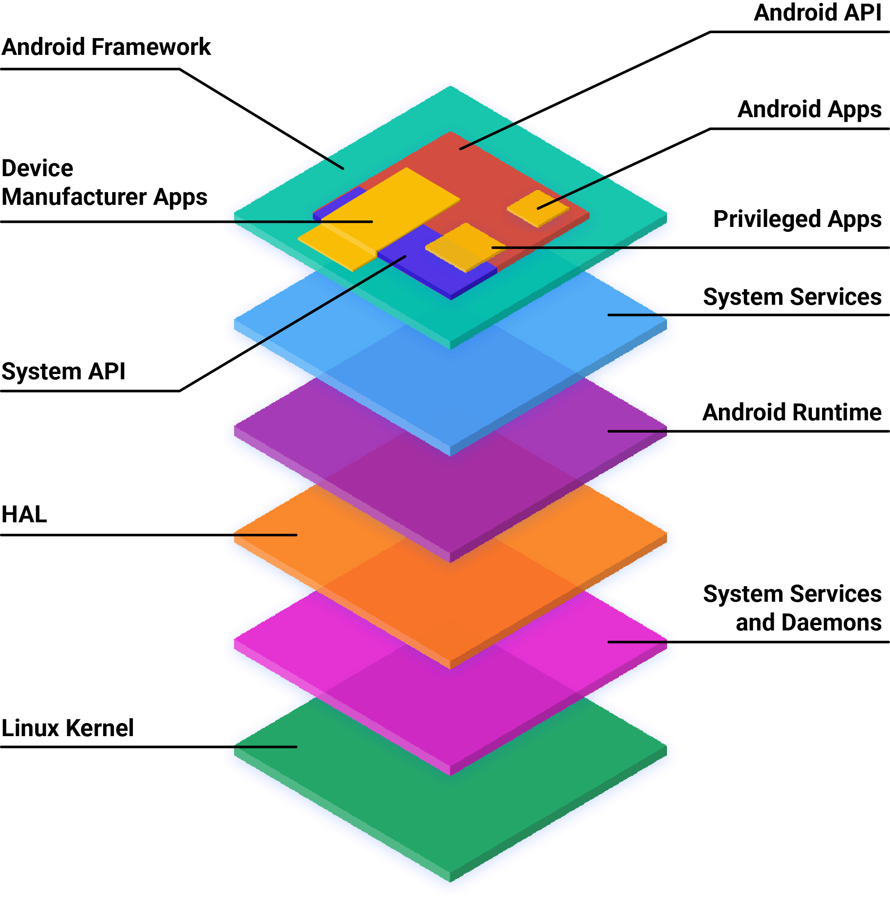
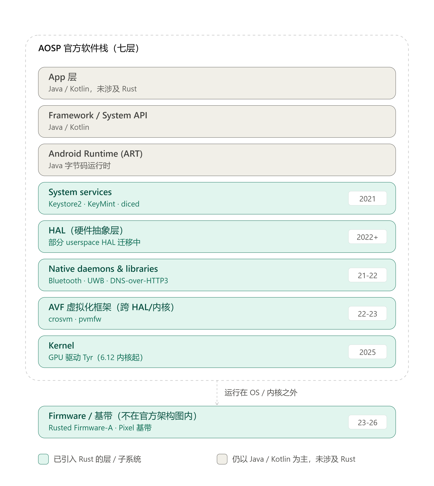

# Rust 在 AOSP 中的落地：架构、动机与关键模块分析

本文基于 Google 官方博客（Google Online Security Blog / blog.google）、Android 官方文档（source.android.com）等一手资料整理，尽量避免转述二手解读。每处关键数据和结论都标注了出处，方便核实。

---

## 一、AOSP 整体架构

AOSP 官方文档给出的架构图如下（来源：[Android Open Source Project - Architecture overview](https://source.android.com/docs/core/architecture)）：

*图 1：AOSP 软件栈架构（官方原图）*

按官方文档的定义，从下到上分为几层：

- **Kernel（内核）**：Linux 内核，官方文档称"尽可能拆分为硬件无关模块和厂商专属模块"。
- **HAL（硬件抽象层）**：为硬件厂商提供标准接口，让 Android 上层不用关心具体驱动实现。
- **Native daemons and libraries（原生守护进程与库）**：包括 `init`、`healthd`、`logd`、`storaged` 等守护进程，以及 `libc`、`liblog`、`libutils`、`libbinder`、`libselinux` 等原生库。官方原话是"这些守护进程和库直接与内核或其他接口交互，不依赖用户空间的 HAL 实现"。
- **Android Runtime (ART)**：Java 字节码运行时。
- **System services（系统服务）**：模块化的组件，如 `system_server`、SurfaceFlinger、MediaService。
- **Android framework / System API / Android API**：面向应用和 OEM 的接口层。
- **App（应用）**：Android App、特权 App、设备厂商 App 三类。

这个分层对理解 Rust 的位置很关键：**Java/Kotlin 已经覆盖了 ART 之上的绝大部分逻辑，Rust 要解决的是这条线以下——HAL、native daemons/libraries、Kernel，以及更底层的 bare-metal 固件——这部分历史上只能用 C/C++ 写的代码。**这一点 Google 在 2021 年的公告里说得很直白：

> "Managed languages like Java and Kotlin are the best option for Android app development... Unfortunately, for the lower layers of the OS, Java and Kotlin are not an option. Lower levels of the OS require systems programming languages like C, C++, and Rust."
> —— [Rust in the Android platform, 2021-04-06](https://security.googleblog.com/2021/04/rust-in-android-platform.html)

### 1.2 Rust 在架构中的位置：全图

把官方架构图和 Rust 落地的实际情况叠在一起看会更直观。下图是在官方七层架构的基础上，标出每一层目前是否已经引入 Rust、引入了哪些标志性组件、大致从哪一年开始：

*图 2：Rust 在 AOSP 七层架构中的位置（基于官方文档与官方博客整理，非官方原图）*

看这张图需要注意两点：

- **上三层（App、Framework、ART）目前和 Rust 没有关系**，这不是遗漏，而是官方从一开始就没打算动这一块——Java/Kotlin 本身已经是内存安全语言，没有替换的必要（见 1.1 节引用）。
- **AVF 虚拟化框架和固件/基带这两块，严格说不在官方那张七层架构图里**：AVF 是横跨 HAL 和内核的一套独立子系统（有自己的架构文档），固件/基带则运行在 Android 系统之外、设备启动更早的阶段。把它们画在官方架构之外、用虚线连到 Kernel 层，是为了如实反映这一点，避免让人误以为官方架构图本身就包含这两块。

---

## 二、引入 Rust 的动机（官方原始表述）

Google 官方给出的动机，核心是一个长期存在但一直没被根治的问题：**内存安全漏洞**。

### 2.1 问题有多严重

2021 年公告原文：

> "memory safety bugs continue to be a top contributor of stability issues, and consistently represent ~70% of Android's high severity security vulnerabilities"
> —— [同上](https://security.googleblog.com/2021/04/rust-in-android-platform.html)

这不是 Android 独有的问题。2022 年的后续博客里 Google 引用行业数据说，过去十多年，内存安全漏洞在各类软件产品中普遍占到 65% 以上（[Memory Safe Languages in Android 13, 2022-12-01](https://security.googleblog.com/2022/12/memory-safe-languages-in-android-13.html)）。

### 2.2 为什么不能只靠 sandbox（沙箱隔离）

Android 一直遵循 Chromium 的 "Rule of 2" 原则：处理不可信输入的代码，如果是 C/C++ 写的，就必须放进受限沙箱。2021 年公告解释了这条路走到头的原因：

> "Sandboxing is expensive: the new processes it requires consume additional overhead and introduce latency due to IPC and additional memory usage. Sandboxing doesn't eliminate vulnerabilities from the code and its efficacy is reduced by high bug density, allowing attackers to chain multiple vulnerabilities together."

也就是说，沙箱本身要付出内存、IPC 延迟的代价，而且并不消灭漏洞，只是限制影响范围；一旦漏洞密度高，攻击者照样能把多个漏洞串起来打穿沙箱边界。Rust 从两个方向缓解这个问题：降低代码里的 bug 密度，从而提升现有沙箱的实际效果；同时减少对沙箱的依赖，让一些原本必须隔离运行的功能可以更轻量地实现。

### 2.3 为什么不是"重写存量代码"

这是整个策略里最关键的一条判断依据。2021 年公告给出了内部对内存安全漏洞"年龄"的分析结论：

> "Most of our memory bugs occur in new or recently modified code, with about 50% being less than a year old."

也就是说，老代码经过长期打磨、测试、fuzzing，问题密度本身在下降；真正高发的是新代码和刚改动过的代码。基于这个发现，Google 明确表态：

> "rewriting tens of millions of lines of code is simply not feasible... our memory-safe language efforts are best focused on new development and not on rewriting mature C/C++ code."

这决定了 Android 引入 Rust 的方式：**不是把已有 C/C++ 模块批量翻译成 Rust，而是要求新功能、新模块优先用 Rust 写**，老代码该维护维护，不做大规模重写。

---

## 三、策略与推进节奏

2021 年公告里 Google 自己承认，往平台里加一门新语言是个"大工程"：

> "Adding a new language to the Android platform is a large undertaking. There are toolchains and dependencies that need to be maintained, test infrastructure and tooling that must be updated, and developers that need to be trained... Scaling this to more of the OS is a multi-year project."

时间线上可以对上：2024 年的博客回顾里提到，"The Android team began prioritizing transitioning new development to memory safe languages around 2019"（[Eliminating Memory Safety Vulnerabilities at the Source, 2024-09-25](https://security.googleblog.com/2024/09/eliminating-memory-safety-vulnerabilities-Android.html)）。也就是说 2019 年内部就定了方向，公开发布是 2021 年 4 月，中间那 18 个月用来搭工具链、建测试基础设施、培训工程师——公告原文也提到"For the past 18 months we have been adding Rust support to the Android Open Source Project"。

推进路径大致是：先在少数"早期试点项目"里验证可行性，再逐步扩展到系统服务、HAL、内核驱动、bare-metal 固件。2022 年底的博客明确写了下一步计划：

> "We're implementing userspace HALs in Rust. We're adding support for Rust in Trusted Applications. We've migrated VM firmware in the Android Virtualization Framework to Rust. With support for Rust landing in Linux 6.1 we're excited to bring memory-safety to the kernel, starting with kernel drivers."
> —— [Memory Safe Languages in Android 13](https://security.googleblog.com/2022/12/memory-safe-languages-in-android-13.html)

这条脉络后来确实照着走：2023 年 bare-metal 固件（pvmfw），2024-2025 年内核驱动落地，2026 年 Pixel 基带固件。

---

## 四、Rust 语言本身的设计优势：不只是"内存安全"这一个词

前面讲的都是"为什么选 Rust"，这一节讲"Rust 到底做对了什么"。很多人对 Rust 的认知停留在"所有权系统能防内存泄漏"，但官方 2021 年公告里其实系统性列了一份清单，说明 Rust 从"事后检测 bug"转向"事前预防 bug"，具体靠的是下面几个语言特性——这份清单是后面第七节逐模块分析的理论基础，值得单独说清楚。

> "Bug detection is most effective when bugs are relatively rare and dangerous bugs can be given the urgency and priority that they merit. Our ability to reap the benefits of improvements in bug detection require that we prioritize preventing the introduction of new bugs."
> —— [Rust in the Android platform](https://security.googleblog.com/2021/04/rust-in-android-platform.html)

也就是说，光靠 fuzzing、静态扫描这些"事后检测"手段，边际效果会随着 bug 密度降低而递减；真正能持续降低漏洞率的，是在编译期就把整类问题堵死。官方给出的清单原文叫"Prioritizing prevention"，包含七点：

**1. 内存安全（Memory safety）**——通过编译期的所有权、借用检查加上少量运行时检查，消除 use-after-free、double-free、缓冲区越界这类问题。这是最广为人知的一条，也是前面所有数据（漏洞占比从 76% 降到 20% 以下）的直接来源。

**2. 数据并发安全（Data concurrency）**——编译器在类型层面（`Send`/`Sync` trait）杜绝数据竞争，官方原文称之为"Fearless Concurrency"（[同上](https://security.googleblog.com/2021/04/rust-in-android-platform.html)）：正因为编译器保证了跨线程访问的安全性，工程师才敢放心地把原本要靠额外进程隔离才能保证安全的逻辑，改成多线程或者异步任务去做。第八节里 DNS-over-HTTP/3 用 async/await 省线程，靠的就是这条。

**3. 更具表达力的类型系统（More expressive type system）**——通过 newtype 包装、带数据的枚举（enum variants with contents）等手段，把"逻辑上不该出现的状态"直接从类型层面排除掉，减少的是逻辑 bug 而不只是内存 bug。

**4. 引用和变量默认不可变（Immutable by default）**——变量和引用默认只读，只有显式标记 `mut` 才能修改。官方原话是这样做"帮助开发者遵循最小权限原则"（[同上](https://security.googleblog.com/2021/04/rust-in-android-platform.html)）：一段代码看一眼签名就知道它会不会改动传进来的数据，不用再去读实现细节。

**5. 更严格的错误处理（Better error handling）**——可能失败的调用返回 `Result`，编译器强制调用方处理或者用 `?` 显式传播，不允许"忘记检查返回值"。官方专门举了一个真实历史漏洞做反例：

> "This protects against bugs like the Rage Against the Cage vulnerability which resulted from an unhandled error."
> —— [同上](https://security.googleblog.com/2021/04/rust-in-android-platform.html)

"Rage Against the Cage"是 Android 历史上一个知名的提权漏洞，根因就是一处系统调用的错误返回值没被检查。这类问题在 C/C++ 里全靠代码审查和经验去防，在 Rust 里编译器直接拦下来。

**6. 强制初始化（Initialization）**——所有变量必须先初始化成合法值才能使用，不存在"读到未初始化内存"这回事。官方给出的历史数据是：

> "Uninitialized memory vulnerabilities have historically been the root cause of 3-5% of security vulnerabilities on Android."
> —— [同上](https://security.googleblog.com/2021/04/rust-in-android-platform.html)

值得一提的是，Android 11 时期 Google 就已经在 C/C++ 里做了变量自动初始化的运行时缓解措施，但那是"打补丁"；Rust 是直接从语言规则上让这类问题不可能发生。

**7. 更安全的整数处理（Safer integer handling）**——所有整数类型转换必须显式 cast，不会在函数调用或赋值时发生隐式截断；调试构建下溢出检查默认开启。官方文档原话："All integer-type conversions are explicit casts. Developers can't accidentally cast during a function call when assigning to a variable, or when attempting to do arithmetic with other types."（[Android Rust introduction](https://source.android.com/docs/setup/build/rust/building-rust-modules/overview)）

这七条不是孤立的语言特性罗列，而是精确对应着 C/C++ 里最常见的几类历史漏洞（内存越界、数据竞争、未初始化读取、整数溢出、错误处理遗漏）。第七节分析具体模块时，会看到不同模块实际用上的是这七条里的不同子集——比如 Keystore2 靠的主要是所有权和错误处理，DNS-over-HTTP/3 靠的主要是并发安全，UWB 靠的是把 `unsafe` 代码缩到最小范围便于审查。

---

## 五、收益：官方给出的数据

以下数据全部来自 Google 官方博客，按时间顺序排列，能看出一条连续的曲线。

| 年份/时间点 | 数据 | 来源 |
|---|---|---|
| 2019 | 全年内存安全漏洞 223 个，占安全公告总漏洞的 76% | [The Register 引述 Vander Stoep 原话](https://www.theregister.com/2022/12/02/android_google_rust/)；官方数据见 [Memory Safe Languages in Android 13](https://security.googleblog.com/2022/12/memory-safe-languages-in-android-13.html) |
| 2022 | 全年降到 85 个；占比降到 35%，是内存安全漏洞首次不再是多数 | [Memory Safe Languages in Android 13](https://security.googleblog.com/2022/12/memory-safe-languages-in-android-13.html) |
| Android 13 (2022) | 21% 的新增原生代码是 Rust；AOSP 中累计约 150 万行 Rust 代码；到目前为止 Rust 代码里发现的内存安全漏洞是 **0** | 同上 |
| 2024 | 占比降到 24%，明显低于行业 70% 的平均水平 | [Eliminating Memory Safety Vulnerabilities at the Source](https://security.googleblog.com/2024/09/eliminating-memory-safety-vulnerabilities-Android.html) |
| 2025 | 占比首次跌破 20%；AOSP 中 Rust 总量约 500 万行；Rust 代码的漏洞密度约 0.2 个/百万行，C/C++ 历史密度约 1000 个/百万行，即约 1000 倍差距 | [Rust in Android: move fast and fix things, 2025-11-13](https://blog.google/security/rust-in-android-move-fast-fix-things/) |

除了安全数据，2025 年这篇博客还给出了工程效率方面的量化对比（用 Google 自己的 DORA 指标体系，对比同期同规模的 Rust 变更和 C++ 变更）：

- **代码评审耗时**：Rust 变更比 C++ 少约 25%；
- **修改轮次**：Rust 变更比 C++ 少约 20% 的返工轮次；
- **回滚率**：中大型变更里，Rust 的回滚率约为 C++ 的四分之一（"~4x lower"）。

原文对这个结果的定性很直接：

> "the safer path is now also the faster one."

另外两个具体的资源收益案例（来自 2022 年博客）：

> "with the new UWB stack we were able to save several megabytes of memory and avoid some IPC latency by running it within an existing process. The new DNS-over-HTTP/3 implementation uses fewer threads to perform the same amount of work by using Rust's async/await feature to process many tasks on a single thread in a safe manner."

也就是说，用 Rust 写新功能后，因为不再需要额外的进程隔离和运行时防护开销，UWB 协议栈省下了几 MB 内存并减少了跨进程通信延迟；DNS-over-HTTP/3 用 Rust 的 async/await 把原本要多线程处理的任务收敛到单线程里安全地跑，线程数更少。

需要说明一点：这些收益不是"Rust 语言本身更快"，而是**因为 Rust 降低了 bug 密度，从而可以省掉原本为了防御内存漏洞而加的沙箱、运行时检查等额外开销**——这正好呼应了第二节里讲的"减少对 sandbox 的依赖"那条逻辑。

---

## 六、目前哪些模块用了 Rust，代码量多大

需要先说明一个局限：**Google 没有公开发布过逐模块的精确代码行数清单**，官方口径只给了两个时间点的汇总数字——Android 13（2022 年）约 150 万行，2025 年约 500 万行。逐模块的规模只能通过 Android 源码搜索（cs.android.com）或社区整理的清单间接了解，比如 [tardyp/awesome-aosp-rust](https://github.com/tardyp/awesome-aosp-rust) 这个项目按源码路径统计了各 Rust crate 被哪些 AOSP 组件引用。下面按官方文档/博客里点名提到的模块分类列出，能确认来源的都标注了。

**系统服务与守护进程**
- **Keystore2**：Android 12 起的新版密钥库守护进程，官方文档明确写"Android 12 also includes a new version of the keystore system daemon, rewritten in Rust and known as keystore2"（[Hardware-backed Keystore](https://source.android.com/docs/security/features/keystore)）。
- **KeyMint / diced（DICE）**：与 Keystore2 配套的密钥管理和设备身份证明组件。
- **prng_seeder**（系统随机数种子服务）。

**连接协议栈**
- **Bluetooth 协议栈**（内部代号 "Gabeldorsche"）：Android 11 前后启动 Rust 重写，官方 2021 年博客发布前就已在开发中。
- **UWB（超宽带）协议栈**：Android 13 新增，官方点名的旗舰模块之一。
- **DNS-over-HTTP/3**：基于 Cloudflare 开源的 `quiche`（Rust 实现的 QUIC/HTTP3 库），Android 13 点名模块之一。
- **NFC 相关组件**（如测试用的 rootcanal）。

**Android 虚拟化框架（AVF）**
- **crosvm**：虚拟机监视器（VMM），官方文档原话是"What makes crosvm unique is its focus on safety with the use of the Rust programming language and a sandbox around virtual devices to protect the host kernel"（[AVF architecture](https://source.android.com/docs/core/virtualization/architecture)）。
- **pvmfw（protected VM firmware）**：pVM 的固件，2023 年从 C 写的 U-Boot 迁移为 Rust 实现（详见第七节）。
- **microdroid_manager、virtualizationservice、authfs、compos** 等 AVF 周边组件，均为 Rust 实现（可在 [tardyp/awesome-aosp-rust](https://github.com/tardyp/awesome-aosp-rust) 中查到源码路径引用）。

**内核**
- Android 使用的 6.12 Linux 内核是"我们第一个启用 Rust 支持的内核，也是第一个投产的 Rust 驱动"（["Android's 6.12 Linux kernel is our first kernel with Rust support enabled and our first production Rust driver."](https://blog.google/security/rust-in-android-move-fast-fix-things/)，2025-11-13）。
- 与 Arm、Collabora 合作的 Rust GPU 驱动项目 "Tyr" 正在推进中。

**固件（Firmware）**
- **pvmfw**（见上）。
- 与 Arm 合作的 **Rusted Firmware-A**（TF-A 的 Rust 化）。
- **Pixel 10 基带（modem）固件**：2026 年集成了基于 `hickory-proto` crate 的 Rust DNS 解析器，是 Pixel 基带首次引入内存安全语言（[Bringing Rust to the Pixel Baseband, 2026-04](https://security.googleblog.com/2026/04/bringing-rust-to-pixel-baseband.html)）。

**第一方应用（非 AOSP 平台代码，但同属 Google 的 Rust 战略）**
- Nearby Presence（蓝牙设备发现协议）、MLS（RCS 加密消息协议）、Chromium 的 PNG/JSON/字体解析器——这几个来自 2025 年博客，说明 Rust 的推广已经从 AOSP 平台扩展到第一方应用层。

---

## 七、时间线：Rust 在 AOSP 中是怎么一步步铺开的

| 时间 | 架构层 / 位置 | 事件 | 来源 |
|---|---|---|---|
| 约 2019 年 | — | Android 团队内部决定把新代码开发优先转向内存安全语言 | [Eliminating Memory Safety Vulnerabilities at the Source](https://security.googleblog.com/2024/09/eliminating-memory-safety-vulnerabilities-Android.html) |
| 2019 年底起（公告前 18 个月） | System services / Native daemons | 开始往 AOSP 加 Rust 工具链、构建系统支持（Soong 里的 `rust_*` 模块类型），早期试点项目在内部开发（Bluetooth Gabeldorsche 栈、Keystore2 等） | [Rust in the Android platform](https://security.googleblog.com/2021/04/rust-in-android-platform.html) |
| 2021-04-06 | — | 官方公告：AOSP 正式支持 Rust 作为系统开发语言 | [同上](https://security.googleblog.com/2021/04/rust-in-android-platform.html) |
| 2021-06 | — | 发布 Rust/C++ 互操作方案（cxx/autocxx 等工具链），解决新旧代码共存问题 | [Rust/C++ interop in the Android Platform](https://security.googleblog.com/2021/06/rustc-interop-in-android-platform.html) |
| Android 12（2021 年 10 月发布） | System services | Rust 正式成为 Android 平台语言；Keystore2 上线，是第一个公开的旗舰级 Rust 系统组件 | [Hardware-backed Keystore](https://source.android.com/docs/security/features/keystore)；[The Register](https://www.theregister.com/2022/12/02/android_google_rust/) |
| Android 13（2022 年发布） | Native daemons & libraries / AVF | 21% 新增原生代码是 Rust，累计约 150 万行；UWB 协议栈、DNS-over-HTTP/3、AVF 相关组件上线；这一年也是 Android 历史上第一次"新增代码里内存安全语言占多数"的release | [Memory Safe Languages in Android 13](https://security.googleblog.com/2022/12/memory-safe-languages-in-android-13.html) |
| 2022-12-01 | — | 官方公布 2019-2022 漏洞趋势：占比从 76% 降到 35% | 同上 |
| 2023-10-09 | AVF（bare-metal 固件） | pvmfw（pVM 固件）从 U-Boot（C）迁移为 Rust，是 Rust 进入 bare-metal（无操作系统裸机环境）的标志性案例 | [Bare-metal Rust in Android](https://security.googleblog.com/2023/10/bare-metal-rust-in-android.html) |
| 2024-09-25 | — | 官方发布长文总结六年策略成效：占比降到 24%，低于行业 70% 常态 | [Eliminating Memory Safety Vulnerabilities at the Source](https://security.googleblog.com/2024/09/eliminating-memory-safety-vulnerabilities-Android.html) |
| 2024（同期） | Firmware | 发布《在存量固件代码库中部署 Rust》教程，把经验向业界开放 | [Deploying Rust in Existing Firmware Codebases](https://security.googleblog.com/2024/09/deploying-rust-in-existing-firmware.html) |
| 2025 年内 | Kernel | Linux 6.12 内核首次启用 Rust 支持，产出第一个投产的 Rust 内核驱动；与 Arm/Collabora 合作的 GPU 驱动 "Tyr" 项目推进；发现并在发布前修复了 Rust 代码里第一个"差点"造成的内存安全漏洞（CVE-2025-48530，CrabbyAVIF 里的线性缓冲区溢出） | [Rust in Android: move fast and fix things](https://blog.google/security/rust-in-android-move-fast-fix-things/) |
| 2025-11-13 | — | 官方发布年度总结：占比首次跌破 20%；累计约 500 万行 Rust；给出量化的开发效率数据（代码评审时间、回滚率等） | 同上 |
| 2026-04 | Firmware / 基带（OS 之外） | Pixel 10 基带固件集成 Rust DNS 解析器，是 Pixel 基带第一次用上内存安全语言 | [Bringing Rust to the Pixel Baseband](https://security.googleblog.com/2026/04/bringing-rust-to-pixel-baseband.html) |

从这条时间线能看出一个清晰的路径：**系统守护进程（Keystore2）→ 用户态协议栈（Bluetooth、UWB、DNS）→ 虚拟化框架（AVF/crosvm/pvmfw）→ bare-metal 固件 → 内核驱动 → 基带这类第三方芯片固件**。越往后走，涉及的运行环境越底层、越苛刻（无标准库、无堆分配、和厂商代码耦合更深），推进难度也越大，所以时间跨度也越长。

---

## 八、标志性模块：Rust 在每一步里具体解决了什么问题

结合第一节的架构位置图和第四节的语言特性清单，下面逐个看每个标志性模块具体用上了 Rust 的哪些特性。

### 7.1 Keystore2（Android 12）——第一个吃螃蟹的系统守护进程

Keystore2 是密钥管理守护进程，负责存取加密密钥、执行签名验证等操作，长期运行、直接通过 Binder IPC 接收来自各个 App 和系统服务的请求。这类"长期运行 + 处理外部输入 + 管理敏感数据生命周期"的守护进程，正是内存安全漏洞的高发地。选它作为第一个公开的 Rust 系统组件，某种程度上是拿一个高价值目标来验证 Rust 在生产环境里能不能扛住。

Rust 在这里的设计优势主要是两点：
- **所有权和生命周期检查**杜绝了密钥数据在多个所有者之间传递时可能出现的 use-after-free、double-free；
- **`Result` 类型强制处理错误路径**。2021 年公告特意举了一个历史漏洞做反例："Rage Against the Cage" 漏洞就是因为一个系统调用的错误返回值没被处理导致的（[原文链接](https://android.googlesource.com/platform/system/core/+/44db990d3a4ce0edbdd16fa7ac20693ef601b723%5E%21/)）。这类"忘记检查错误"的问题在 Rust 里编译不过，因为 `Result` 类型逼着你显式处理或者用 `?` 传播。

### 7.2 Bluetooth "Gabeldorsche" 协议栈——处理不可信射频输入的典型场景

蓝牙协议栈要解析来自空口的数据包，数据来源不可控，历史上是媒体、蓝牙、NFC 这几个模块漏洞密度最高的地方之一（2022 年博客原话："Historical vulnerability density is greater than 1/kLOC ... in many of Android's C/C++ components (e.g. media, Bluetooth, NFC, etc)"）。这正是 "Rule of 2" 里说的"处理不可信输入的代码"，过去只能靠塞进沙箱来兜底。

用 Rust 重写之后，协议解析这块的内存安全问题在编译期就被挡住了，理论上可以放宽沙箱强度或者减少额外的运行时防护开销，这也是第二节提到的"减少对 sandbox 依赖"在具体模块上的体现。

### 7.3 UWB（超宽带）协议栈——省内存、减少 IPC 的实证案例

UWB 是 Android 13 全新引入的协议栈（用于精确测距、定位），没有历史包袱，是一个"从零开始选语言"的场景，Google 直接选了 Rust。前面第五节引用的官方数据很具体：因为不需要跑在独立的隔离进程里，新栈省了几 MB 内存、少了一次 IPC 往返。

官方还给了一个关于 `unsafe` 代码使用的具体例子：整个 UWB 代码里只有两处用了 `unsafe`（一处用来把 Java 对象里存的指针还原成 Rust 对象引用，另一处用于对应的资源释放），而且这两处额外的审查还帮着发现了一个潜在的竞态条件（[Memory Safe Languages in Android 13](https://security.googleblog.com/2022/12/memory-safe-languages-in-android-13.html)）。这说明 Rust 的 `unsafe{}` 块不是"绕过所有检查"，而是把一小段确实需要绕开借用检查器的代码框出来，方便重点审查——这跟 Java 用 JNI 调 native 代码的思路是一致的，只是 Rust 的 `unsafe` 块比整段 JNI 代码要小得多，审查成本也低得多。

### 7.4 DNS-over-HTTP/3（基于 Cloudflare 的 quiche）——async/await 带来的并发模型优势

这个模块直接复用了 Cloudflare 开源的 `quiche`（Rust 实现的 QUIC 协议库），处理的是网络上收到的、格式复杂且不可信的协议数据，同样是内存安全的高风险场景。它的独特之处在于用了 Rust 的 `async/await`：原本用 C/C++ 实现类似功能往往要靠多线程并发处理请求，而 Rust 的异步模型可以在单线程里安全地调度多个任务，减少了线程数量（第五节引用过原文）。这不是内存安全直接带来的收益，而是第四节讲过的"数据并发安全"特性在起作用：`Send`/`Sync` trait 让编译器在编译期就能保证跨线程访问不出数据竞争，工程师才敢放心地"用更少线程做同样的事"。

### 7.5 AVF / crosvm / pvmfw——虚拟化边界上的信任根

Android 虚拟化框架（AVF）的核心是把敏感计算放进受硬件虚拟化保护的 pVM 里运行。这里有两层 Rust：

- **crosvm**（虚拟机监视器）：官方文档原话是"What makes crosvm unique is its focus on safety with the use of the Rust programming language and a sandbox around virtual devices to protect the host kernel"（[AVF architecture](https://source.android.com/docs/core/virtualization/architecture)）。VMM 这一层要模拟虚拟设备、处理来自 Guest 的 I/O 请求，一旦出内存安全问题就可能直接威胁到宿主内核，所以官方明确把"用 Rust 写"当作 crosvm 的设计特点之一来介绍，而不是顺带一提。
- **pvmfw**（pVM 固件）：这是最能说明问题的案例。它最初是基于开源 U-Boot（C 语言）构建的，官方博客直接点名了具体问题："U-Boot was not designed with security in a hostile environment in mind, and there have been numerous security vulnerabilities found in it due to out of bounds memory access, integer underflow and memory corruption. Its VirtIO drivers in particular had a number of missing or problematic bounds checks."（[Bare-metal Rust in Android](https://security.googleblog.com/2023/10/bare-metal-rust-in-android.html)）。Google 先是修复了具体问题，然后干脆把这部分重写成 Rust，从根上避免同一类问题再犯。pvmfw 运行在没有操作系统、没有堆分配器、没有标准库的裸机环境里，这次迁移也顺带催生了几个可复用的 bare-metal Rust 基础库（页表管理、SMCCC 调用等），后来被 Project Oak 等其他项目复用。

### 7.6 内核驱动与 GPU 驱动 "Tyr"——从用户态走进内核态

2022 年博客就预告了"随 Linux 6.1 落地 Rust 内核支持"的计划，到 2025 年官方确认 Android 用的 6.12 内核是第一个启用 Rust 支持、并且跑出第一个投产 Rust 驱动的版本。跟 Arm、Collabora 合作的 GPU 驱动项目 "Tyr" 也在推进中（["our ongoing collaboration with Arm and Collabora on a Rust-based kernel-mode GPU driver"](https://www.collabora.com/news-and-blog/news-and-events/introducing-tyr-a-new-rust-drm-driver.html)）。内核驱动直接管理硬件、运行在最高权限环境，一旦出内存安全问题影响面是整个系统级别的，这也是为什么这一步是整条路径里推进最谨慎、耗时最长的一环——从 2022 年预告到 2025 年才有第一个投产驱动，中间隔了三年。

### 7.7 固件——Rusted Firmware-A 与 Pixel 基带

固件层（尤其是基带 modem）historically 是攻击者高度关注的目标：2026 年的博客直接提到"Google's Project Zero gained remote code execution on Pixel modems over the Internet"作为背景。Pixel 10 系列把基带固件里的 DNS 解析部分换成了基于 `hickory-proto` crate 的 Rust 实现，官方称这是"Pixel 基带首次引入内存安全语言"。这一步的技术难点在于基带固件对代码体积极其敏感（官方原文提到额外的代码体积可能是其他嵌入式系统采用同类方案的阻碍），所以团队专门做了 `no_std` 适配，让 Rust 代码能在没有标准库、资源极度受限的环境下跑起来。

另一条平行的线是与 Arm 合作的 **Rusted Firmware-A**——把 Arm 可信固件（TF-A，运行在 EL3、比内核权限更高）用 Rust 重写，这是目前 Rust 化程度最深的一层，因为 EL3 固件出问题基本等同于整个信任链被攻破。

---

## 九、小结

把上面几节串起来看，Rust 在 AOSP 里不是一次性的"技术选型公告"，而是一条持续七年、还在往更底层推进的工程路线：

1. **动机**：内存安全漏洞占比长期偏高（~70%），且沙箱隔离这条老路的边际收益在下降；
2. **策略**：不重写存量代码，只要求新代码优先用 Rust，靠"新代码更安全 + 老代码自然衰减风险"这套组合拳；
3. **语言优势**：不是单靠"内存安全"一个卖点，而是内存安全、并发安全、类型表达力、默认不可变、强制错误处理、强制初始化、安全整数转换这七条互相配合，对应着 C/C++ 里最常见的几类历史漏洞；
4. **位置**：卡在 Java/Kotlin 管不到的那部分——native daemons、system services、HAL、内核驱动、bare-metal 固件，AVF 和固件/基带这两块甚至跨出了官方七层架构图的范围；
5. **收益**：不只是安全数据好看（漏洞占比从 76% 降到不到 20%，Rust 代码漏洞密度比 C/C++ 低约 1000 倍），2025 年的数据还显示 Rust 代码在评审效率、回滚率这些工程指标上也优于 C++，这是最初制定策略时没完全预料到的额外收益；
6. **路径**：从系统守护进程（Keystore2）到协议栈（Bluetooth/UWB/DNS）到虚拟化（AVF/crosvm/pvmfw）到 bare-metal 固件，再到内核驱动和第三方芯片固件（基带），每一步都踩着"风险高、值得投入"的模块往前走，权限越高、环境越苛刻的地方推进得越晚、越谨慎。

---

## 参考资料

1. [Architecture overview - Android Open Source Project](https://source.android.com/docs/core/architecture)
2. [Rust in the Android platform - Google Online Security Blog, 2021-04-06](https://security.googleblog.com/2021/04/rust-in-android-platform.html)
3. [Rust/C++ interop in the Android Platform, 2021-06](https://security.googleblog.com/2021/06/rustc-interop-in-android-platform.html)
4. [Memory Safe Languages in Android 13, 2022-12-01](https://security.googleblog.com/2022/12/memory-safe-languages-in-android-13.html)
5. [Bare-metal Rust in Android, 2023-10-09](https://security.googleblog.com/2023/10/bare-metal-rust-in-android.html)
6. [Eliminating Memory Safety Vulnerabilities at the Source, 2024-09-25](https://security.googleblog.com/2024/09/eliminating-memory-safety-vulnerabilities-Android.html)
7. [Deploying Rust in Existing Firmware Codebases, 2024-09](https://security.googleblog.com/2024/09/deploying-rust-in-existing-firmware.html)
8. [Rust in Android: move fast and fix things, 2025-11-13](https://blog.google/security/rust-in-android-move-fast-fix-things/)
9. [Bringing Rust to the Pixel Baseband, 2026-04](https://security.googleblog.com/2026/04/bringing-rust-to-pixel-baseband.html)
10. [Hardware-backed Keystore - Android Open Source Project](https://source.android.com/docs/security/features/keystore)
11. [AVF architecture - Android Open Source Project](https://source.android.com/docs/core/virtualization/architecture)
12. [Android Rust modules - Android Open Source Project](https://source.android.com/docs/setup/build/rust/building-rust-modules/android-rust-modules)
13. [tardyp/awesome-aosp-rust（社区整理的 AOSP Rust crate 使用清单）](https://github.com/tardyp/awesome-aosp-rust)
